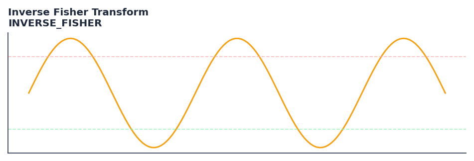

# Inverse Fisher Transform

<div class="indicator-meta"><span class="category-badge">Ehlers DSP</span> <span class="kw-badge">oscillator</span> <span class="kw-badge">ehlers</span> <span class="kw-badge">normalization</span> <span class="kw-badge">momentum</span></div>

A compressive transform that forces oscillator values towards +1 or -1, creating clear buy/sell signals.

## Visual Example



*Synthetic ideal per library logic. Generated 2026-07-01 IST via `docs/generate_all_previews.py` (reproducible; maps to core `Next<T>` implementation).*

## Description

A compressive transform that forces oscillator values towards +1 or -1, creating clear buy/sell signals.

Apply to RSI or other oscillators to rescale them to a ±1 range with sharp threshold behaviour. Values near ±1 indicate high-confidence overbought/oversold conditions.

Part of QuantWave's Ehlers digital signal processing suite. Designed for low-lag cycle and trend work — pair with Roofing Filter or SuperSmoother on noisy inputs.

The Inverse Fisher Transform maps input values to (-1, +1) via a hyperbolic tangent function. Ehlers uses it in Cybernetic Analysis to create oscillators whose output clusters near the extremes, making crossovers of fixed thresholds reliable trading signals.

**Typical applications:**

- Use for cycle timing in mean-reverting regimes
- Gate with Hurst exponent or ADX before taking cycle signals
- Allow `N`+ bars warm-up for filter state to stabilise
- Chain with Roofing Filter when input is noisy

QuantWave implements this via the universal `Next<T>` trait — bit-identical across Rust streaming, Python streaming, and Polars `.ta()` batch plugins.

## Formula / Specification

**Implementation** (`quantwave-core/src/indicators/inverse_fisher.rs`):

\[
IFT(x) = \frac{e^{2x} - 1}{e^{2x} + 1} = \tanh(x)
\]

Gold-standard parity vectors: `quantwave-core/tests/gold_standard/inverse_fisher.json`.


## Parameters

| Parameter | Default | Description |
|-----------|---------|-------------|
| (none) | — | No tunable parameters for this detector. |

## Usage Examples

**Streaming (Rust)**

```rust
use quantwave_core::indicators::INVERSE_FISHER;
use quantwave_core::traits::Next;

let mut ind = INVERSE_FISHER::new(14);
for price in &prices {
    let value = ind.next(price);
}
```

**Streaming (Python)**

```python
from quantwave import INVERSE_FISHER

ind = INVERSE_FISHER(14)
for price in prices:
    value = ind.next(price)
```

**Polars Batch (Python)**

```python
import polars as pl
import quantwave as qw

def apply_inverse_fisher_transform(series: pl.Series) -> pl.Series:
    ind = qw.INVERSE_FISHER(14)
    return pl.Series([ind.next(float(v)) for v in series.to_list()])

df = (
    pl.read_csv('ohlcv.csv')
    .lazy()
    .with_columns(
        pl.col("close").map_batches(apply_inverse_fisher_transform, return_dtype=pl.Float64).alias("inverse_fisher_transform")
    )
    .collect()
)
```

All surfaces are bit-identical via the single `Next<T>` implementation and proptests.

## Edge Cases & Limitations

- Recursive DSP filters require a warm-up period; first N bars may be unstable or raw-pass-through.
- Designed for cyclic/mean-reverting regimes; trending markets can produce lag or drift.
- Parameter `period` (or equivalent) controls cutoff — too small adds noise, too large adds lag.
- Prefer chaining with other Ehlers tools (Roofing Filter, SuperSmoother) on noisy inputs.
- Validated via proptests against gold-standard vectors where available.
- No look-ahead bias; suitable for live streaming and batch feature pipelines.

## Boundary Behavior

| Condition | Behavior |
|-----------|----------|
| Warm-up | Leading bars return NaN until warmup_bars is satisfied. |
| period > len | When period exceeds series length, output is all NaN. |
| NaN inputs | NaN in input propagates to output (NaN out). |
| Invalid params | Non-positive period or missing required params raise ValueError. |
| Empty data | Empty input returns an empty result series. |

## Related Indicators & See Also

- [Indicator Gallery](../gallery.md)
- [Native Indicators index](index.md)
- [Ehlers DSP guide](../ehlers/index.md)
- [Cyber Cycle](cyber_cycle.md)
- [SuperSmoother](supersmoother.md)

## Sources & References

**Primary Source**: https://github.com/lavs9/quantwave/blob/main/references/Ehlers%20Papers/TheInverseFisherTransform.pdf

**Implementation**: `quantwave-core/src/indicators/inverse_fisher.rs` (`INVERSE_FISHER` / `INVERSE_FISHER_METADATA`).
**Parity**: `quantwave-core/tests/gold_standard/inverse_fisher.json`

**Provenance**: Standards bulk upgrade 2026-07-01 IST — see `docs/DOCUMENTATION_STANDARDS.md`.
