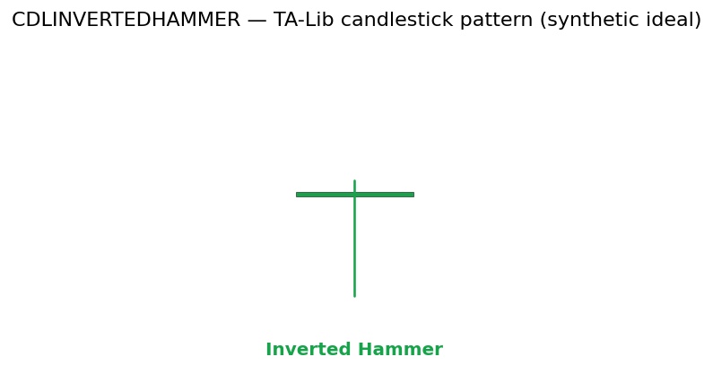

# Inverted Hammer

<div class="indicator-meta"><span class="category-badge">Patterns</span> <span class="kw-badge">pattern</span> <span class="kw-badge">candlestick</span> <span class="kw-badge">classic</span></div>

A bullish reversal pattern at the bottom of a downtrend.

## Visual Example



*Synthetic ideal per library logic. Generated 2026-06-25 IST via `docs/generate_all_previews.py` (reproducible; maps to core `Next<T>` implementation).*

## Description

The Inverted Hammer indicator is a technical analysis tool that a bullish reversal pattern at the bottom of a downtrend.

This indicator is primarily used for identifying key market conditions. It provides a robust signal that can be easily integrated into both simple strategies and more complex machine learning feature pipelines. Compared to its alternatives, it offers a distinct balance of responsiveness and stability.

Traders often combine this with other metrics to confirm signals and avoid false positives during sideways market regimes. It remains a standard tool for systematic trading models.

Signals a potential move to the upside.

QuantWave implements this indicator via the universal `Next<T>` trait, guaranteeing bit-identical results between Rust streaming, Python streaming, and Polars batch (`.ta()` / `map_batches`) surfaces.


## Formula / Specification

**Recognition Rules (TA-Lib-compatible, `CDLINVERTEDHAMMER` in `quantwave-core/src/indicators/pattern.rs`)**:

1. Stateless candlestick pattern evaluated on OHLC windows.
2. Returns a signed signal (+100 bullish, −100 bearish, 0 none) on the completion bar.
3. Exact threshold geometry (body ratios, gap requirements, shadow lengths) matches the TA-Lib reference implementation wrapped via `talib_cdl!` in `quantwave-core/src/indicators/pattern.rs`.
4. Validate against `quantwave-core/tests/gold_standard/` vectors where present.


## Parameters

| Parameter | Default | Description |
|-----------|---------|-------------|
| (none) | — | No tunable parameters for this detector. |

## Usage Examples

**Streaming (Rust)**

```rust
use quantwave_core::indicators::CDLINVERTEDHAMMER;
use quantwave_core::traits::Next;

let mut det = CDLINVERTEDHAMMER::new();
for (o, h, l, c) in &ohlcv {
    let sig = det.next((o, h, l, c));
}
```

**Streaming (Python)**

```python
from quantwave import CDLINVERTEDHAMMER

det = CDLINVERTEDHAMMER()
for o, h, l, c in ohlcv:
    sig = det.next((o, h, l, c))
```

**Polars Batch (Python)**

```python
import polars as pl
import quantwave as qw

def apply_inverted_hammer(series: pl.Series) -> pl.Series:
    ind = qw.CDLINVERTEDHAMMER(14)
    return pl.Series([ind.next(float(v)) for v in series.to_list()])

df = (
    pl.read_csv('ohlcv.csv')
    .lazy()
    .with_columns(
        pl.col("close").map_batches(apply_inverted_hammer, return_dtype=pl.Float64).alias("inverted_hammer")
    )
    .collect()
)
```

All surfaces are bit-identical via the single `Next<T>` implementation and proptests.

## Edge Cases & Limitations

- Requires sufficient complete OHLC bars; early bars yield no signal.
- False positives are common in sideways markets — gate with trend or structure filters.
- Pattern semantics follow TA-Lib body/shadow rules; literature variants may differ.
- Signed output (+/−/0) should be consumed as events, not continuous features without encoding.
- Combine with volume expansion or higher-timeframe confirmation for production use.
- No look-ahead bias; signal is known only after the pattern window closes.

## Boundary Behavior

| Condition | Behavior |
|-----------|----------|
| Warm-up | Pattern functions emit 0 (no pattern) until enough bars exist. |
| period > len | Short series returns all zeros (no pattern detected). |
| NaN inputs | Bars with NaN OHLC are treated as no pattern (0). |
| Invalid params | N/A for most candlestick patterns. |
| Empty data | Empty input returns an empty integer series. |

## Related Indicators & See Also

- [Indicator Gallery](../gallery.md)
- [Native Indicators index](index.md)
- [Engulfing](engulfing.md)
- [Market Structure](../price_action/market_structure.md)
- [PA Flag Breakout notebook](../../../examples/notebooks/pa_flag_breakout_strategy.md)

## Sources & References

**Primary Source**: https://www.investopedia.com/articles/active-trading/062315/using-bullish-candlestick-patterns-buy-stocks.asp

**Implementation**: `quantwave-core/src/indicators/pattern.rs` (`CDLINVERTEDHAMMER` / `CDLINVERTEDHAMMER_METADATA`).
**Pattern reference**: TA-Lib CDL family via `talib_cdl!` in `pattern.rs`. Nison (1991) cited for psychology only — no duplicated boilerplate.
**Parity**: `quantwave-core/tests/gold_standard/cdlinvertedhammer.json`

**Provenance**: Standards bulk upgrade 2026-06-25 IST — see `docs/DOCUMENTATION_STANDARDS.md`.
