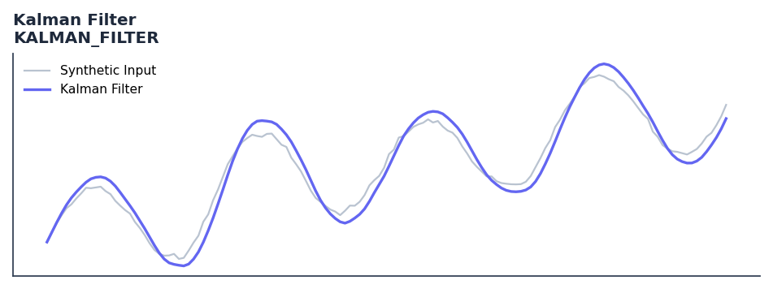

# Kalman Filter

<div class="indicator-meta"><span class="category-badge">ML Features</span> <span class="kw-badge">filter</span> <span class="kw-badge">adaptive</span> <span class="kw-badge">smoothing</span> <span class="kw-badge">ml</span> <span class="kw-badge">kalman</span></div>

An adaptive 1D Kalman filter for smoothing price data with minimal lag.

## Visual Example



*Synthetic ideal per library logic. Generated 2026-07-01 IST via `docs/generate_all_previews.py` (reproducible; maps to core `Next<T>` implementation).*

## Description

An adaptive 1D Kalman filter for smoothing price data with minimal lag.

Use as a highly responsive alternative to moving averages. The Q parameter (process noise) controls responsiveness to trend changes, while R (measurement noise) controls smoothness. Higher Q makes it track price faster; higher R increases smoothing.

Research-oriented feature for ML pipelines; validated for batch ↔ streaming parity.

The Kalman Filter is an optimal estimator for linear systems with Gaussian noise. In technical analysis, the 1D version recursively updates the estimate of the 'true' price by balancing the predicted state against new measurements. It is particularly effective for feature engineering in ML models due to its ability to separate signal from noise dynamically.

**Typical applications:**

- See Parameters — default period/length `0.01`
- Validated via proptests and gold-standard vectors where available
- Use Polars `.ta` plugins for batch; `streaming_class()` for live

QuantWave implements this via the universal `Next<T>` trait — bit-identical across Rust streaming, Python streaming, and Polars `.ta()` batch plugins.

## Formula / Specification

**Implementation** (`quantwave-core/src/indicators/kalman.rs`):

\[
P_{t|t-1} = P_{t-1} + Q
\]
\[
K_t = \frac{P_{t|t-1}}{P_{t|t-1} + R}
\]
\[
X_t = X_{t-1} + K_t(Z_t - X_{t-1})
\]
\[
P_t = (1 - K_t)P_{t|t-1}
\]

Gold-standard parity vectors: `quantwave-core/tests/gold_standard/kalman_filter.json`.


## Parameters

| Parameter | Default | Description |
|-----------|---------|-------------|
| `q` | 0.01 | Process noise (responsiveness) |
| `r` | 0.1 | Measurement noise (smoothing) |


## Usage Examples

**Streaming (Rust)**

```rust
use quantwave_core::indicators::KALMAN_FILTER;
use quantwave_core::traits::Next;

let mut ind = KALMAN_FILTER::new(0.01);
for price in &prices {
    let value = ind.next(price);
}
```

**Streaming (Python)**

```python
from quantwave import KALMAN_FILTER

ind = KALMAN_FILTER(0.01)
for price in prices:
    value = ind.next(price)
```

**Polars Batch (Python)**

```python
import polars as pl
import quantwave as qw

def apply_kalman_filter(series: pl.Series) -> pl.Series:
    ind = qw.KALMAN_FILTER(0.01)
    return pl.Series([ind.next(float(v)) for v in series.to_list()])

df = (
    pl.read_csv('ohlcv.csv')
    .lazy()
    .with_columns(
        pl.col("close").map_batches(apply_kalman_filter, return_dtype=pl.Float64).alias("kalman_filter")
    )
    .collect()
)
```

All surfaces are bit-identical via the single `Next<T>` implementation and proptests.

## Edge Cases & Limitations

- Warm-up: first `0.01` bars may return NaN or partial state per implementation.
- Parameter sensitivity: smaller periods increase noise; larger periods increase lag.
- Sudden gaps or bad ticks can distort rolling windows — consider pre-filtering.
- Single-series indicators ignore volume unless otherwise documented.
- Validated via proptests against gold-standard vectors where available.
- No look-ahead bias; streaming and Polars batch paths are bit-identical.

## Boundary Behavior

| Condition | Behavior |
|-----------|----------|
| Warm-up | Leading bars return NaN until warmup_bars is satisfied. |
| period > len | When period exceeds series length, output is all NaN. |
| NaN inputs | NaN in input propagates to output (NaN out). |
| Invalid params | Non-positive period or missing required params raise ValueError. |
| Empty data | Empty input returns an empty result series. |

## Related Indicators & See Also

- [Indicator Gallery](../gallery.md)
- [Native Indicators index](index.md)
- [Batch vs Streaming guide](../../../examples/batch-streaming.md)
- [RSI](relative_strength_index_rsi.md)
- [SuperTrend](../supertrend/)

## Sources & References

**Primary Source**: https://en.wikipedia.org/wiki/Kalman_filter

**Implementation**: `quantwave-core/src/indicators/kalman.rs` (`KALMAN_FILTER` / `KALMAN_FILTER_METADATA`).
**Parity**: `quantwave-core/tests/gold_standard/kalman_filter.json`

**Provenance**: Standards bulk upgrade 2026-07-01 IST — see `docs/DOCUMENTATION_STANDARDS.md`.
