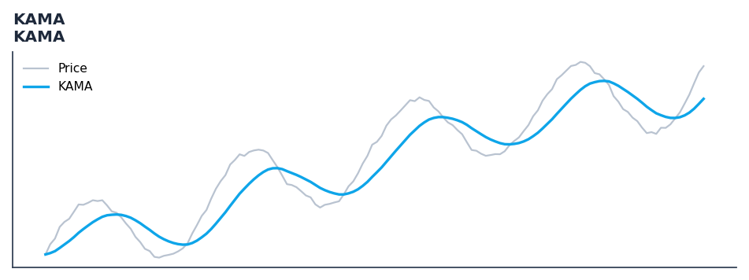

# KAMA

<div class="indicator-meta"><span class="category-badge">Classic</span> <span class="kw-badge">moving-average</span> <span class="kw-badge">adaptive</span> <span class="kw-badge">smoothing</span> <span class="kw-badge">classic</span></div>

Kaufman's Adaptive Moving Average adjusts its sensitivity based on market volatility.

## Visual Example



*Synthetic ideal per library logic. Generated 2026-06-25 IST via `docs/generate_all_previews.py` (reproducible; maps to core `Next<T>` implementation).*

## Description

The KAMA indicator is a technical analysis tool that kaufman's adaptive moving average adjusts its sensitivity based on market volatility.

This indicator is primarily used for identifying key market conditions. It provides a robust signal that can be easily integrated into both simple strategies and more complex machine learning feature pipelines. Compared to its alternatives, it offers a distinct balance of responsiveness and stability.

Traders often combine this with other metrics to confirm signals and avoid false positives during sideways market regimes. It remains a standard tool for systematic trading models.

Use as an adaptive moving average that is fast in trending markets and slow in choppy, sideways conditions. Reduces whipsaws that plague fixed-period moving averages in ranging markets.

Perry Kaufman designed KAMA using an Efficiency Ratio that measures how directionally price has moved versus total path length. A high ratio (strong trend) produces a fast-reacting EMA; a low ratio (choppy market) produces a near-flat line, dramatically reducing false signals during consolidation. — New Trading Systems and Methods, 4th ed.

QuantWave implements this indicator via the universal `Next<T>` trait, guaranteeing bit-identical results between Rust streaming, Python streaming, and Polars batch (`.ta()` / `map_batches`) surfaces.


## Formula / Specification

**Implementation** (`quantwave-core/src/indicators/kama.rs`):

\[
ER = \frac{|Price - Price_{t-n}|}{\sum |Price - Price_{t-1}|}
\]
\[
SC = [ER(FastSC - SlowSC) + SlowSC]^2
\]
\[
KAMA = KAMA_{t-1} + SC(Price - KAMA_{t-1})
\]

Gold-standard parity vectors: `quantwave-core/tests/gold_standard/kama.json`.


## Parameters

| Parameter | Default | Description |
|-----------|---------|-------------|
| `period` | 10 | Efficiency Ratio lookback period |
| `fast_period` | 2 | Fastest smoothing period |
| `slow_period` | 30 | Slowest smoothing period |


## Usage Examples

**Streaming (Rust)**

```rust
use quantwave_core::indicators::KAMA;
use quantwave_core::traits::Next;

let mut ind = KAMA::new(10);
for price in &prices {
    let value = ind.next(price);
}
```

**Streaming (Python)**

```python
from quantwave import KAMA

ind = KAMA(10)
for price in prices:
    value = ind.next(price)
```

**Polars Batch (Python)**

```python
import polars as pl

df = (
    pl.read_csv('ohlcv.csv')
    .lazy()
    .with_columns(
        pl.col("close").ta.kama(10).alias("kama")
    )
    .collect()
)
```

All surfaces are bit-identical via the single `Next<T>` implementation and proptests.

## Edge Cases & Limitations

- Warm-up: first `10` bars may return NaN or partial state per implementation.
- Parameter sensitivity: smaller periods increase noise; larger periods increase lag.
- Sudden gaps or bad ticks can distort rolling windows — consider pre-filtering.
- Single-series indicators ignore volume unless otherwise documented.
- Validated via proptests against gold-standard vectors where available.
- No look-ahead bias; streaming and Polars batch paths are bit-identical.

## Boundary Behavior

| Condition | Behavior |
|-----------|----------|
| Warm-up | Leading bars return NaN until warmup_bars is satisfied. |
| period > len | When period exceeds series length, output is all NaN. |
| NaN inputs | NaN in input propagates to output (NaN out). |
| Invalid params | Non-positive period or missing required params raise ValueError. |
| Empty data | Empty input returns an empty result series. |

## Related Indicators & See Also

- [Indicator Gallery](../gallery.md)
- [Native Indicators index](index.md)
- [Batch vs Streaming guide](../../../examples/batch-streaming.md)
- [RSI](relative_strength_index_rsi.md)
- [SuperTrend](supertrend.md)

## Sources & References

**Primary Source**: https://stockcharts.com/school/doku.php?id=chart_school:technical_indicators:kaufman_s_adaptive_moving_average

**Implementation**: `quantwave-core/src/indicators/kama.rs` (`KAMA` / `KAMA_METADATA`).
**Parity**: `quantwave-core/tests/gold_standard/kama.json`

**Provenance**: Standards bulk upgrade 2026-06-25 IST — see `docs/DOCUMENTATION_STANDARDS.md`.
