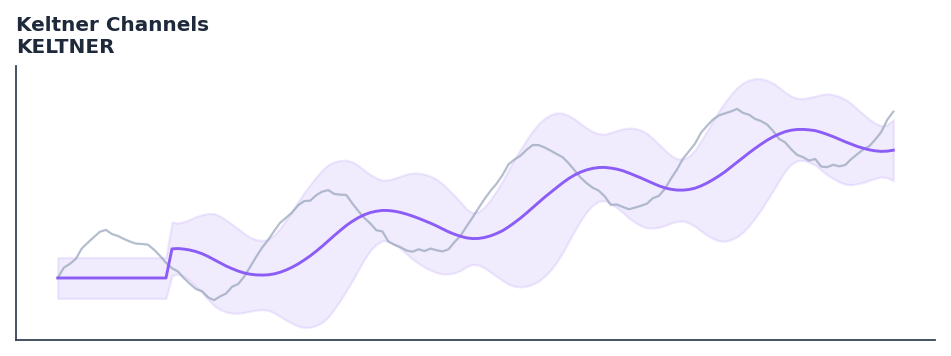

# Keltner Channels

<div class="indicator-meta"><span class="category-badge">Classic</span> <span class="kw-badge">volatility</span> <span class="kw-badge">trend</span> <span class="kw-badge">breakout</span> <span class="kw-badge">channels</span> <span class="kw-badge">classic</span></div>

Keltner Channels are volatility-based envelopes set above and below an exponential moving average.

## Visual Example



*Synthetic ideal per library logic. Generated 2026-06-25 IST via `docs/generate_all_previews.py` (reproducible; maps to core `Next<T>` implementation).*

## Description

Keltner Channels are volatility-based envelopes set above and below an exponential moving average.

Use as volatility-adjusted envelope bands around an EMA. When Keltner Channels contract inside Bollinger Bands (the Squeeze), a high-energy breakout move is typically imminent.

Keltner Channels, updated by Linda Raschke in the 1980s from Chester Keltner original design, use ATR to set channel width around an EMA. Unlike Bollinger Bands which use standard deviation, ATR-based channels adapt to average bar range rather than statistical volatility, producing smoother and more stable channel boundaries. — StockCharts ChartSchool

QuantWave implements this indicator via the universal `Next<T>` trait, guaranteeing bit-identical results between Rust streaming, Python streaming, and Polars batch (`.ta()` / `map_batches`) surfaces.

## Formula / Specification

**Implementation** (`quantwave-core/src/indicators/keltner.rs`):

\[
UC = EMA + (Multiplier \times ATR)
\]

Gold-standard parity vectors: `quantwave-core/tests/gold_standard/keltner.json`.


## Parameters

| Parameter | Default | Description |
|-----------|---------|-------------|
| `period` | 20 | EMA Period |
| `multiplier` | 2.0 | ATR Multiplier |


## Usage Examples

**Streaming (Rust)**

```rust
use quantwave_core::indicators::KELTNER;
use quantwave_core::traits::Next;

let mut ind = KELTNER::new(20);
for price in &prices {
    let value = ind.next(price);
}
```

**Streaming (Python)**

```python
from quantwave import KELTNER

ind = KELTNER(20)
for price in prices:
    value = ind.next(price)
```

**Polars Batch (Python)**

```python
import polars as pl
import quantwave as qw

def apply_keltner_channels(series: pl.Series) -> pl.Series:
    ind = qw.KELTNER(20)
    return pl.Series([ind.next(float(v)) for v in series.to_list()])

df = (
    pl.read_csv('ohlcv.csv')
    .lazy()
    .with_columns(
        pl.col("close").map_batches(apply_keltner_channels, return_dtype=pl.Float64).alias("keltner_channels")
    )
    .collect()
)
```

All surfaces are bit-identical via the single `Next<T>` implementation and proptests.

## Edge Cases & Limitations

- Warm-up: first `20` bars may return NaN or partial state per implementation.
- Parameter sensitivity: smaller periods increase noise; larger periods increase lag.
- Sudden gaps or bad ticks can distort rolling windows — consider pre-filtering.
- Single-series indicators ignore volume unless otherwise documented.
- Validated via proptests against gold-standard vectors where available.
- No look-ahead bias; streaming and Polars batch paths are bit-identical.

## Related Indicators & See Also

- [Indicator Gallery](../gallery.md)
- [Native Indicators index](index.md)
- [Batch vs Streaming guide](../../../examples/batch-streaming.md)
- [RSI](relative_strength_index_rsi.md)
- [SuperTrend](supertrend.md)

## Sources & References

**Primary Source**: https://www.investopedia.com/terms/k/keltnerchannel.asp

**Implementation**: `quantwave-core/src/indicators/keltner.rs` (`KELTNER` / `KELTNER_METADATA`).
**Parity**: `quantwave-core/tests/gold_standard/keltner.json`

**Provenance**: Standards bulk upgrade 2026-06-25 IST — see `docs/DOCUMENTATION_STANDARDS.md`.
