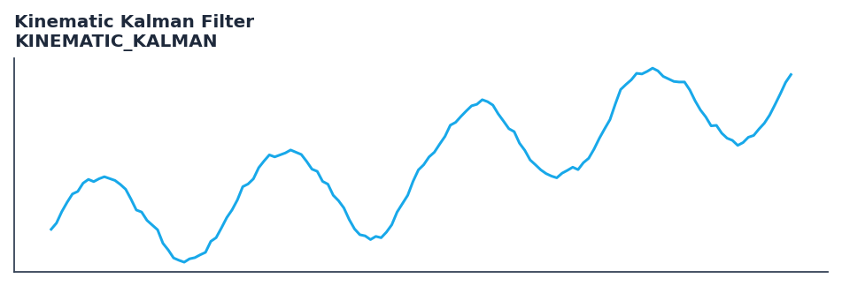

# Kinematic Kalman Filter

<div class="indicator-meta"><span class="category-badge">ML Features</span> <span class="kw-badge">kalman</span> <span class="kw-badge">adaptive</span> <span class="kw-badge">kinematic</span> <span class="kw-badge">momentum</span> <span class="kw-badge">lag-reduction</span></div>

A 2D Kalman filter tracking price and velocity to reduce lag in trends.

## Visual Example



*Synthetic ideal per library logic. Generated 2026-06-25 IST via `docs/generate_all_previews.py` (reproducible; maps to core `Next<T>` implementation).*

## Description

The Kinematic Kalman Filter indicator is a technical analysis tool that a 2d kalman filter tracking price and velocity to reduce lag in trends.

This indicator is primarily used for identifying key market conditions. It provides a robust signal that can be easily integrated into both simple strategies and more complex machine learning feature pipelines. Compared to its alternatives, it offers a distinct balance of responsiveness and stability.

Traders often combine this with other metrics to confirm signals and avoid false positives during sideways market regimes. It remains a standard tool for systematic trading models.

Optimized for trend-following strategies where lag reduction is critical. q_pos controls price sensitivity, q_vel controls momentum sensitivity, and r controls overall smoothing.

The Kinematic Kalman Filter extends the 1D model by incorporating a velocity state. This allows the filter to 'anticipate' the next price based on current momentum, providing a zero-lag-like response during strong trends while maintaining smoothness via its optimal error-correction logic.

QuantWave implements this indicator via the universal `Next<T>` trait, guaranteeing bit-identical results between Rust streaming, Python streaming, and Polars batch (`.ta()` / `map_batches`) surfaces.


## Formula / Specification

**Implementation** (`quantwave-core/src/indicators/kinematic_kalman.rs`):

\[
\hat{x}_{k|k-1} = \Phi \hat{x}_{k-1|k-1}
\]
\[
P_{k|k-1} = \Phi P_{k-1|k-1} \Phi^T + Q
\]
\[
K_k = P_{k|k-1} H^T (H P_{k|k-1} H^T + R)^{-1}
\]
\[
\hat{x}_{k|k} = \hat{x}_{k|k-1} + K_k (z_k - H \hat{x}_{k|k-1})
\]
\[
P_{k|k} = (I - K_k H) P_{k|k-1}
\]

Gold-standard parity vectors: `quantwave-core/tests/gold_standard/kinematic_kalman.json`.


## Parameters

| Parameter | Default | Description |
|-----------|---------|-------------|
| `q_pos` | 0.001 | Process noise for position (price) |
| `q_vel` | 0.0001 | Process noise for velocity (momentum) |
| `r` | 0.1 | Measurement noise (smoothing strength) |


## Usage Examples

**Streaming (Rust)**

```rust
use quantwave_core::indicators::KINEMATIC_KALMAN;
use quantwave_core::traits::Next;

let mut ind = KINEMATIC_KALMAN::new(0.001);
for price in &prices {
    let value = ind.next(price);
}
```

**Streaming (Python)**

```python
from quantwave import KINEMATIC_KALMAN

ind = KINEMATIC_KALMAN(0.001)
for price in prices:
    value = ind.next(price)
```

**Polars Batch (Python)**

```python
import polars as pl
import quantwave as qw

def apply_kinematic_kalman_filter(series: pl.Series) -> pl.Series:
    ind = qw.KINEMATIC_KALMAN(0.001)
    return pl.Series([ind.next(float(v)) for v in series.to_list()])

df = (
    pl.read_csv('ohlcv.csv')
    .lazy()
    .with_columns(
        pl.col("close").map_batches(apply_kinematic_kalman_filter, return_dtype=pl.Float64).alias("kinematic_kalman_filter")
    )
    .collect()
)
```

All surfaces are bit-identical via the single `Next<T>` implementation and proptests.

## Edge Cases & Limitations

- Warm-up: first `0.001` bars may return NaN or partial state per implementation.
- Parameter sensitivity: smaller periods increase noise; larger periods increase lag.
- Sudden gaps or bad ticks can distort rolling windows — consider pre-filtering.
- Single-series indicators ignore volume unless otherwise documented.
- Validated via proptests against gold-standard vectors where available.
- No look-ahead bias; streaming and Polars batch paths are bit-identical.

## Boundary Behavior

| Condition | Behavior |
|-----------|----------|
| Warm-up | Leading bars return NaN until warmup_bars is satisfied. |
| period > len | When period exceeds series length, output is all NaN. |
| NaN inputs | NaN in input propagates to output (NaN out). |
| Invalid params | Non-positive period or missing required params raise ValueError. |
| Empty data | Empty input returns an empty result series. |

## Related Indicators & See Also

- [Indicator Gallery](../gallery.md)
- [Native Indicators index](index.md)
- [Batch vs Streaming guide](../../../examples/batch-streaming.md)
- [RSI](relative_strength_index_rsi.md)
- [SuperTrend](supertrend/)

## Sources & References

**Primary Source**: https://www.cs.unc.edu/~welch/kalman/media/pdf/Kalman1960.pdf

**Implementation**: `quantwave-core/src/indicators/kinematic_kalman.rs` (`KINEMATIC_KALMAN` / `KINEMATIC_KALMAN_METADATA`).
**Parity**: `quantwave-core/tests/gold_standard/kinematic_kalman.json`

**Provenance**: Standards bulk upgrade 2026-06-25 IST — see `docs/DOCUMENTATION_STANDARDS.md`.
