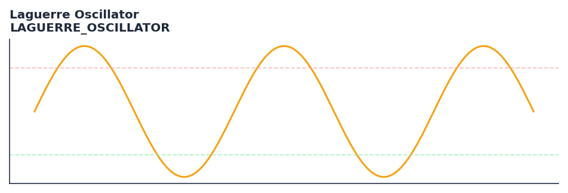

# Laguerre Oscillator

<div class="indicator-meta"><span class="category-badge">Ehlers DSP</span> <span class="kw-badge">oscillator</span> <span class="kw-badge">ehlers</span> <span class="kw-badge">dsp</span> <span class="kw-badge">laguerre</span> <span class="kw-badge">momentum</span></div>

A low-lag trend oscillator derived from Laguerre polynomials and normalized by RMS volatility.

## Visual Example



*Synthetic ideal per library logic. Generated 2026-06-25 IST via `docs/generate_all_previews.py` (reproducible; maps to core `Next<T>` implementation).*

## Description

A low-lag trend oscillator derived from Laguerre polynomials and normalized by RMS volatility.

Use to detect overbought and oversold conditions with very low lag. The single gamma parameter lets you tune it from aggressive to smooth.

Ehlers describes the Laguerre Oscillator in Cybernetic Analysis as measuring the difference between the first and last elements of a 4-element Laguerre filter bank, extracting the high-frequency component as a zero-lag momentum measure.

QuantWave implements this indicator via the universal `Next<T>` trait, guaranteeing bit-identical results between Rust streaming, Python streaming, and Polars batch (`.ta()` / `map_batches`) surfaces.

## Formula / Specification

**Implementation** (`quantwave-core/src/indicators/laguerre_oscillator.rs`):

\[
L_0 = UltimateSmoother(Close, Length)
\]
\[
L_1 = -\gamma L_0 + L_{0,t-1} + \gamma L_{1,t-1}
\]
\[
RMS = \sqrt{\frac{1}{n}\sum (L_0 - L_1)^2}
\]
\[
Osc = (L_0 - L_1) / RMS
\]

Gold-standard parity vectors: `quantwave-core/tests/gold_standard/laguerre_oscillator.json`.


## Parameters

| Parameter | Default | Description |
|-----------|---------|-------------|
| `length` | 30 | UltimateSmoother period |
| `gamma` | 0.5 | Smoothing factor |
| `rms_period` | 100 | RMS normalization period |


## Usage Examples

**Streaming (Rust)**

```rust
use quantwave_core::indicators::LAGUERRE_OSCILLATOR;
use quantwave_core::traits::Next;

let mut ind = LAGUERRE_OSCILLATOR::new(30);
for price in &prices {
    let value = ind.next(price);
}
```

**Streaming (Python)**

```python
from quantwave import LAGUERRE_OSCILLATOR

ind = LAGUERRE_OSCILLATOR(30)
for price in prices:
    value = ind.next(price)
```

**Polars Batch (Python)**

```python
import polars as pl
import quantwave as qw

def apply_laguerre_oscillator(series: pl.Series) -> pl.Series:
    ind = qw.LAGUERRE_OSCILLATOR(30)
    return pl.Series([ind.next(float(v)) for v in series.to_list()])

df = (
    pl.read_csv('ohlcv.csv')
    .lazy()
    .with_columns(
        pl.col("close").map_batches(apply_laguerre_oscillator, return_dtype=pl.Float64).alias("laguerre_oscillator")
    )
    .collect()
)
```

All surfaces are bit-identical via the single `Next<T>` implementation and proptests.

## Edge Cases & Limitations

- Recursive DSP filters require a warm-up period; first N bars may be unstable or raw-pass-through.
- Designed for cyclic/mean-reverting regimes; trending markets can produce lag or drift.
- Parameter `period` (or equivalent) controls cutoff — too small adds noise, too large adds lag.
- Prefer chaining with other Ehlers tools (Roofing Filter, SuperSmoother) on noisy inputs.
- Validated via proptests against gold-standard vectors where available.
- No look-ahead bias; suitable for live streaming and batch feature pipelines.

## Related Indicators & See Also

- [Indicator Gallery](../gallery.md)
- [Native Indicators index](index.md)
- [Ehlers DSP guide](../ehlers/index.md)
- [Cyber Cycle](cyber_cycle.md)
- [SuperSmoother](supersmoother.md)

## Sources & References

**Primary Source**: https://github.com/lavs9/quantwave/blob/main/references/traderstipsreference/TRADERS%E2%80%99%20TIPS%20-%20JULY%202025.html

**Implementation**: `quantwave-core/src/indicators/laguerre_oscillator.rs` (`LAGUERRE_OSCILLATOR` / `LAGUERRE_OSCILLATOR_METADATA`).
**Parity**: `quantwave-core/tests/gold_standard/laguerre_oscillator.json`

**Provenance**: Standards bulk upgrade 2026-06-25 IST — see `docs/DOCUMENTATION_STANDARDS.md`.
