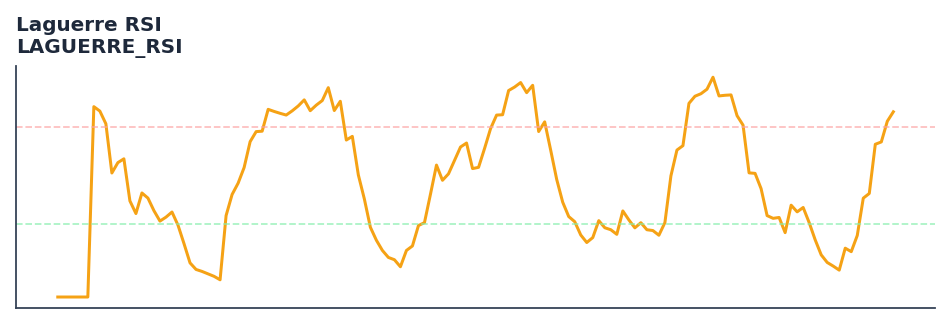

# Laguerre RSI

<div class="indicator-meta"><span class="category-badge">Ehlers DSP</span> <span class="kw-badge">oscillator</span> <span class="kw-badge">rsi</span> <span class="kw-badge">ehlers</span> <span class="kw-badge">dsp</span> <span class="kw-badge">laguerre</span> <span class="kw-badge">momentum</span></div>

RSI calculated over Laguerre-warped time for faster response.

## Visual Example



*Synthetic ideal per library logic. Generated 2026-07-01 IST via `docs/generate_all_previews.py` (reproducible; maps to core `Next<T>` implementation).*

## Description

RSI calculated over Laguerre-warped time for faster response.

Use as a faster lower-lag alternative to traditional RSI. Laguerre smoothing produces fewer whipsaws while remaining responsive to genuine momentum shifts.

Part of QuantWave's Ehlers digital signal processing suite. Designed for low-lag cycle and trend work — pair with Roofing Filter or SuperSmoother on noisy inputs.

Ehlers constructs the Laguerre RSI in Cybernetic Analysis by computing RSI on the four outputs of a Laguerre filter bank. The result has RSI-like scaling (0 to 1) but dramatically less lag and smoother behaviour than conventional RSI.

**Typical applications:**

- Use for cycle timing in mean-reverting regimes
- Gate with Hurst exponent or ADX before taking cycle signals
- Allow `0.5`+ bars warm-up for filter state to stabilise
- Chain with Roofing Filter when input is noisy

QuantWave implements this via the universal `Next<T>` trait — bit-identical across Rust streaming, Python streaming, and Polars `.ta()` batch plugins.

## Formula / Specification

**Implementation** (`quantwave-core/src/indicators/laguerre_rsi.rs`):

\[
L_0 = (1 - \gamma) \cdot Close + \gamma \cdot L_{0,t-1}
\]
\[
L_1 = -\gamma L_0 + L_{0,t-1} + \gamma L_{1,t-1}
\]
\[
L_2 = -\gamma L_1 + L_{1,t-1} + \gamma L_{2,t-1}
\]
\[
L_3 = -\gamma L_2 + L_{2,t-1} + \gamma L_{3,t-1}
\]
\[
CU = \sum \max(L_{i} - L_{i+1}, 0)
\]
\[
CD = \sum \max(L_{i+1} - L_{i}, 0)
\]
\[
RSI = \frac{CU}{CU + CD}
\]

Gold-standard parity vectors: `quantwave-core/tests/gold_standard/laguerre_rsi.json`.


## Parameters

| Parameter | Default | Description |
|-----------|---------|-------------|
| `gamma` | 0.5 | Smoothing factor (0.0 to 1.0) |


## Usage Examples

**Streaming (Rust)**

```rust
use quantwave_core::indicators::LAGUERRE_RSI;
use quantwave_core::traits::Next;

let mut ind = LAGUERRE_RSI::new(0.5);
for price in &prices {
    let value = ind.next(price);
}
```

**Streaming (Python)**

```python
from quantwave import LAGUERRE_RSI

ind = LAGUERRE_RSI(0.5)
for price in prices:
    value = ind.next(price)
```

**Polars Batch (Python)**

```python
import polars as pl
import quantwave as qw

def apply_laguerre_rsi(series: pl.Series) -> pl.Series:
    ind = qw.LAGUERRE_RSI(0.5)
    return pl.Series([ind.next(float(v)) for v in series.to_list()])

df = (
    pl.read_csv('ohlcv.csv')
    .lazy()
    .with_columns(
        pl.col("close").map_batches(apply_laguerre_rsi, return_dtype=pl.Float64).alias("laguerre_rsi")
    )
    .collect()
)
```

All surfaces are bit-identical via the single `Next<T>` implementation and proptests.

## Edge Cases & Limitations

- Recursive DSP filters require a warm-up period; first N bars may be unstable or raw-pass-through.
- Designed for cyclic/mean-reverting regimes; trending markets can produce lag or drift.
- Parameter `period` (or equivalent) controls cutoff — too small adds noise, too large adds lag.
- Prefer chaining with other Ehlers tools (Roofing Filter, SuperSmoother) on noisy inputs.
- Validated via proptests against gold-standard vectors where available.
- No look-ahead bias; suitable for live streaming and batch feature pipelines.

## Boundary Behavior

| Condition | Behavior |
|-----------|----------|
| Warm-up | Leading bars return NaN until warmup_bars is satisfied. |
| period > len | When period exceeds series length, output is all NaN. |
| NaN inputs | NaN in input propagates to output (NaN out). |
| Invalid params | Non-positive period or missing required params raise ValueError. |
| Empty data | Empty input returns an empty result series. |

## Related Indicators & See Also

- [Indicator Gallery](../gallery.md)
- [Native Indicators index](index.md)
- [Ehlers DSP guide](../ehlers/index.md)
- [Cyber Cycle](cyber_cycle.md)
- [SuperSmoother](supersmoother.md)

## Sources & References

**Primary Source**: https://github.com/lavs9/quantwave/blob/main/references/Ehlers%20Papers/TimeWarp.pdf

**Implementation**: `quantwave-core/src/indicators/laguerre_rsi.rs` (`LAGUERRE_RSI` / `LAGUERRE_RSI_METADATA`).
**Parity**: `quantwave-core/tests/gold_standard/laguerre_rsi.json`

**Provenance**: Standards bulk upgrade 2026-07-01 IST — see `docs/DOCUMENTATION_STANDARDS.md`.
