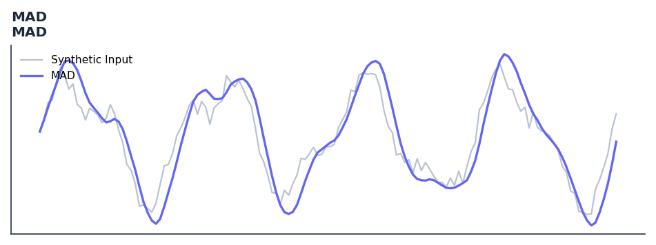

# MAD

<div class="indicator-meta"><span class="category-badge">Ehlers DSP</span> <span class="kw-badge">volatility</span> <span class="kw-badge">statistics</span> <span class="kw-badge">robust</span> <span class="kw-badge">ehlers</span></div>

Moving Average Difference: 100 * (SMA(short) - SMA(long)) / SMA(long)

## Visual Example



*Synthetic ideal per library logic. Generated 2026-07-01 IST via `docs/generate_all_previews.py` (reproducible; maps to core `Next<T>` implementation).*

## Description

Moving Average Difference: 100 * (SMA(short) - SMA(long)) / SMA(long)

Use as a robust volatility measure when outliers or fat-tailed distributions would distort standard deviation. Works well for position sizing and volatility-based stop placement.

Part of QuantWave's Ehlers digital signal processing suite. Designed for low-lag cycle and trend work — pair with Roofing Filter or SuperSmoother on noisy inputs.

Mean Absolute Deviation measures dispersion as the average absolute difference from the median rather than the squared difference from the mean used by standard deviation. It is less sensitive to outliers, making it a more robust volatility estimate for financial time series with fat tails.

**Typical applications:**

- Use for cycle timing in mean-reverting regimes
- Gate with Hurst exponent or ADX before taking cycle signals
- Allow `8`+ bars warm-up for filter state to stabilise
- Chain with Roofing Filter when input is noisy

QuantWave implements this via the universal `Next<T>` trait — bit-identical across Rust streaming, Python streaming, and Polars `.ta()` batch plugins.

## Formula / Specification

**Implementation** (`quantwave-core/src/indicators/mad.rs`):

\[
MAD = 100 \times \frac{SMA(short) - SMA(long)}{SMA(long)}
\]

Gold-standard parity vectors: `quantwave-core/tests/gold_standard/mad.json`.


## Parameters

| Parameter | Default | Description |
|-----------|---------|-------------|
| `short_period` | 8 | Short-term SMA period |
| `long_period` | 23 | Long-term SMA period |


## Usage Examples

**Streaming (Rust)**

```rust
use quantwave_core::indicators::MAD;
use quantwave_core::traits::Next;

let mut ind = MAD::new(8);
for price in &prices {
    let value = ind.next(price);
}
```

**Streaming (Python)**

```python
from quantwave import MAD

ind = MAD(8)
for price in prices:
    value = ind.next(price)
```

**Polars Batch (Python)**

```python
import polars as pl
import quantwave as qw

def apply_mad(series: pl.Series) -> pl.Series:
    ind = qw.MAD(8)
    return pl.Series([ind.next(float(v)) for v in series.to_list()])

df = (
    pl.read_csv('ohlcv.csv')
    .lazy()
    .with_columns(
        pl.col("close").map_batches(apply_mad, return_dtype=pl.Float64).alias("mad")
    )
    .collect()
)
```

All surfaces are bit-identical via the single `Next<T>` implementation and proptests.

## Edge Cases & Limitations

- Recursive DSP filters require a warm-up period; first N bars may be unstable or raw-pass-through.
- Designed for cyclic/mean-reverting regimes; trending markets can produce lag or drift.
- Parameter `period` (or equivalent) controls cutoff — too small adds noise, too large adds lag.
- Prefer chaining with other Ehlers tools (Roofing Filter, SuperSmoother) on noisy inputs.
- Validated via proptests against gold-standard vectors where available.
- No look-ahead bias; suitable for live streaming and batch feature pipelines.

## Boundary Behavior

| Condition | Behavior |
|-----------|----------|
| Warm-up | Leading bars return NaN until warmup_bars is satisfied. |
| period > len | When period exceeds series length, output is all NaN. |
| NaN inputs | NaN in input propagates to output (NaN out). |
| Invalid params | Non-positive period or missing required params raise ValueError. |
| Empty data | Empty input returns an empty result series. |

## Related Indicators & See Also

- [Indicator Gallery](../gallery.md)
- [Native Indicators index](index.md)
- [Ehlers DSP guide](../ehlers/index.md)
- [Cyber Cycle](cyber_cycle.md)
- [SuperSmoother](supersmoother.md)

## Sources & References

**Primary Source**: https://github.com/lavs9/quantwave/blob/main/references/traderstipsreference/TRADERS’ TIPS - OCTOBER 2021.html

**Implementation**: `quantwave-core/src/indicators/mad.rs` (`MAD` / `MAD_METADATA`).
**Parity**: `quantwave-core/tests/gold_standard/mad.json`

**Provenance**: Standards bulk upgrade 2026-07-01 IST — see `docs/DOCUMENTATION_STANDARDS.md`.
