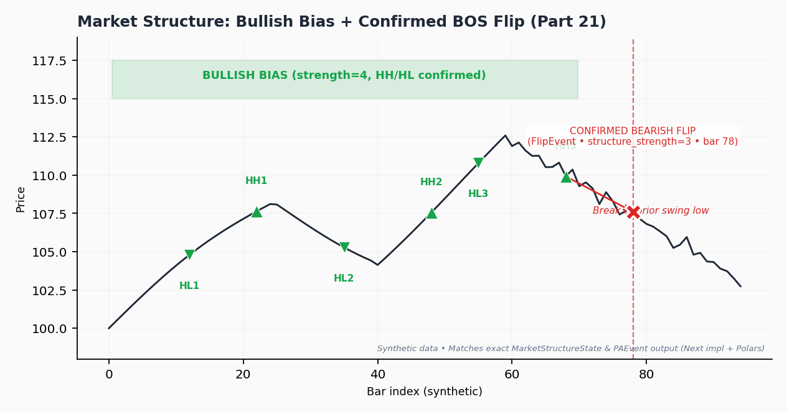

# Market Structure (Swings + Confirmed Break of Structure)

<div class="indicator-meta"><span class="category-badge">Price Action</span> <span class="kw-badge">structure</span> <span class="kw-badge">bos</span> <span class="kw-badge">swing</span> <span class="kw-badge">bias</span> <span class="kw-badge">mql5</span></div>

**Date**: 2026-05-31 IST  
**Sources**: MQL5 Price Action Analysis Toolkit (Part 21) — "Market Structure Flip Detector" by lynnchris. Article: https://www.mql5.com/en/articles/17891. Archived implementation: `references/MQL5/lynnchris/implemented/Part21/Flip_Detector.mq5`. Core implementation in `quantwave-core/src/indicators/market_structure.rs` (with `PAEvent` adapters).

Market Structure is the foundational detector in QuantWave's Price Action suite. It identifies adaptive swing points (higher-highs, higher-lows, etc.) and tracks directional **bias** (Bullish / Bearish / Neutral) while emitting only **confirmed** Break-of-Structure (BOS) flips — those that occur after bias has been established (structure count ≥ 2). This design dramatically reduces noise compared to naive swing or fractal detectors.

## When to Use

- As the primary filter/gate for all other PA signals (Flags, H&S, S/R interactions).
- To establish trend regime in a clean, rule-based way without lagging moving averages.
- For high-quality entry triggers on confirmed BOS flips (e.g., first bearish flip after a series of bullish swings signals potential reversal).
- In strategies that require "structure confirmation" before acting on patterns or breakouts.
- For ML feature engineering: bias state, structure strength at events, and flip occurrences are extremely predictive when joined with regime or cycle features.

**Do not use** for raw every-swing signals — the confirmed-only rule is intentional (per the MQL5 Part 21 methodology).

## Rich Metadata & Output

The streaming `MarketStructure` and Polars `.ta.market_structure()` both return a rich `MarketStructureState` (exposed as nested Struct in Polars):

- `bias`: Bullish | Bearish | Neutral (String in Polars)
- `last_swing_high`, `last_swing_low`: Optional `SwingPoint` { bar, price, is_high }
- `current_flip`: Optional `FlipEvent` { is_bearish, price, bar, structure_strength }
- `has_current_flip`: Boolean convenience (Polars) for easy event filtering
- `swing_depth_used`, `bar_index`

**FlipEvent** carries `structure_strength` (consecutive HH/HL or LL/LH count before the breaking swing). Higher strength = more established structure before the flip.

**Visual: Confirmed Bullish Structure + BOS Flip**  
Imagine a price series making a sequence of higher highs and higher lows (e.g., swings at bars 10, 25, 40, 55). Bias turns Bullish after the second HL/HH. Later, a lower-high swing breaks the prior swing low at bar 87 — this emits a confirmed bearish `FlipEvent` with `structure_strength=4`. Only this high-quality flip is surfaced; earlier noisy swings are ignored.



*See also the fuller annotated examples and code in the [Price Action Patterns guide](../../../examples/notebooks/pa_flag_breakout_strategy.md). Visual generated as part of the p1k6 documentation professionalization effort.*

## Practical Code Examples

### Rust Streaming (`Next` trait — single source of truth)

```rust
use quantwave_core::indicators::market_structure::MarketStructure;
use quantwave_core::traits::Next;

let mut ms = MarketStructure::new(3);  // swing_strength = 3 (common default; matches many MQL5 examples)

for (h, l) in highs.iter().zip(lows.iter()) {
    let state = ms.next((*h, *l));
    if let Some(flip) = &state.current_flip {
        if state.bias == quantwave_core::indicators::market_structure::Bias::Bullish {
            // High-quality bearish BOS flip after established bullish structure
            println!("Confirmed BOS flip at bar {} (strength {})", flip.bar, flip.structure_strength);
        }
    }
}
```

### Polars Batch (research, feature generation, backtesting)

```python
import polars as pl
import quantwave as qw  # or from polars import col; use .ta() extension

df = (
    pl.DataFrame({"high": highs, "low": lows})
    .lazy()
    .ta.market_structure("high", "low", swing_strength=3)
    .collect()
)

# Extract only bars with confirmed flips (the events)
flips = df.filter(
    pl.col("market_structure").struct.field("has_current_flip")
)

# Rich access
print(flips.select([
    pl.col("market_structure").struct.field("bias"),
    pl.col("market_structure").struct.field("current_flip").struct.field("structure_strength"),
]))
```

### Python Streaming (convenience wrapper, parity with Rust)

```python
from quantwave import MarketStructure

ms = MarketStructure(3)  # swing_strength

for h, l in zip(highs, lows):
    state = ms.next(h, l)  # returns MarketStructureStateResult (bias as int: 0=Neutral,1=Bullish,2=Bearish)
    if state.current_flip:
        print(f"Flip at bar {state.current_flip.bar}, strength={state.current_flip.structure_strength}")
```

**Note on Python bindings**: Bias is encoded as integer for FFI (0/1/2). Full rich structs (including all SwingPoint/FlipEvent fields) are available. For maximum field richness in research, prefer the Polars path.

## Strategy Integration Example (Sizing & Filtering)

Use Market Structure as the bias gate:

```python
# Pseudocode inside your strategy loop or Polars expression
if (state.bias == "Bullish" and
    flag.breakout_confirmed and
    recent_flip is None):   # avoid entering right on a structure flip
    # Proceed with long flag breakout
    pass
```

See the companion notebook for complete examples combining with geometric patterns and regime filters.

## ML / Feature Engineering Ideas

- `ms_bias_bullish` (boolean or one-hot)
- `structure_strength_at_event` (from last flip or current state)
- `bars_since_last_flip`
- `is_bullish_structure` (derived from consecutive counts)
- Event-aligned joins: at every BOS flip bar, pull concurrent values of Trendflex, Hurst, HMM regime probability, etc.

Because of **guaranteed streaming ↔ batch parity** (proptests in `quantwave-core/tests/`), features engineered on historical Polars batches transfer **directly** to live streaming inference with zero drift.

## Parameters

- `swing_strength` (default: 3): Radius (in bars) for local extremum detection. Higher values produce smoother, less frequent swings. (In the original MQL5 Part 21, this is often derived dynamically from ATR × multiplier; the fixed-bar version here ensures clean streaming parity while remaining highly effective.)

**Metadata source of truth**: `MARKET_STRUCTURE_METADATA` in `market_structure.rs` (includes LaTeX sketch of swing logic and formula_source link).

## Related

- [Geometric Patterns (Flags + H&S)](geometric_patterns.md) — built directly on this foundation
- [S/R Interactions](sr_monitor.md)
- [Using Rich PA Events for Strategies & ML](pa_events_strategies.md)
- Main strategy notebook: [Price Action Patterns: Market Structure, Flags, H&S, S/R](../../../examples/notebooks/pa_flag_breakout_strategy.md)
- MQL5 Part 21 (foundation): https://www.mql5.com/en/articles/17891
- Full native indicators list: [Native Indicators index](index.md)

All PA components ship with property-based tests asserting bit-identical results between streaming and batch replay.
