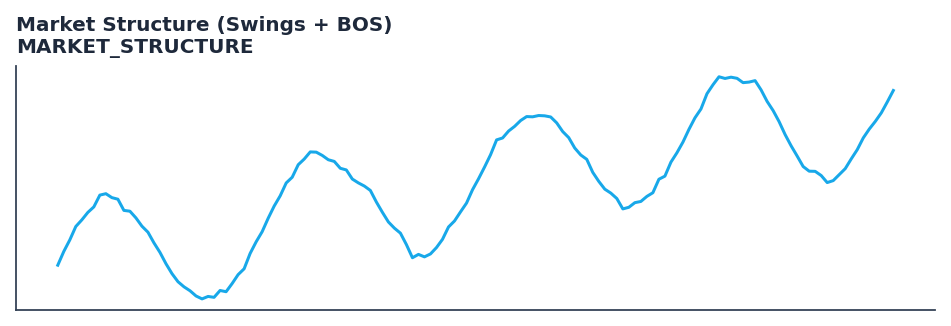

# Market Structure (Swings + BOS)

<div class="indicator-meta"><span class="category-badge">Price Action</span> <span class="kw-badge">price-action</span> <span class="kw-badge">structure</span> <span class="kw-badge">swing</span> <span class="kw-badge">bos</span> <span class="kw-badge">market-structure</span> <span class="kw-badge">mql5</span></div>

Adaptive swing detection with ATR-derived depth + bias tracking and confirmed Break of Structure flips (HH/HL/LL/LH). Foundation for geometric PA patterns (Flags, H&S) and S/R monitoring from the MQL5 lynnchris toolkit (Part 21).

## Visual Example



*Synthetic ideal per library logic. Generated 2026-07-01 IST via `docs/generate_all_previews.py` (reproducible; maps to core `Next<T>` implementation).*

## Description

Adaptive swing detection with ATR-derived depth + bias tracking and confirmed Break of Structure flips (HH/HL/LL/LH). Foundation for geometric PA patterns (Flags, H&S) and S/R monitoring from the MQL5 lynnchris toolkit (Part 21).

Use .ta.market_structure() or the Rust struct for rich PA events. Bias and flips feed position sizing, regime filters, and confluence with ML features / Ehlers regimes. Emit as Struct for backtester consumption.

Not Ehlers DSP; classical PA structure from MQL5 series. See Part 21 for ATR-adaptive depth swings and confirmed flips only after bias (avoids premature signals).

QuantWave implements this indicator via the universal `Next<T>` trait, guaranteeing bit-identical results between Rust streaming, Python streaming, and Polars batch (`.ta()` / `map_batches`) surfaces.

## Formula / Specification

**Implementation** (`market_structure`):

\text{depth} = \max(1, \lfloor \text{ATR} \times \text{mult} \times \text{loosen} / \text{point} \rfloor)
\text{IsSwingHigh}(shift, depth) = \forall i \in [shift-depth, shift+depth], i \ne shift: High_i \le High_{shift}


## Parameters

| Parameter | Default | Description |
|-----------|---------|-------------|
| `swing_strength` | 3 | Bar window radius for local extremum (depth). Part 21 derives this from ATR*mult; fixed here for streaming parity + immediate use (see source Flip_Detector.mq5:150). |


## Usage Examples

**Streaming (Rust)**

```rust
use quantwave_core::indicators::MarketStructure;
use quantwave_core::traits::Next;

let mut ind = MarketStructure::new(3);
for price in &prices {
    let value = ind.next(price);
}
```

**Streaming (Python)**

```python
from quantwave import MarketStructure

ind = MarketStructure(3)
for price in prices:
    value = ind.next(price)
```

**Polars Batch (Python)**

```python
import polars as pl
import quantwave as qw

def apply_market_structure_swings_bos(series: pl.Series) -> pl.Series:
    ind = qw.MarketStructure(3)
    return pl.Series([ind.next(float(v)) for v in series.to_list()])

df = (
    pl.read_csv('ohlcv.csv')
    .lazy()
    .with_columns(
        pl.col("close").map_batches(apply_market_structure_swings_bos, return_dtype=pl.Float64).alias("market_structure_swings_bos")
    )
    .collect()
)
```

All surfaces are bit-identical via the single `Next<T>` implementation and proptests.

## Edge Cases & Limitations

- Warm-up: first `3` bars may return NaN or partial state per implementation.
- Parameter sensitivity: smaller periods increase noise; larger periods increase lag.
- Sudden gaps or bad ticks can distort rolling windows — consider pre-filtering.
- Single-series indicators ignore volume unless otherwise documented.
- Validated via proptests against gold-standard vectors where available.
- No look-ahead bias; streaming and Polars batch paths are bit-identical.

## Boundary Behavior

| Condition | Behavior |
|-----------|----------|
| Warm-up | Early bars return empty event lists or default structs (no scalar NaN). |
| period > len | Insufficient history yields no events rather than NaN scalars. |
| NaN inputs | NaN OHLC typically suppresses event detection for that bar. |
| Invalid params | Invalid swing_strength or tolerance raises ValueError. |
| Empty data | Empty input returns empty event collections. |

## Related Indicators & See Also

- [Indicator Gallery](../gallery.md)
- [Native Indicators index](index.md)
- [Batch vs Streaming guide](../../../examples/batch-streaming.md)
- [RSI](relative_strength_index_rsi.md)
- [SuperTrend](supertrend/)

## Sources & References

**Primary Source**: https://www.mql5.com/en/articles/17891 (Part 21) + cross Part 66/69/67

**Implementation**: `quantwave-core/src/indicators/market_structure` (`MarketStructure` / `_METADATA`).

**Provenance**: Standards bulk upgrade 2026-07-01 IST — see `docs/DOCUMENTATION_STANDARDS.md`.
