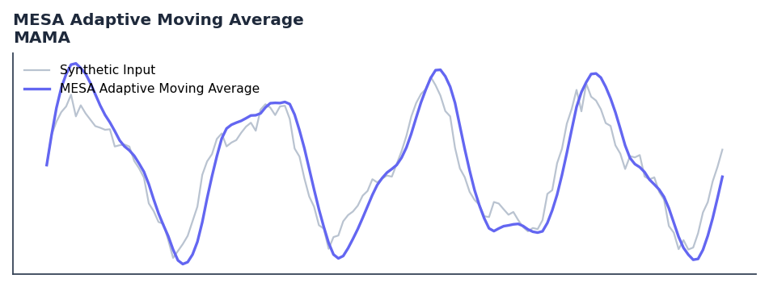

# MESA Adaptive Moving Average

<div class="indicator-meta"><span class="category-badge">Ehlers DSP</span> <span class="kw-badge">moving-average</span> <span class="kw-badge">adaptive</span> <span class="kw-badge">ehlers</span> <span class="kw-badge">dsp</span> <span class="kw-badge">trend</span></div>

MAMA adapts to price movement in an entirely new and unique way based on the rate change of phase.

## Visual Example



*Synthetic ideal per library logic. Generated 2026-06-25 IST via `docs/generate_all_previews.py` (reproducible; maps to core `Next<T>` implementation).*

## Description

MAMA adapts to price movement in an entirely new and unique way based on the rate change of phase.

Use as an adaptive trend filter that automatically speeds up in fast markets and slows in choppy ones. The FAMA line crossing MAMA provides high-probability trend change signals.

Presented in Rocket Science for Traders (2001), MAMA adapts its alpha based on the rate of phase change measured by the Hilbert Transform Discriminator. Fast cycles produce large alpha for responsiveness; slow cycles produce small alpha to reduce noise.

QuantWave implements this indicator via the universal `Next<T>` trait, guaranteeing bit-identical results between Rust streaming, Python streaming, and Polars batch (`.ta()` / `map_batches`) surfaces.

## Formula / Specification

**Implementation** (`quantwave-core/src/indicators/mama.rs`):

\[
\text{MAMA} = \alpha \cdot \text{Price} + (1 - \alpha) \cdot \text{MAMA}_{1}
\]
\[
\text{FAMA} = 0.5\alpha \cdot \text{MAMA} + (1 - 0.5\alpha) \cdot \text{FAMA}_{1}
\]

Gold-standard parity vectors: `quantwave-core/tests/gold_standard/mama.json`.


## Parameters

| Parameter | Default | Description |
|-----------|---------|-------------|
| `fast_limit` | 0.5 | Fast limit for alpha |
| `slow_limit` | 0.05 | Slow limit for alpha |


## Usage Examples

**Streaming (Rust)**

```rust
use quantwave_core::indicators::MAMA;
use quantwave_core::traits::Next;

let mut ind = MAMA::new(0.5);
for price in &prices {
    let value = ind.next(price);
}
```

**Streaming (Python)**

```python
from quantwave import MAMA

ind = MAMA(0.5)
for price in prices:
    value = ind.next(price)
```

**Polars Batch (Python)**

```python
import polars as pl
import quantwave as qw

def apply_mesa_adaptive_moving_average(series: pl.Series) -> pl.Series:
    ind = qw.MAMA(0.5)
    return pl.Series([ind.next(float(v)) for v in series.to_list()])

df = (
    pl.read_csv('ohlcv.csv')
    .lazy()
    .with_columns(
        pl.col("close").map_batches(apply_mesa_adaptive_moving_average, return_dtype=pl.Float64).alias("mesa_adaptive_moving_average")
    )
    .collect()
)
```

All surfaces are bit-identical via the single `Next<T>` implementation and proptests.

## Edge Cases & Limitations

- Recursive DSP filters require a warm-up period; first N bars may be unstable or raw-pass-through.
- Designed for cyclic/mean-reverting regimes; trending markets can produce lag or drift.
- Parameter `period` (or equivalent) controls cutoff — too small adds noise, too large adds lag.
- Prefer chaining with other Ehlers tools (Roofing Filter, SuperSmoother) on noisy inputs.
- Validated via proptests against gold-standard vectors where available.
- No look-ahead bias; suitable for live streaming and batch feature pipelines.

## Related Indicators & See Also

- [Indicator Gallery](../gallery.md)
- [Native Indicators index](index.md)
- [Ehlers DSP guide](../ehlers/index.md)
- [Cyber Cycle](cyber_cycle.md)
- [SuperSmoother](supersmoother.md)

## Sources & References

**Primary Source**: https://github.com/lavs9/quantwave/blob/main/references/Ehlers%20Papers/implemented/MAMA.pdf

**Implementation**: `quantwave-core/src/indicators/mama.rs` (`MAMA` / `MAMA_METADATA`).
**Parity**: `quantwave-core/tests/gold_standard/mama.json`

**Provenance**: Standards bulk upgrade 2026-06-25 IST — see `docs/DOCUMENTATION_STANDARDS.md`.
