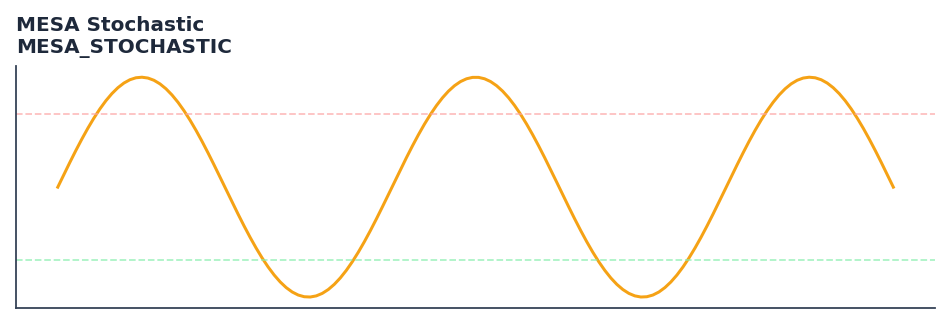

# MESA Stochastic

<div class="indicator-meta"><span class="category-badge">Ehlers DSP</span> <span class="kw-badge">oscillator</span> <span class="kw-badge">stochastic</span> <span class="kw-badge">ehlers</span> <span class="kw-badge">cycle</span> <span class="kw-badge">adaptive</span></div>

Standard Stochastic calculation applied to Roofing Filtered data, followed by SuperSmoothing.

## Visual Example



*Synthetic ideal per library logic. Generated 2026-06-25 IST via `docs/generate_all_previews.py` (reproducible; maps to core `Next<T>` implementation).*

## Description

The MESA Stochastic indicator is a technical analysis tool that standard stochastic calculation applied to roofing filtered data, followed by supersmoothing.

This indicator is primarily used for identifying key market conditions. It provides a robust signal that can be easily integrated into both simple strategies and more complex machine learning feature pipelines. Compared to its alternatives, it offers a distinct balance of responsiveness and stability.

Traders often combine this with other metrics to confirm signals and avoid false positives during sideways market regimes. It remains a standard tool for systematic trading models.

Use as a cycle-synchronized stochastic that automatically scales its lookback to the measured dominant cycle period for consistent overbought/oversold signals.

The MESA Stochastic extends Ehlers adaptive stochastic concept by using the MESA-measured dominant cycle period as the lookback window. Unlike traditional stochastics with fixed periods, it adapts to the current market rhythm, keeping the oscillator calibrated to one full cycle at all times.

QuantWave implements this indicator via the universal `Next<T>` trait, guaranteeing bit-identical results between Rust streaming, Python streaming, and Polars batch (`.ta()` / `map_batches`) surfaces.


## Formula / Specification

**Implementation** (`quantwave-core/src/indicators/mesa_stochastic.rs`):

\[
Filt = \text{RoofingFilter}(Price, P_{hp}, P_{ss})
\]
\[
Stoc = \frac{Filt - \min(Filt, L)}{\max(Filt, L) - \min(Filt, L)}
\]
\[
MESAStoch = \text{SuperSmoother}(Stoc \times 100, P_{ss})
\]

Gold-standard parity vectors: `quantwave-core/tests/gold_standard/mesa_stochastic.json`.


## Parameters

| Parameter | Default | Description |
|-----------|---------|-------------|
| `length` | 20 | Stochastic lookback length |
| `hp_period` | 48 | HighPass critical period |
| `ss_period` | 10 | SuperSmoother critical period |


## Usage Examples

**Streaming (Rust)**

```rust
use quantwave_core::indicators::MESA_STOCHASTIC;
use quantwave_core::traits::Next;

let mut ind = MESA_STOCHASTIC::new(20);
for price in &prices {
    let value = ind.next(price);
}
```

**Streaming (Python)**

```python
from quantwave import MESA_STOCHASTIC

ind = MESA_STOCHASTIC(20)
for price in prices:
    value = ind.next(price)
```

**Polars Batch (Python)**

```python
import polars as pl
import quantwave as qw

def apply_mesa_stochastic(series: pl.Series) -> pl.Series:
    ind = qw.MESA_STOCHASTIC(20)
    return pl.Series([ind.next(float(v)) for v in series.to_list()])

df = (
    pl.read_csv('ohlcv.csv')
    .lazy()
    .with_columns(
        pl.col("close").map_batches(apply_mesa_stochastic, return_dtype=pl.Float64).alias("mesa_stochastic")
    )
    .collect()
)
```

All surfaces are bit-identical via the single `Next<T>` implementation and proptests.

## Edge Cases & Limitations

- Recursive DSP filters require a warm-up period; first N bars may be unstable or raw-pass-through.
- Designed for cyclic/mean-reverting regimes; trending markets can produce lag or drift.
- Parameter `period` (or equivalent) controls cutoff — too small adds noise, too large adds lag.
- Prefer chaining with other Ehlers tools (Roofing Filter, SuperSmoother) on noisy inputs.
- Validated via proptests against gold-standard vectors where available.
- No look-ahead bias; suitable for live streaming and batch feature pipelines.

## Boundary Behavior

| Condition | Behavior |
|-----------|----------|
| Warm-up | Leading bars return NaN until warmup_bars is satisfied. |
| period > len | When period exceeds series length, output is all NaN. |
| NaN inputs | NaN in input propagates to output (NaN out). |
| Invalid params | Non-positive period or missing required params raise ValueError. |
| Empty data | Empty input returns an empty result series. |

## Related Indicators & See Also

- [Indicator Gallery](../gallery.md)
- [Native Indicators index](index.md)
- [Ehlers DSP guide](../ehlers/index.md)
- [Cyber Cycle](cyber_cycle.md)
- [SuperSmoother](supersmoother.md)

## Sources & References

**Primary Source**: https://github.com/lavs9/quantwave/blob/main/references/Ehlers%20Papers/Anticipating%20Turning%20Points.pdf

**Implementation**: `quantwave-core/src/indicators/mesa_stochastic.rs` (`MESA_STOCHASTIC` / `MESA_STOCHASTIC_METADATA`).
**Parity**: `quantwave-core/tests/gold_standard/mesa_stochastic.json`

**Provenance**: Standards bulk upgrade 2026-06-25 IST — see `docs/DOCUMENTATION_STANDARDS.md`.
