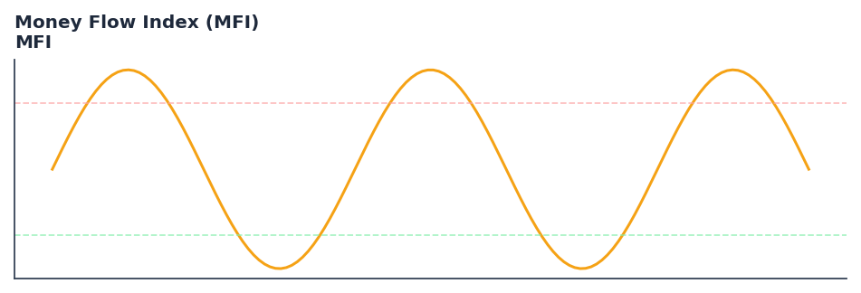

# Money Flow Index (MFI)

<div class="indicator-meta"><span class="category-badge">Classic</span> <span class="kw-badge">momentum</span> <span class="kw-badge">volume</span> <span class="kw-badge">oscillator</span> <span class="kw-badge">classic</span></div>

A technical oscillator that uses price and volume data for identifying overbought or oversold signals.

## Visual Example



*Synthetic ideal per library logic. Generated 2026-07-01 IST via `docs/generate_all_previews.py` (reproducible; maps to core `Next<T>` implementation).*

## Description

A technical oscillator that uses price and volume data for identifying overbought or oversold signals.

Use as a volume-weighted RSI. Divergences between MFI and price can signal potential reversals, especially when the MFI is in extreme territory (>80 or <20).

Native Rust implementation with gold-standard or TA-Lib parity tests where applicable.

The Money Flow Index (MFI) is a momentum indicator that measures the inflow and outflow of money into an asset over a specific period of time. It is related to the RSI but incorporates volume, whereas the RSI only considers price. — Investopedia

**Typical applications:**

- Fade extremes in ranges; trade with trend on recoveries from oversold/overbought
- Use divergences as early warning — confirm with structure or volume
- Parameter default `14` — shorten for sensitivity, lengthen for stability
- Drop into `build_feature_matrix()` for ML research

QuantWave implements this via the universal `Next<T>` trait — bit-identical across Rust streaming, Python streaming, and Polars `.ta()` batch plugins.

## Formula / Specification

**Implementation** (`quantwave-core/src/indicators/momentum.rs`):

\[
\text{Money Ratio} = \frac{\text{Positive Money Flow}}{\text{Negative Money Flow}} \\ MFI = 100 - \frac{100}{1 + \text{Money Ratio}}
\]

Gold-standard parity vectors: `quantwave-core/tests/gold_standard/mfi.json`.


## Parameters

| Parameter | Default | Description |
|-----------|---------|-------------|
| `timeperiod` | 14 | Lookback period |


## Usage Examples

**Streaming (Rust)**

```rust
use quantwave_core::indicators::MFI;
use quantwave_core::traits::Next;

let mut ind = MFI::new(14);
for price in &prices {
    let value = ind.next(price);
}
```

**Streaming (Python)**

```python
from quantwave import MFI

ind = MFI(14)
for price in prices:
    value = ind.next(price)
```

**Polars Batch (Python)**

```python
import polars as pl
import quantwave as qw

def apply_money_flow_index_mfi(series: pl.Series) -> pl.Series:
    ind = qw.MFI(14)
    return pl.Series([ind.next(float(v)) for v in series.to_list()])

df = (
    pl.read_csv('ohlcv.csv')
    .lazy()
    .with_columns(
        pl.col("close").map_batches(apply_money_flow_index_mfi, return_dtype=pl.Float64).alias("money_flow_index_mfi")
    )
    .collect()
)
```

All surfaces are bit-identical via the single `Next<T>` implementation and proptests.

## Edge Cases & Limitations

- Warm-up: first `14` bars may return NaN or partial state per implementation.
- Parameter sensitivity: smaller periods increase noise; larger periods increase lag.
- Sudden gaps or bad ticks can distort rolling windows — consider pre-filtering.
- Single-series indicators ignore volume unless otherwise documented.
- Validated via proptests against gold-standard vectors where available.
- No look-ahead bias; streaming and Polars batch paths are bit-identical.

## Boundary Behavior

| Condition | Behavior |
|-----------|----------|
| Warm-up | Leading bars return NaN until warmup_bars is satisfied. |
| period > len | When period exceeds series length, output is all NaN. |
| NaN inputs | NaN in input propagates to output (NaN out). |
| Invalid params | Non-positive period or missing required params raise ValueError. |
| Empty data | Empty input returns an empty result series. |

## Related Indicators & See Also

- [Indicator Gallery](../gallery.md)
- [Native Indicators index](index.md)
- [Batch vs Streaming guide](../../../examples/batch-streaming.md)
- [RSI](relative_strength_index_rsi.md)
- [SuperTrend](supertrend/)

## Sources & References

**Primary Source**: https://www.investopedia.com/terms/m/mfi.asp

**Implementation**: `quantwave-core/src/indicators/momentum.rs` (`MFI` / `MFI_METADATA`).
**Parity**: `quantwave-core/tests/gold_standard/mfi.json`

**Provenance**: Standards bulk upgrade 2026-07-01 IST — see `docs/DOCUMENTATION_STANDARDS.md`.
