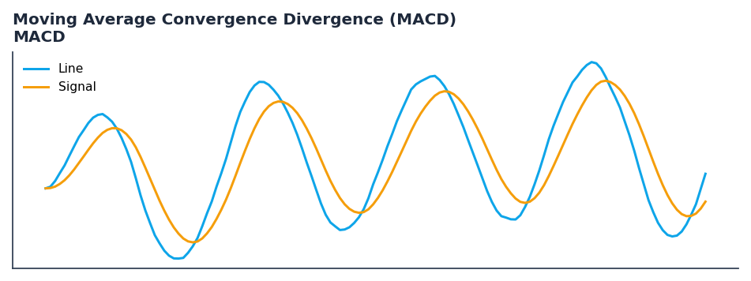

# Moving Average Convergence Divergence (MACD)

<div class="indicator-meta"><span class="category-badge">Classic</span> <span class="kw-badge">trend</span> <span class="kw-badge">momentum</span> <span class="kw-badge">moving-average</span> <span class="kw-badge">classic</span></div>

A trend-following momentum indicator that shows the relationship between two moving averages.

## Visual Example



*Synthetic ideal per library logic. Generated 2026-06-25 IST via `docs/generate_all_previews.py` (reproducible; maps to core `Next<T>` implementation).*

## Description

A trend-following momentum indicator that shows the relationship between two moving averages.

Use to identify trend direction and momentum. Crossovers of the MACD line and signal line provide entry and exit signals, while the histogram shows the strength of the trend.

Gerald Appel developed the MACD in the late 1970s. It is calculated by subtracting the 26-period EMA from the 12-period EMA. A nine-day EMA of the MACD, called the 'signal line,' is then plotted on top of the MACD line, which can function as a trigger for buy and sell signals. — Investopedia

QuantWave implements this indicator via the universal `Next<T>` trait, guaranteeing bit-identical results between Rust streaming, Python streaming, and Polars batch (`.ta()` / `map_batches`) surfaces.

## Formula / Specification

**Implementation** (`quantwave-core/src/indicators/momentum.rs`):

\[
MACD = EMA(12) - EMA(26) \\ Signal = EMA(MACD, 9)
\]

Gold-standard parity vectors: `quantwave-core/tests/gold_standard/macd.json`.


## Parameters

| Parameter | Default | Description |
|-----------|---------|-------------|
| `fastperiod` | 12 | Fast EMA period |
| `slowperiod` | 26 | Slow EMA period |
| `signalperiod` | 9 | Signal EMA period |


## Usage Examples

**Streaming (Rust)**

```rust
use quantwave_core::indicators::MACD;
use quantwave_core::traits::Next;

let mut ind = MACD::new(12);
for price in &prices {
    let value = ind.next(price);
}
```

**Streaming (Python)**

```python
from quantwave import MACD

ind = MACD(12)
for price in prices:
    value = ind.next(price)
```

**Polars Batch (Python)**

```python
import polars as pl
import quantwave as qw

def apply_moving_average_convergence_divergence_macd(series: pl.Series) -> pl.Series:
    ind = qw.MACD(12)
    return pl.Series([ind.next(float(v)) for v in series.to_list()])

df = (
    pl.read_csv('ohlcv.csv')
    .lazy()
    .with_columns(
        pl.col("close").map_batches(apply_moving_average_convergence_divergence_macd, return_dtype=pl.Float64).alias("moving_average_convergence_divergence_macd")
    )
    .collect()
)
```

All surfaces are bit-identical via the single `Next<T>` implementation and proptests.

## Edge Cases & Limitations

- Warm-up: first `12` bars may return NaN or partial state per implementation.
- Parameter sensitivity: smaller periods increase noise; larger periods increase lag.
- Sudden gaps or bad ticks can distort rolling windows — consider pre-filtering.
- Single-series indicators ignore volume unless otherwise documented.
- Validated via proptests against gold-standard vectors where available.
- No look-ahead bias; streaming and Polars batch paths are bit-identical.

## Related Indicators & See Also

- [Indicator Gallery](../gallery.md)
- [Native Indicators index](index.md)
- [Batch vs Streaming guide](../../../examples/batch-streaming.md)
- [RSI](relative_strength_index_rsi.md)
- [SuperTrend](supertrend.md)

## Sources & References

**Primary Source**: https://www.investopedia.com/terms/m/macd.asp

**Implementation**: `quantwave-core/src/indicators/momentum.rs` (`MACD` / `MACD_METADATA`).
**Parity**: `quantwave-core/tests/gold_standard/macd.json`

**Provenance**: Standards bulk upgrade 2026-06-25 IST — see `docs/DOCUMENTATION_STANDARDS.md`.
