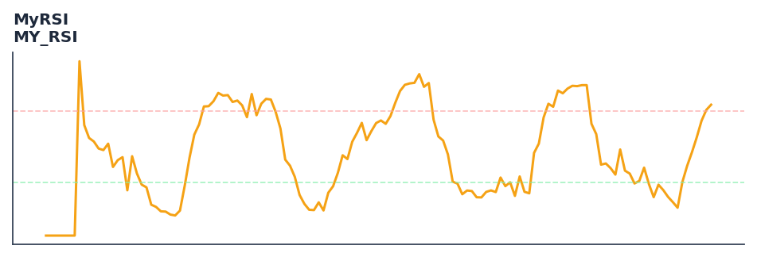

# MyRSI

<div class="indicator-meta"><span class="category-badge">Ehlers DSP</span> <span class="kw-badge">oscillator</span> <span class="kw-badge">rsi</span> <span class="kw-badge">ehlers</span> <span class="kw-badge">momentum</span> <span class="kw-badge">smoothing</span></div>

Ehlers' version of RSI that swings between -1 and +1.

## Visual Example



*Synthetic ideal per library logic. Generated 2026-06-25 IST via `docs/generate_all_previews.py` (reproducible; maps to core `Next<T>` implementation).*

## Description

The MyRSI indicator is a technical analysis tool that ehlers' version of rsi that swings between -1 and +1.

This indicator is primarily used for identifying key market conditions. It provides a robust signal that can be easily integrated into both simple strategies and more complex machine learning feature pipelines. Compared to its alternatives, it offers a distinct balance of responsiveness and stability.

Traders often combine this with other metrics to confirm signals and avoid false positives during sideways market regimes. It remains a standard tool for systematic trading models.

Use as Ehlers smoothed RSI variant that applies cycle-aware filtering to reduce whipsaws while maintaining RSI-style overbought/oversold interpretation.

Ehlers presents a smoothed RSI formulation that applies a Laguerre or SuperSmoother filter to the up/down ratio before computing the RSI index. This reduces the noise and oscillation of standard RSI without significantly increasing lag, producing more reliable overbought and oversold readings.

QuantWave implements this indicator via the universal `Next<T>` trait, guaranteeing bit-identical results between Rust streaming, Python streaming, and Polars batch (`.ta()` / `map_batches`) surfaces.


## Formula / Specification

**Implementation** (`quantwave-core/src/indicators/my_rsi.rs`):

\[
CU = \sum_{i=0}^{length-1} \max(0, Price_i - Price_{i+1})
\]
\[
CD = \sum_{i=0}^{length-1} \max(0, Price_{i+1} - Price_i)
\]
\[
MyRSI = \frac{CU - CD}{CU + CD}
\]

Gold-standard parity vectors: `quantwave-core/tests/gold_standard/my_rsi.json`.


## Parameters

| Parameter | Default | Description |
|-----------|---------|-------------|
| `length` | 14 | Smoothing length |


## Usage Examples

**Streaming (Rust)**

```rust
use quantwave_core::indicators::MY_RSI;
use quantwave_core::traits::Next;

let mut ind = MY_RSI::new(14);
for price in &prices {
    let value = ind.next(price);
}
```

**Streaming (Python)**

```python
from quantwave import MY_RSI

ind = MY_RSI(14)
for price in prices:
    value = ind.next(price)
```

**Polars Batch (Python)**

```python
import polars as pl
import quantwave as qw

def apply_myrsi(series: pl.Series) -> pl.Series:
    ind = qw.MY_RSI(14)
    return pl.Series([ind.next(float(v)) for v in series.to_list()])

df = (
    pl.read_csv('ohlcv.csv')
    .lazy()
    .with_columns(
        pl.col("close").map_batches(apply_myrsi, return_dtype=pl.Float64).alias("myrsi")
    )
    .collect()
)
```

All surfaces are bit-identical via the single `Next<T>` implementation and proptests.

## Edge Cases & Limitations

- Recursive DSP filters require a warm-up period; first N bars may be unstable or raw-pass-through.
- Designed for cyclic/mean-reverting regimes; trending markets can produce lag or drift.
- Parameter `period` (or equivalent) controls cutoff — too small adds noise, too large adds lag.
- Prefer chaining with other Ehlers tools (Roofing Filter, SuperSmoother) on noisy inputs.
- Validated via proptests against gold-standard vectors where available.
- No look-ahead bias; suitable for live streaming and batch feature pipelines.

## Boundary Behavior

| Condition | Behavior |
|-----------|----------|
| Warm-up | Leading bars return NaN until warmup_bars is satisfied. |
| period > len | When period exceeds series length, output is all NaN. |
| NaN inputs | NaN in input propagates to output (NaN out). |
| Invalid params | Non-positive period or missing required params raise ValueError. |
| Empty data | Empty input returns an empty result series. |

## Related Indicators & See Also

- [Indicator Gallery](../gallery.md)
- [Native Indicators index](index.md)
- [Ehlers DSP guide](../ehlers/index.md)
- [Cyber Cycle](cyber_cycle.md)
- [SuperSmoother](supersmoother.md)

## Sources & References

**Primary Source**: https://github.com/lavs9/quantwave/blob/main/references/Ehlers%20Papers/Noise%20Elimination%20Technology.pdf

**Implementation**: `quantwave-core/src/indicators/my_rsi.rs` (`MY_RSI` / `MY_RSI_METADATA`).
**Parity**: `quantwave-core/tests/gold_standard/my_rsi.json`

**Provenance**: Standards bulk upgrade 2026-06-25 IST — see `docs/DOCUMENTATION_STANDARDS.md`.
