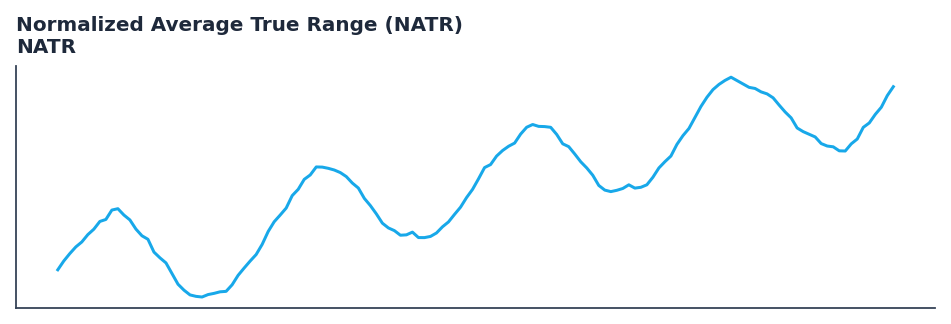

# Normalized Average True Range (NATR)

<div class="indicator-meta"><span class="category-badge">Classic</span> <span class="kw-badge">volatility</span> <span class="kw-badge">atr</span> <span class="kw-badge">normalization</span> <span class="kw-badge">classic</span></div>

A normalized version of ATR that represents volatility as a percentage of price.

## Visual Example



*Synthetic ideal per library logic. Generated 2026-07-01 IST via `docs/generate_all_previews.py` (reproducible; maps to core `Next<T>` implementation).*

## Description

A normalized version of ATR that represents volatility as a percentage of price.

Use to compare volatility across different securities with varying price levels. NATR allows for normalized risk assessment and position sizing.

Native Rust implementation with gold-standard or TA-Lib parity tests where applicable.

Normalized ATR (NATR) was developed to allow traders to compare the volatility of high-priced stocks with low-priced stocks. By dividing the ATR by the closing price and multiplying by 100, the result is a percentage that can be used consistently across all assets. — TA-Lib Documentation

**Typical applications:**

- Size stops and position risk from band width or ATR expansion
- Detect squeeze conditions (narrow bands) before breakout systems
- Warm-up: first `14` bars build rolling volatility state
- Combine with trend direction (SuperTrend, MACD) for breakout bias

QuantWave implements this via the universal `Next<T>` trait — bit-identical across Rust streaming, Python streaming, and Polars `.ta()` batch plugins.

## Formula / Specification

**Implementation** (`quantwave-core/src/indicators/volatility.rs`):

\[
NATR = \frac{ATR(n)}{Close} \times 100
\]

Gold-standard parity vectors: `quantwave-core/tests/gold_standard/natr.json`.


## Parameters

| Parameter | Default | Description |
|-----------|---------|-------------|
| `timeperiod` | 14 | Smoothing period |


## Usage Examples

**Streaming (Rust)**

```rust
use quantwave_core::indicators::NATR;
use quantwave_core::traits::Next;

let mut ind = NATR::new(14);
for price in &prices {
    let value = ind.next(price);
}
```

**Streaming (Python)**

```python
from quantwave import NATR

ind = NATR(14)
for price in prices:
    value = ind.next(price)
```

**Polars Batch (Python)**

```python
import polars as pl
import quantwave as qw

def apply_normalized_average_true_range_natr(series: pl.Series) -> pl.Series:
    ind = qw.NATR(14)
    return pl.Series([ind.next(float(v)) for v in series.to_list()])

df = (
    pl.read_csv('ohlcv.csv')
    .lazy()
    .with_columns(
        pl.col("close").map_batches(apply_normalized_average_true_range_natr, return_dtype=pl.Float64).alias("normalized_average_true_range_natr")
    )
    .collect()
)
```

All surfaces are bit-identical via the single `Next<T>` implementation and proptests.

## Edge Cases & Limitations

- Warm-up: first `14` bars may return NaN or partial state per implementation.
- Parameter sensitivity: smaller periods increase noise; larger periods increase lag.
- Sudden gaps or bad ticks can distort rolling windows — consider pre-filtering.
- Single-series indicators ignore volume unless otherwise documented.
- Validated via proptests against gold-standard vectors where available.
- No look-ahead bias; streaming and Polars batch paths are bit-identical.

## Boundary Behavior

| Condition | Behavior |
|-----------|----------|
| Warm-up | Leading bars return NaN until warmup_bars is satisfied. |
| period > len | When period exceeds series length, output is all NaN. |
| NaN inputs | NaN in input propagates to output (NaN out). |
| Invalid params | Non-positive period or missing required params raise ValueError. |
| Empty data | Empty input returns an empty result series. |

## Related Indicators & See Also

- [Indicator Gallery](../gallery.md)
- [Native Indicators index](index.md)
- [Batch vs Streaming guide](../../../examples/batch-streaming.md)
- [RSI](relative_strength_index_rsi.md)
- [SuperTrend](../supertrend/)

## Sources & References

**Primary Source**: https://www.tradingtechnologies.com/help/x-study/technical-indicator-definitions/normalized-average-true-range-natr/

**Implementation**: `quantwave-core/src/indicators/volatility.rs` (`NATR` / `NATR_METADATA`).
**Parity**: `quantwave-core/tests/gold_standard/natr.json`

**Provenance**: Standards bulk upgrade 2026-07-01 IST — see `docs/DOCUMENTATION_STANDARDS.md`.
