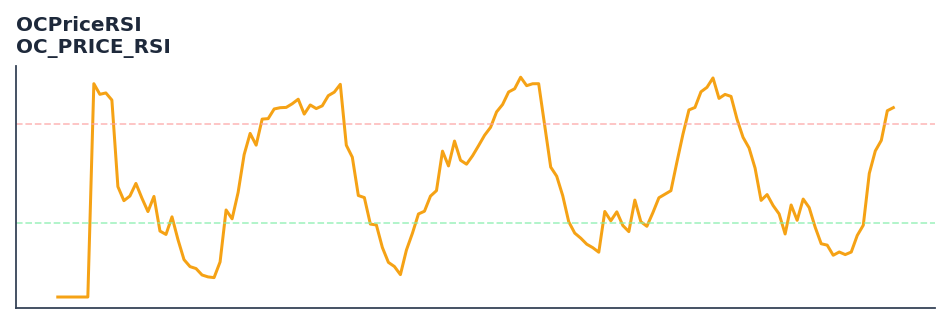

# OCPriceRSI

<div class="indicator-meta"><span class="category-badge">Ehlers DSP</span> <span class="kw-badge">oscillator</span> <span class="kw-badge">rsi</span> <span class="kw-badge">ehlers</span> <span class="kw-badge">momentum</span></div>

RSI calculated using the average of Open and Close prices to reduce noise.

## Visual Example



*Synthetic ideal per library logic. Generated 2026-07-01 IST via `docs/generate_all_previews.py` (reproducible; maps to core `Next<T>` implementation).*

## Description

RSI calculated using the average of Open and Close prices to reduce noise.

Use to measure momentum on the open-to-close price differential rather than close-to-close, capturing intraday directional strength more directly.

Part of QuantWave's Ehlers digital signal processing suite. Designed for low-lag cycle and trend work — pair with Roofing Filter or SuperSmoother on noisy inputs.

Ehlers computes this RSI variant on the difference between the open and close price of each bar rather than on the closing price series. The open-close differential captures the net directional pressure within each bar, producing a momentum oscillator more sensitive to intraday commitment than standard RSI.

**Typical applications:**

- Use for cycle timing in mean-reverting regimes
- Gate with Hurst exponent or ADX before taking cycle signals
- Allow `14`+ bars warm-up for filter state to stabilise
- Chain with Roofing Filter when input is noisy

QuantWave implements this via the universal `Next<T>` trait — bit-identical across Rust streaming, Python streaming, and Polars `.ta()` batch plugins.

## Formula / Specification

**Implementation** (`quantwave-core/src/indicators/oc_price_rsi.rs`):

\[
Input = \frac{Open + Close}{2}
\]
\[
RSI = \text{Wilder's RSI}(Input, Period)
\]

Gold-standard parity vectors: `quantwave-core/tests/gold_standard/oc_price_rsi.json`.


## Parameters

| Parameter | Default | Description |
|-----------|---------|-------------|
| `period` | 14 | RSI period |


## Usage Examples

**Streaming (Rust)**

```rust
use quantwave_core::indicators::OC_PRICE_RSI;
use quantwave_core::traits::Next;

let mut ind = OC_PRICE_RSI::new(14);
for price in &prices {
    let value = ind.next(price);
}
```

**Streaming (Python)**

```python
from quantwave import OC_PRICE_RSI

ind = OC_PRICE_RSI(14)
for price in prices:
    value = ind.next(price)
```

**Polars Batch (Python)**

```python
import polars as pl
import quantwave as qw

def apply_ocpricersi(series: pl.Series) -> pl.Series:
    ind = qw.OC_PRICE_RSI(14)
    return pl.Series([ind.next(float(v)) for v in series.to_list()])

df = (
    pl.read_csv('ohlcv.csv')
    .lazy()
    .with_columns(
        pl.col("close").map_batches(apply_ocpricersi, return_dtype=pl.Float64).alias("ocpricersi")
    )
    .collect()
)
```

All surfaces are bit-identical via the single `Next<T>` implementation and proptests.

## Edge Cases & Limitations

- Recursive DSP filters require a warm-up period; first N bars may be unstable or raw-pass-through.
- Designed for cyclic/mean-reverting regimes; trending markets can produce lag or drift.
- Parameter `period` (or equivalent) controls cutoff — too small adds noise, too large adds lag.
- Prefer chaining with other Ehlers tools (Roofing Filter, SuperSmoother) on noisy inputs.
- Validated via proptests against gold-standard vectors where available.
- No look-ahead bias; suitable for live streaming and batch feature pipelines.

## Boundary Behavior

| Condition | Behavior |
|-----------|----------|
| Warm-up | Leading bars return NaN until warmup_bars is satisfied. |
| period > len | When period exceeds series length, output is all NaN. |
| NaN inputs | NaN in input propagates to output (NaN out). |
| Invalid params | Non-positive period or missing required params raise ValueError. |
| Empty data | Empty input returns an empty result series. |

## Related Indicators & See Also

- [Indicator Gallery](../gallery.md)
- [Native Indicators index](index.md)
- [Ehlers DSP guide](../ehlers/index.md)
- [Cyber Cycle](cyber_cycle.md)
- [SuperSmoother](supersmoother.md)

## Sources & References

**Primary Source**: https://github.com/lavs9/quantwave/blob/main/references/Ehlers%20Papers/EveryLittleBitHelps.pdf

**Implementation**: `quantwave-core/src/indicators/oc_price_rsi.rs` (`OC_PRICE_RSI` / `OC_PRICE_RSI_METADATA`).
**Parity**: `quantwave-core/tests/gold_standard/oc_price_rsi.json`

**Provenance**: Standards bulk upgrade 2026-07-01 IST — see `docs/DOCUMENTATION_STANDARDS.md`.
