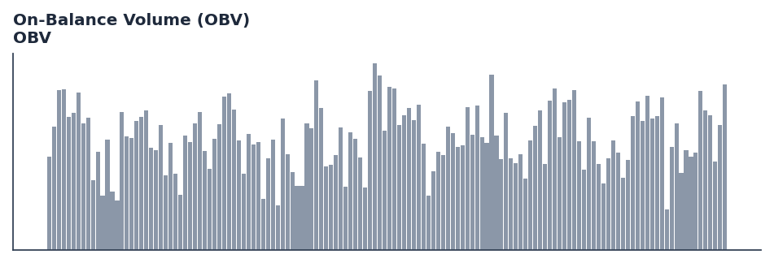

# On-Balance Volume (OBV)

<div class="indicator-meta"><span class="category-badge">Classic</span> <span class="kw-badge">volume</span> <span class="kw-badge">momentum</span> <span class="kw-badge">classic</span> <span class="kw-badge">accumulation</span> <span class="kw-badge">distribution</span></div>

A momentum indicator that uses volume flow to predict changes in stock price.

## Visual Example



*Synthetic ideal per library logic. Generated 2026-06-25 IST via `docs/generate_all_previews.py` (reproducible; maps to core `Next<T>` implementation).*

## Description

The On-Balance Volume (OBV) indicator is a technical analysis tool that a momentum indicator that uses volume flow to predict changes in stock price.

This indicator is primarily used for identifying key market conditions. It provides a robust signal that can be easily integrated into both simple strategies and more complex machine learning feature pipelines. Compared to its alternatives, it offers a distinct balance of responsiveness and stability.

Traders often combine this with other metrics to confirm signals and avoid false positives during sideways market regimes. It remains a standard tool for systematic trading models.

Use to identify accumulation by institutions. When price is flat but OBV is rising, a breakout to the upside is likely. Conversely, when price is flat but OBV is falling, a breakdown is likely.

Introduced by Joe Granville in his 1963 book 'Granville's New Key to Stock Market Profits', OBV is one of the oldest and most respected volume indicators. It operates on the principle that volume precedes price, and that institutional money flow leaves a detectable trail in the volume data before the price move occurs. — StockCharts ChartSchool

QuantWave implements this indicator via the universal `Next<T>` trait, guaranteeing bit-identical results between Rust streaming, Python streaming, and Polars batch (`.ta()` / `map_batches`) surfaces.


## Formula / Specification

**Implementation** (`quantwave-core/src/indicators/volume.rs`):

\[
OBV_t = OBV_{t-1} + \begin{cases} Volume & \text{if } Close_t > Close_{t-1} \\ 0 & \text{if } Close_t = Close_{t-1} \\ -Volume & \text{if } Close_t < Close_{t-1} \end{cases}
\]

Gold-standard parity vectors: `quantwave-core/tests/gold_standard/obv.json`.


## Parameters

| Parameter | Default | Description |
|-----------|---------|-------------|
| (none) | — | No tunable parameters for this detector. |

## Usage Examples

**Streaming (Rust)**

```rust
use quantwave_core::indicators::OBV;
use quantwave_core::traits::Next;

let mut ind = OBV::new(14);
for price in &prices {
    let value = ind.next(price);
}
```

**Streaming (Python)**

```python
from quantwave import OBV

ind = OBV(14)
for price in prices:
    value = ind.next(price)
```

**Polars Batch (Python)**

```python
import polars as pl
import quantwave as qw

def apply_on_balance_volume_obv(series: pl.Series) -> pl.Series:
    ind = qw.OBV(14)
    return pl.Series([ind.next(float(v)) for v in series.to_list()])

df = (
    pl.read_csv('ohlcv.csv')
    .lazy()
    .with_columns(
        pl.col("close").map_batches(apply_on_balance_volume_obv, return_dtype=pl.Float64).alias("on_balance_volume_obv")
    )
    .collect()
)
```

All surfaces are bit-identical via the single `Next<T>` implementation and proptests.

## Edge Cases & Limitations

- Warm-up: first `N` bars may return NaN or partial state per implementation.
- Parameter sensitivity: smaller periods increase noise; larger periods increase lag.
- Sudden gaps or bad ticks can distort rolling windows — consider pre-filtering.
- Single-series indicators ignore volume unless otherwise documented.
- Validated via proptests against gold-standard vectors where available.
- No look-ahead bias; streaming and Polars batch paths are bit-identical.

## Boundary Behavior

| Condition | Behavior |
|-----------|----------|
| Warm-up | Output starts from bar 1; warmup_bars marks period-stability, not NaN. |
| period > len | Cumulative sum continues; period only affects smoothed variants. |
| NaN inputs | NaN inputs may produce NaN or skip depending on indicator. |
| Invalid params | Invalid params raise ValueError. |
| Empty data | Empty input returns an empty result series. |

## Related Indicators & See Also

- [Indicator Gallery](../gallery.md)
- [Native Indicators index](index.md)
- [Batch vs Streaming guide](../../../examples/batch-streaming.md)
- [RSI](relative_strength_index_rsi.md)
- [SuperTrend](supertrend.md)

## Sources & References

**Primary Source**: https://www.investopedia.com/terms/o/onbalancevolume.asp

**Implementation**: `quantwave-core/src/indicators/volume.rs` (`OBV` / `OBV_METADATA`).
**Parity**: `quantwave-core/tests/gold_standard/obv.json`

**Provenance**: Standards bulk upgrade 2026-06-25 IST — see `docs/DOCUMENTATION_STANDARDS.md`.
