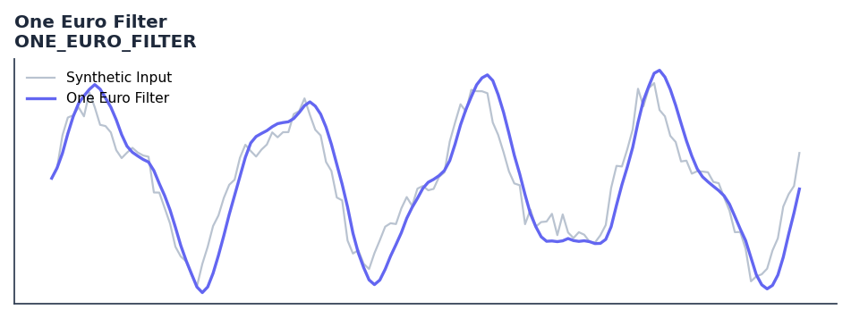

# One Euro Filter

<div class="indicator-meta"><span class="category-badge">Ehlers DSP</span> <span class="kw-badge">filter</span> <span class="kw-badge">smoothing</span> <span class="kw-badge">adaptive</span> <span class="kw-badge">real-time</span> <span class="kw-badge">low-pass</span></div>

A speed-based adaptive low-pass filter that dynamically adjusts its smoothing coefficient.

## Visual Example



*Synthetic ideal per library logic. Generated 2026-06-25 IST via `docs/generate_all_previews.py` (reproducible; maps to core `Next<T>` implementation).*

## Description

The One Euro Filter indicator is a technical analysis tool that a speed-based adaptive low-pass filter that dynamically adjusts its smoothing coefficient.

This indicator is primarily used for identifying key market conditions. It provides a robust signal that can be easily integrated into both simple strategies and more complex machine learning feature pipelines. Compared to its alternatives, it offers a distinct balance of responsiveness and stability.

Traders often combine this with other metrics to confirm signals and avoid false positives during sideways market regimes. It remains a standard tool for systematic trading models.

Use in real-time systems where you need low lag at high speeds and low noise at low speeds. The adaptive cutoff frequency makes it self-tuning for different signal velocities.

The One Euro Filter, developed by Casiez et al. (2012), is an adaptive lowpass filter that adjusts its cutoff frequency based on the signal derivative. When the signal changes quickly (high speed) the cutoff is raised to reduce lag; when it changes slowly the cutoff is lowered to reduce noise — automatically balancing the speed-accuracy trade-off.

QuantWave implements this indicator via the universal `Next<T>` trait, guaranteeing bit-identical results between Rust streaming, Python streaming, and Polars batch (`.ta()` / `map_batches`) surfaces.


## Formula / Specification

**Implementation** (`quantwave-core/src/indicators/one_euro_filter.rs`):

\[
\alpha_{dx} = \frac{2\pi}{4\pi + 10}
\]
\[
SmoothedDX = \alpha_{dx}(Price - Price_{t-1}) + (1 - \alpha_{dx})SmoothedDX_{t-1}
\]
\[
Cutoff = PeriodMin + \beta |SmoothedDX|
\]
\[
\alpha_3 = \frac{2\pi}{4\pi + Cutoff}
\]
\[
Smoothed = \alpha_3 Price + (1 - \alpha_3)Smoothed_{t-1}
\]

Gold-standard parity vectors: `quantwave-core/tests/gold_standard/one_euro_filter.json`.


## Parameters

| Parameter | Default | Description |
|-----------|---------|-------------|
| `period_min` | 10 | Minimum cutoff period |
| `beta` | 0.2 | Responsiveness factor |


## Usage Examples

**Streaming (Rust)**

```rust
use quantwave_core::indicators::ONE_EURO_FILTER;
use quantwave_core::traits::Next;

let mut ind = ONE_EURO_FILTER::new(10);
for price in &prices {
    let value = ind.next(price);
}
```

**Streaming (Python)**

```python
from quantwave import ONE_EURO_FILTER

ind = ONE_EURO_FILTER(10)
for price in prices:
    value = ind.next(price)
```

**Polars Batch (Python)**

```python
import polars as pl
import quantwave as qw

def apply_one_euro_filter(series: pl.Series) -> pl.Series:
    ind = qw.ONE_EURO_FILTER(10)
    return pl.Series([ind.next(float(v)) for v in series.to_list()])

df = (
    pl.read_csv('ohlcv.csv')
    .lazy()
    .with_columns(
        pl.col("close").map_batches(apply_one_euro_filter, return_dtype=pl.Float64).alias("one_euro_filter")
    )
    .collect()
)
```

All surfaces are bit-identical via the single `Next<T>` implementation and proptests.

## Edge Cases & Limitations

- Recursive DSP filters require a warm-up period; first N bars may be unstable or raw-pass-through.
- Designed for cyclic/mean-reverting regimes; trending markets can produce lag or drift.
- Parameter `period` (or equivalent) controls cutoff — too small adds noise, too large adds lag.
- Prefer chaining with other Ehlers tools (Roofing Filter, SuperSmoother) on noisy inputs.
- Validated via proptests against gold-standard vectors where available.
- No look-ahead bias; suitable for live streaming and batch feature pipelines.

## Boundary Behavior

| Condition | Behavior |
|-----------|----------|
| Warm-up | Leading bars return NaN until warmup_bars is satisfied. |
| period > len | When period exceeds series length, output is all NaN. |
| NaN inputs | NaN in input propagates to output (NaN out). |
| Invalid params | Non-positive period or missing required params raise ValueError. |
| Empty data | Empty input returns an empty result series. |

## Related Indicators & See Also

- [Indicator Gallery](../gallery.md)
- [Native Indicators index](index.md)
- [Ehlers DSP guide](../ehlers/index.md)
- [Cyber Cycle](cyber_cycle.md)
- [SuperSmoother](supersmoother.md)

## Sources & References

**Primary Source**: https://github.com/lavs9/quantwave/blob/main/references/traderstipsreference/TRADERS’%20TIPS%20-%20DECEMBER%202025.html

**Implementation**: `quantwave-core/src/indicators/one_euro_filter.rs` (`ONE_EURO_FILTER` / `ONE_EURO_FILTER_METADATA`).
**Parity**: `quantwave-core/tests/gold_standard/one_euro_filter.json`

**Provenance**: Standards bulk upgrade 2026-06-25 IST — see `docs/DOCUMENTATION_STANDARDS.md`.
