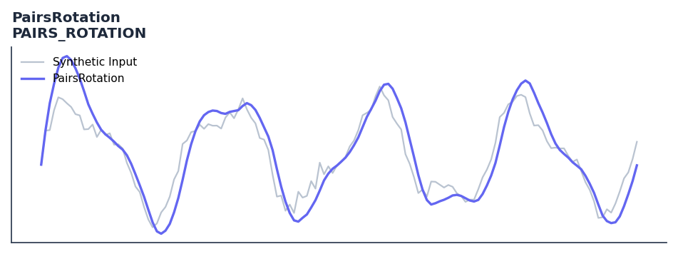

# PairsRotation

<div class="indicator-meta"><span class="category-badge">Ehlers DSP</span> <span class="kw-badge">pairs-trading</span> <span class="kw-badge">rotation</span> <span class="kw-badge">relative-strength</span> <span class="kw-badge">ehlers</span></div>

Relative rotation of two securities using normalized roofing filters.

## Visual Example



*Synthetic ideal per library logic. Generated 2026-07-01 IST via `docs/generate_all_previews.py` (reproducible; maps to core `Next<T>` implementation).*

## Description

Relative rotation of two securities using normalized roofing filters.

Use to detect and trade rotation between two correlated assets. When one asset leads and the other lags, the indicator signals a rotation trade opportunity.

Part of QuantWave's Ehlers digital signal processing suite. Designed for low-lag cycle and trend work — pair with Roofing Filter or SuperSmoother on noisy inputs.

Pairs Rotation analysis measures the relative cycle phase between two correlated assets. When one asset is at a cycle peak while its correlated partner is at a trough, a statistical rotation trade can be placed — long the laggard, short the leader — anticipating mean reversion of the spread.

**Typical applications:**

- Use for cycle timing in mean-reverting regimes
- Gate with Hurst exponent or ADX before taking cycle signals
- Allow `125`+ bars warm-up for filter state to stabilise
- Chain with Roofing Filter when input is noisy

QuantWave implements this via the universal `Next<T>` trait — bit-identical across Rust streaming, Python streaming, and Polars `.ta()` batch plugins.

## Formula / Specification

**Implementation** (`quantwave-core/src/indicators/pairs_rotation.rs`):

\[
Filt = SuperSmoother(HighPass(Price, HPLen), LPLen)
\]
\[
MS = 0.0242 \cdot Filt^2 + 0.9758 \cdot MS_{t-1}
\]
\[
Normalized = \frac{Filt}{\sqrt{MS}}
\]

Gold-standard parity vectors: `quantwave-core/tests/gold_standard/pairs_rotation.json`.


## Parameters

| Parameter | Default | Description |
|-----------|---------|-------------|
| `hp_len` | 125 | HighPass filter length |
| `lp_len` | 20 | LowPass (SuperSmoother) length |


## Usage Examples

**Streaming (Rust)**

```rust
use quantwave_core::indicators::PAIRS_ROTATION;
use quantwave_core::traits::Next;

let mut ind = PAIRS_ROTATION::new(125);
for price in &prices {
    let value = ind.next(price);
}
```

**Streaming (Python)**

```python
from quantwave import PAIRS_ROTATION

ind = PAIRS_ROTATION(125)
for price in prices:
    value = ind.next(price)
```

**Polars Batch (Python)**

```python
import polars as pl
import quantwave as qw

def apply_pairsrotation(series: pl.Series) -> pl.Series:
    ind = qw.PAIRS_ROTATION(125)
    return pl.Series([ind.next(float(v)) for v in series.to_list()])

df = (
    pl.read_csv('ohlcv.csv')
    .lazy()
    .with_columns(
        pl.col("close").map_batches(apply_pairsrotation, return_dtype=pl.Float64).alias("pairsrotation")
    )
    .collect()
)
```

All surfaces are bit-identical via the single `Next<T>` implementation and proptests.

## Edge Cases & Limitations

- Recursive DSP filters require a warm-up period; first N bars may be unstable or raw-pass-through.
- Designed for cyclic/mean-reverting regimes; trending markets can produce lag or drift.
- Parameter `period` (or equivalent) controls cutoff — too small adds noise, too large adds lag.
- Prefer chaining with other Ehlers tools (Roofing Filter, SuperSmoother) on noisy inputs.
- Validated via proptests against gold-standard vectors where available.
- No look-ahead bias; suitable for live streaming and batch feature pipelines.

## Boundary Behavior

| Condition | Behavior |
|-----------|----------|
| Warm-up | Leading bars return NaN until warmup_bars is satisfied. |
| period > len | When period exceeds series length, output is all NaN. |
| NaN inputs | NaN in input propagates to output (NaN out). |
| Invalid params | Non-positive period or missing required params raise ValueError. |
| Empty data | Empty input returns an empty result series. |

## Related Indicators & See Also

- [Indicator Gallery](../gallery.md)
- [Native Indicators index](index.md)
- [Ehlers DSP guide](../ehlers/index.md)
- [Cyber Cycle](cyber_cycle.md)
- [SuperSmoother](supersmoother.md)

## Sources & References

**Primary Source**: https://github.com/lavs9/quantwave/blob/main/references/Ehlers%20Papers/PAIRS%20ROTATION.pdf

**Implementation**: `quantwave-core/src/indicators/pairs_rotation.rs` (`PAIRS_ROTATION` / `PAIRS_ROTATION_METADATA`).
**Parity**: `quantwave-core/tests/gold_standard/pairs_rotation.json`

**Provenance**: Standards bulk upgrade 2026-07-01 IST — see `docs/DOCUMENTATION_STANDARDS.md`.
