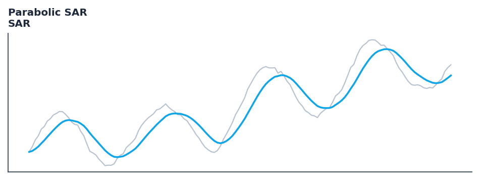

# Parabolic SAR

<div class="indicator-meta"><span class="category-badge">Classic</span> <span class="kw-badge">trend</span> <span class="kw-badge">classic</span> <span class="kw-badge">stop-loss</span> <span class="kw-badge">wilder</span></div>

A trend-following indicator used to determine price direction and potential reversals.

## Visual Example



*Synthetic ideal per library logic. Generated 2026-07-01 IST via `docs/generate_all_previews.py` (reproducible; maps to core `Next<T>` implementation).*

## Description

A trend-following indicator used to determine price direction and potential reversals.

Use for setting trailing stop losses and identifying trend reversals. Dots below price indicate an uptrend, while dots above price indicate a downtrend.

Native Rust implementation with gold-standard or TA-Lib parity tests where applicable.

Developed by J. Welles Wilder, the Parabolic Stop and Reverse (SAR) uses an acceleration factor that increases as the trend persists. This 'parabolic' nature allows the indicator to stay close to price action and provide timely exit signals when a trend exhausts. — StockCharts ChartSchool

**Typical applications:**

- Trend filter or signal line for systematic entries
- Default lookback `0.02` — tune per asset volatility
- Cross with faster oscillator for entry timing
- Streaming and Polars paths are bit-identical for production parity

QuantWave implements this via the universal `Next<T>` trait — bit-identical across Rust streaming, Python streaming, and Polars `.ta()` batch plugins.

## Formula / Specification

**Implementation** (`quantwave-core/src/indicators/overlap.rs`):

\[
SAR_{t+1} = SAR_t + AF \times (EP - SAR_t)
\]

Gold-standard parity vectors: `quantwave-core/tests/gold_standard/sar.json`.


## Parameters

| Parameter | Default | Description |
|-----------|---------|-------------|
| `acceleration` | 0.02 | Acceleration factor |
| `maximum` | 0.2 | Maximum acceleration |


## Usage Examples

**Streaming (Rust)**

```rust
use quantwave_core::indicators::SAR;
use quantwave_core::traits::Next;

let mut ind = SAR::new(0.02);
for price in &prices {
    let value = ind.next(price);
}
```

**Streaming (Python)**

```python
from quantwave import SAR

ind = SAR(0.02)
for price in prices:
    value = ind.next(price)
```

**Polars Batch (Python)**

```python
import polars as pl
import quantwave as qw

def apply_parabolic_sar(series: pl.Series) -> pl.Series:
    ind = qw.SAR(0.02)
    return pl.Series([ind.next(float(v)) for v in series.to_list()])

df = (
    pl.read_csv('ohlcv.csv')
    .lazy()
    .with_columns(
        pl.col("close").map_batches(apply_parabolic_sar, return_dtype=pl.Float64).alias("parabolic_sar")
    )
    .collect()
)
```

All surfaces are bit-identical via the single `Next<T>` implementation and proptests.

## Edge Cases & Limitations

- Warm-up: first `0.02` bars may return NaN or partial state per implementation.
- Parameter sensitivity: smaller periods increase noise; larger periods increase lag.
- Sudden gaps or bad ticks can distort rolling windows — consider pre-filtering.
- Single-series indicators ignore volume unless otherwise documented.
- Validated via proptests against gold-standard vectors where available.
- No look-ahead bias; streaming and Polars batch paths are bit-identical.

## Boundary Behavior

| Condition | Behavior |
|-----------|----------|
| Warm-up | Leading bars return NaN until warmup_bars is satisfied. |
| period > len | When period exceeds series length, output is all NaN. |
| NaN inputs | NaN in input propagates to output (NaN out). |
| Invalid params | Non-positive period or missing required params raise ValueError. |
| Empty data | Empty input returns an empty result series. |

## Related Indicators & See Also

- [Indicator Gallery](../gallery.md)
- [Native Indicators index](index.md)
- [Batch vs Streaming guide](../../../examples/batch-streaming.md)
- [RSI](relative_strength_index_rsi.md)
- [SuperTrend](supertrend/)

## Sources & References

**Primary Source**: https://www.investopedia.com/terms/p/parabolicindicator.asp

**Implementation**: `quantwave-core/src/indicators/overlap.rs` (`SAR` / `SAR_METADATA`).
**Parity**: `quantwave-core/tests/gold_standard/sar.json`

**Provenance**: Standards bulk upgrade 2026-07-01 IST — see `docs/DOCUMENTATION_STANDARDS.md`.
