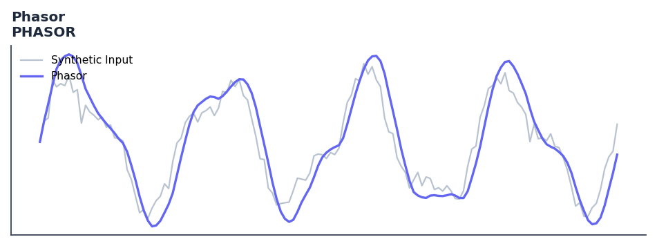

# Phasor

<div class="indicator-meta"><span class="category-badge">Rocket Science</span> <span class="kw-badge">cycle</span> <span class="kw-badge">phase</span> <span class="kw-badge">ehlers</span> <span class="kw-badge">dsp</span> <span class="kw-badge">dominant-cycle</span></div>

Extracts In-Phase (I) and Quadrature (Q) components using a Hilbert Transform.

## Visual Example



*Synthetic ideal per library logic. Generated 2026-06-25 IST via `docs/generate_all_previews.py` (reproducible; maps to core `Next<T>` implementation).*

## Description

The Phasor indicator is a technical analysis tool that extracts in-phase (i) and quadrature (q) components using a hilbert transform.

This indicator is primarily used for identifying key market conditions. It provides a robust signal that can be easily integrated into both simple strategies and more complex machine learning feature pipelines. Compared to its alternatives, it offers a distinct balance of responsiveness and stability.

Traders often combine this with other metrics to confirm signals and avoid false positives during sideways market regimes. It remains a standard tool for systematic trading models.

Use to measure the instantaneous phase and amplitude of the dominant market cycle. Phase crossings of key angles (90, 180 degrees) provide precise cycle turn timing signals.

Ehlers borrows the concept of a phasor from electrical engineering to represent the amplitude and phase of a market cycle as a rotating vector. In Rocket Science for Traders (2001) he shows how measuring the instantaneous phasor angle gives more precise cycle timing than zero-crossing methods.

QuantWave implements this indicator via the universal `Next<T>` trait, guaranteeing bit-identical results between Rust streaming, Python streaming, and Polars batch (`.ta()` / `map_batches`) surfaces.


## Formula / Specification

**Implementation** (`quantwave-core/src/indicators/phasor.rs`):

\[
I = \text{Detrender}_{t-3}
\]
\[
Q = \text{HilbertFIR}(\text{Detrender}, \text{Period})
\]

Gold-standard parity vectors: `quantwave-core/tests/gold_standard/phasor.json`.


## Parameters

| Parameter | Default | Description |
|-----------|---------|-------------|
| (none) | — | No tunable parameters for this detector. |

## Usage Examples

**Streaming (Rust)**

```rust
use quantwave_core::indicators::PHASOR;
use quantwave_core::traits::Next;

let mut ind = PHASOR::new(14);
for price in &prices {
    let value = ind.next(price);
}
```

**Streaming (Python)**

```python
from quantwave import PHASOR

ind = PHASOR(14)
for price in prices:
    value = ind.next(price)
```

**Polars Batch (Python)**

```python
import polars as pl
import quantwave as qw

def apply_phasor(series: pl.Series) -> pl.Series:
    ind = qw.PHASOR(14)
    return pl.Series([ind.next(float(v)) for v in series.to_list()])

df = (
    pl.read_csv('ohlcv.csv')
    .lazy()
    .with_columns(
        pl.col("close").map_batches(apply_phasor, return_dtype=pl.Float64).alias("phasor")
    )
    .collect()
)
```

All surfaces are bit-identical via the single `Next<T>` implementation and proptests.

## Edge Cases & Limitations

- Recursive DSP filters require a warm-up period; first N bars may be unstable or raw-pass-through.
- Designed for cyclic/mean-reverting regimes; trending markets can produce lag or drift.
- Parameter `period` (or equivalent) controls cutoff — too small adds noise, too large adds lag.
- Prefer chaining with other Ehlers tools (Roofing Filter, SuperSmoother) on noisy inputs.
- Validated via proptests against gold-standard vectors where available.
- No look-ahead bias; suitable for live streaming and batch feature pipelines.

## Boundary Behavior

| Condition | Behavior |
|-----------|----------|
| Warm-up | Leading bars return NaN until warmup_bars is satisfied. |
| period > len | When period exceeds series length, output is all NaN. |
| NaN inputs | NaN in input propagates to output (NaN out). |
| Invalid params | Non-positive period or missing required params raise ValueError. |
| Empty data | Empty input returns an empty result series. |

## Related Indicators & See Also

- [Indicator Gallery](../gallery.md)
- [Native Indicators index](index.md)
- [Ehlers DSP guide](../ehlers/index.md)
- [Cyber Cycle](cyber_cycle.md)
- [SuperSmoother](supersmoother.md)

## Sources & References

**Primary Source**: https://github.com/lavs9/quantwave/blob/main/references/Ehlers%20Papers/ROCKET%20SCIENCE%20FOR%20TRADER.pdf

**Implementation**: `quantwave-core/src/indicators/phasor.rs` (`PHASOR` / `PHASOR_METADATA`).
**Parity**: `quantwave-core/tests/gold_standard/phasor.json`

**Provenance**: Standards bulk upgrade 2026-06-25 IST — see `docs/DOCUMENTATION_STANDARDS.md`.
