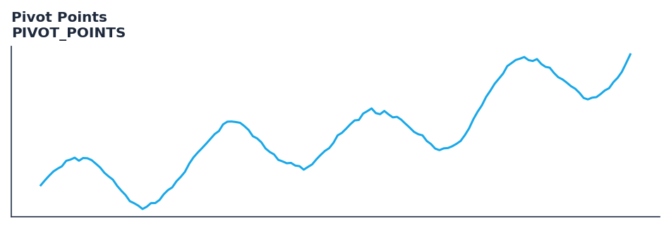

# Pivot Points

<div class="indicator-meta"><span class="category-badge">Classic</span> <span class="kw-badge">support-resistance</span> <span class="kw-badge">classic</span> <span class="kw-badge">levels</span> <span class="kw-badge">pattern</span></div>

Pivot Points are used to determine overall trend over different time frames.

## Visual Example



*Synthetic ideal per library logic. Generated 2026-06-25 IST via `docs/generate_all_previews.py` (reproducible; maps to core `Next<T>` implementation).*

## Description

The Pivot Points indicator is a technical analysis tool that pivot points are used to determine overall trend over different time frames.

This indicator is primarily used for identifying key market conditions. It provides a robust signal that can be easily integrated into both simple strategies and more complex machine learning feature pipelines. Compared to its alternatives, it offers a distinct balance of responsiveness and stability.

Traders often combine this with other metrics to confirm signals and avoid false positives during sideways market regimes. It remains a standard tool for systematic trading models.

Use to identify key daily, weekly, or monthly support and resistance levels calculated from the prior session OHLC. Pivot levels are widely watched by floor traders and algorithms alike.

Traditional Pivot Points, widely used by floor traders, calculate a central pivot (P = (H+L+C)/3) plus support and resistance levels at fixed multiples of the prior session range. Because they are derived from universal OHLC data and widely published, they become self-fulfilling levels of institutional interest. — StockCharts ChartSchool

QuantWave implements this indicator via the universal `Next<T>` trait, guaranteeing bit-identical results between Rust streaming, Python streaming, and Polars batch (`.ta()` / `map_batches`) surfaces.


## Formula / Specification

**Implementation** (`quantwave-core/src/indicators/pivot_points.rs`):

\[
P = \frac{H + L + C}{3}
\]

Gold-standard parity vectors: `quantwave-core/tests/gold_standard/pivot_points.json`.


## Parameters

| Parameter | Default | Description |
|-----------|---------|-------------|
| (none) | — | No tunable parameters for this detector. |

## Usage Examples

**Streaming (Rust)**

```rust
use quantwave_core::indicators::PIVOT_POINTS;
use quantwave_core::traits::Next;

let mut ind = PIVOT_POINTS::new(14);
for price in &prices {
    let value = ind.next(price);
}
```

**Streaming (Python)**

```python
from quantwave import PIVOT_POINTS

ind = PIVOT_POINTS(14)
for price in prices:
    value = ind.next(price)
```

**Polars Batch (Python)**

```python
import polars as pl
import quantwave as qw

def apply_pivot_points(series: pl.Series) -> pl.Series:
    ind = qw.PIVOT_POINTS(14)
    return pl.Series([ind.next(float(v)) for v in series.to_list()])

df = (
    pl.read_csv('ohlcv.csv')
    .lazy()
    .with_columns(
        pl.col("close").map_batches(apply_pivot_points, return_dtype=pl.Float64).alias("pivot_points")
    )
    .collect()
)
```

All surfaces are bit-identical via the single `Next<T>` implementation and proptests.

## Edge Cases & Limitations

- Warm-up: first `N` bars may return NaN or partial state per implementation.
- Parameter sensitivity: smaller periods increase noise; larger periods increase lag.
- Sudden gaps or bad ticks can distort rolling windows — consider pre-filtering.
- Single-series indicators ignore volume unless otherwise documented.
- Validated via proptests against gold-standard vectors where available.
- No look-ahead bias; streaming and Polars batch paths are bit-identical.

## Boundary Behavior

| Condition | Behavior |
|-----------|----------|
| Warm-up | Leading bars return NaN until warmup_bars is satisfied. |
| period > len | When period exceeds series length, output is all NaN. |
| NaN inputs | NaN in input propagates to output (NaN out). |
| Invalid params | Non-positive period or missing required params raise ValueError. |
| Empty data | Empty input returns an empty result series. |

## Related Indicators & See Also

- [Indicator Gallery](../gallery.md)
- [Native Indicators index](index.md)
- [Batch vs Streaming guide](../../../examples/batch-streaming.md)
- [RSI](relative_strength_index_rsi.md)
- [SuperTrend](supertrend.md)

## Sources & References

**Primary Source**: https://www.investopedia.com/terms/p/pivotpoint.asp

**Implementation**: `quantwave-core/src/indicators/pivot_points.rs` (`PIVOT_POINTS` / `PIVOT_POINTS_METADATA`).
**Parity**: `quantwave-core/tests/gold_standard/pivot_points.json`

**Provenance**: Standards bulk upgrade 2026-06-25 IST — see `docs/DOCUMENTATION_STANDARDS.md`.
