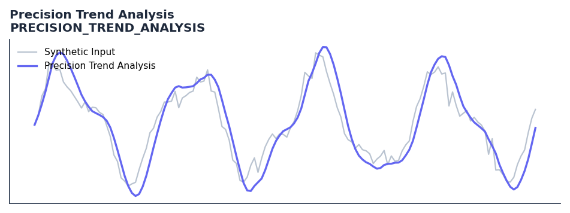

# Precision Trend Analysis

<div class="indicator-meta"><span class="category-badge">Ehlers DSP</span> <span class="kw-badge">trend</span> <span class="kw-badge">ehlers</span> <span class="kw-badge">dsp</span> <span class="kw-badge">filter</span></div>

Trend identification using the difference between two high-pass filters.

## Visual Example



*Synthetic ideal per library logic. Generated 2026-07-01 IST via `docs/generate_all_previews.py` (reproducible; maps to core `Next<T>` implementation).*

## Description

Trend identification using the difference between two high-pass filters.

Use as a high-precision trend indicator that applies DSP filtering to remove cycle noise before measuring trend direction, giving fewer but more reliable trend signals.

Part of QuantWave's Ehlers digital signal processing suite. Designed for low-lag cycle and trend work — pair with Roofing Filter or SuperSmoother on noisy inputs.

Ehlers Precision Trend analysis applies a roofing-filter style preprocessing to price before computing the trend indicator, removing the cyclical component that causes premature trend reversals in standard indicators. The result is a trend signal that changes state only when the genuine trend direction changes.

**Typical applications:**

- Use for cycle timing in mean-reverting regimes
- Gate with Hurst exponent or ADX before taking cycle signals
- Allow `250`+ bars warm-up for filter state to stabilise
- Chain with Roofing Filter when input is noisy

QuantWave implements this via the universal `Next<T>` trait — bit-identical across Rust streaming, Python streaming, and Polars `.ta()` batch plugins.

## Formula / Specification

**Implementation** (`quantwave-core/src/indicators/precision_trend.rs`):

\[
HP1 = HighPass(Price, Length1)
\]
\[
HP2 = HighPass(Price, Length2)
\]
\[
Trend = HP1 - HP2
\]
\[
ROC = \frac{Length2}{6.28} \cdot (Trend - Trend_{t-1})
\]

Gold-standard parity vectors: `quantwave-core/tests/gold_standard/precision_trend.json`.


## Parameters

| Parameter | Default | Description |
|-----------|---------|-------------|
| `length1` | 250 | First HighPass filter period |
| `length2` | 40 | Second HighPass filter period |


## Usage Examples

**Streaming (Rust)**

```rust
use quantwave_core::indicators::PRECISION_TREND_ANALYSIS;
use quantwave_core::traits::Next;

let mut ind = PRECISION_TREND_ANALYSIS::new(250);
for price in &prices {
    let value = ind.next(price);
}
```

**Streaming (Python)**

```python
from quantwave import PRECISION_TREND_ANALYSIS

ind = PRECISION_TREND_ANALYSIS(250)
for price in prices:
    value = ind.next(price)
```

**Polars Batch (Python)**

```python
import polars as pl
import quantwave as qw

def apply_precision_trend_analysis(series: pl.Series) -> pl.Series:
    ind = qw.PRECISION_TREND_ANALYSIS(250)
    return pl.Series([ind.next(float(v)) for v in series.to_list()])

df = (
    pl.read_csv('ohlcv.csv')
    .lazy()
    .with_columns(
        pl.col("close").map_batches(apply_precision_trend_analysis, return_dtype=pl.Float64).alias("precision_trend_analysis")
    )
    .collect()
)
```

All surfaces are bit-identical via the single `Next<T>` implementation and proptests.

## Edge Cases & Limitations

- Recursive DSP filters require a warm-up period; first N bars may be unstable or raw-pass-through.
- Designed for cyclic/mean-reverting regimes; trending markets can produce lag or drift.
- Parameter `period` (or equivalent) controls cutoff — too small adds noise, too large adds lag.
- Prefer chaining with other Ehlers tools (Roofing Filter, SuperSmoother) on noisy inputs.
- Validated via proptests against gold-standard vectors where available.
- No look-ahead bias; suitable for live streaming and batch feature pipelines.

## Boundary Behavior

| Condition | Behavior |
|-----------|----------|
| Warm-up | Leading bars return NaN until warmup_bars is satisfied. |
| period > len | When period exceeds series length, output is all NaN. |
| NaN inputs | NaN in input propagates to output (NaN out). |
| Invalid params | Non-positive period or missing required params raise ValueError. |
| Empty data | Empty input returns an empty result series. |

## Related Indicators & See Also

- [Indicator Gallery](../gallery.md)
- [Native Indicators index](index.md)
- [Ehlers DSP guide](../ehlers/index.md)
- [Cyber Cycle](cyber_cycle.md)
- [SuperSmoother](supersmoother.md)

## Sources & References

**Primary Source**: https://github.com/lavs9/quantwave/blob/main/references/traderstipsreference/TRADERS’%20TIPS%20-%20SEPTEMBER%202024.html

**Implementation**: `quantwave-core/src/indicators/precision_trend.rs` (`PRECISION_TREND_ANALYSIS` / `PRECISION_TREND_ANALYSIS_METADATA`).
**Parity**: `quantwave-core/tests/gold_standard/precision_trend.json`

**Provenance**: Standards bulk upgrade 2026-07-01 IST — see `docs/DOCUMENTATION_STANDARDS.md`.
