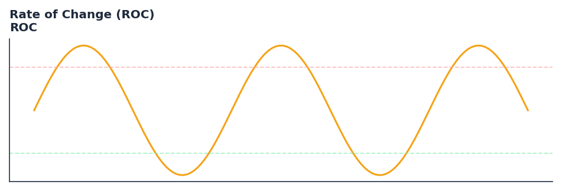

# Rate of Change (ROC)

<div class="indicator-meta"><span class="category-badge">Classic</span> <span class="kw-badge">momentum</span> <span class="kw-badge">classic</span> <span class="kw-badge">oscillator</span></div>

A momentum-based technical indicator that measures the percentage change in price between the current price and the price n periods ago.

## Visual Example



*Synthetic ideal per library logic. Generated 2026-07-01 IST via `docs/generate_all_previews.py` (reproducible; maps to core `Next<T>` implementation).*

## Description

A momentum-based technical indicator that measures the percentage change in price between the current price and the price n periods ago.

Use to measure the speed at which price is changing. It is often used to identify overbought/oversold conditions and trend reversals.

Native Rust implementation with gold-standard or TA-Lib parity tests where applicable.

The Rate of Change (ROC) indicator is a pure momentum oscillator that measures the percentage change in price from one period to the next. It is highly effective at identifying the velocity of a move and anticipating when that velocity is slowing down. — StockCharts ChartSchool

**Typical applications:**

- Fade extremes in ranges; trade with trend on recoveries from oversold/overbought
- Use divergences as early warning — confirm with structure or volume
- Parameter default `10` — shorten for sensitivity, lengthen for stability
- Drop into `build_feature_matrix()` for ML research

QuantWave implements this via the universal `Next<T>` trait — bit-identical across Rust streaming, Python streaming, and Polars `.ta()` batch plugins.

## Formula / Specification

**Implementation** (`quantwave-core/src/indicators/momentum.rs`):

\[
ROC = \frac{Price_t - Price_{t-n}}{Price_{t-n}} \times 100
\]

Gold-standard parity vectors: `quantwave-core/tests/gold_standard/roc.json`.


## Parameters

| Parameter | Default | Description |
|-----------|---------|-------------|
| `timeperiod` | 10 | Lookback period |


## Usage Examples

**Streaming (Rust)**

```rust
use quantwave_core::indicators::ROC;
use quantwave_core::traits::Next;

let mut ind = ROC::new(10);
for price in &prices {
    let value = ind.next(price);
}
```

**Streaming (Python)**

```python
from quantwave import ROC

ind = ROC(10)
for price in prices:
    value = ind.next(price)
```

**Polars Batch (Python)**

```python
import polars as pl
import quantwave  # registers pl.col().ta

df = (
    pl.read_csv('ohlcv.csv')
    .lazy()
    .with_columns(
        pl.col("close").ta.roc(10).alias("rate_of_change_roc")
    )
    .collect()
)
```

All surfaces are bit-identical via the single `Next<T>` implementation and proptests.

## Edge Cases & Limitations

- Warm-up: first `10` bars may return NaN or partial state per implementation.
- Parameter sensitivity: smaller periods increase noise; larger periods increase lag.
- Sudden gaps or bad ticks can distort rolling windows — consider pre-filtering.
- Single-series indicators ignore volume unless otherwise documented.
- Validated via proptests against gold-standard vectors where available.
- No look-ahead bias; streaming and Polars batch paths are bit-identical.

## Boundary Behavior

| Condition | Behavior |
|-----------|----------|
| Warm-up | Leading bars return NaN until warmup_bars is satisfied. |
| period > len | When period exceeds series length, output is all NaN. |
| NaN inputs | NaN in input propagates to output (NaN out). |
| Invalid params | Non-positive period or missing required params raise ValueError. |
| Empty data | Empty input returns an empty result series. |

## Related Indicators & See Also

- [Indicator Gallery](../gallery.md)
- [Native Indicators index](index.md)
- [Batch vs Streaming guide](../../../examples/batch-streaming.md)
- [RSI](relative_strength_index_rsi.md)
- [SuperTrend](supertrend/)

## Sources & References

**Primary Source**: https://www.investopedia.com/terms/r/rateofchange.asp

**Implementation**: `quantwave-core/src/indicators/momentum.rs` (`ROC` / `ROC_METADATA`).
**Parity**: `quantwave-core/tests/gold_standard/roc.json`

**Provenance**: Standards bulk upgrade 2026-07-01 IST — see `docs/DOCUMENTATION_STANDARDS.md`.
