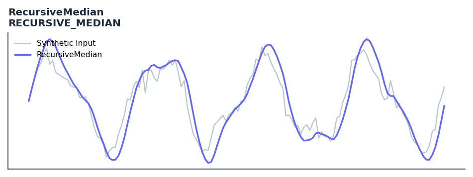

# RecursiveMedian

<div class="indicator-meta"><span class="category-badge">Ehlers DSP</span> <span class="kw-badge">filter</span> <span class="kw-badge">ehlers</span> <span class="kw-badge">dsp</span> <span class="kw-badge">median</span> <span class="kw-badge">robust</span> <span class="kw-badge">smoothing</span></div>

EMA of a 5-bar median filter for smooth tracking with minimal jitter.

## Visual Example



*Synthetic ideal per library logic. Generated 2026-06-25 IST via `docs/generate_all_previews.py` (reproducible; maps to core `Next<T>` implementation).*

## Description

EMA of a 5-bar median filter for smooth tracking with minimal jitter.

Use to filter out extreme outliers and noise while maintaining trend sensitivity. Excellent as a baseline for other oscillators.

Standard filters like SMA or EMA are distorted by price spikes. The recursive median filter uses the median to reject outliers and an EMA to provide smoothness, offering a cleaner trend representation than standard moving averages.

QuantWave implements this indicator via the universal `Next<T>` trait, guaranteeing bit-identical results between Rust streaming, Python streaming, and Polars batch (`.ta()` / `map_batches`) surfaces.

## Formula / Specification

**Implementation** (`quantwave-core/src/indicators/recursive_median.rs`):

\[
\alpha = \frac{\cos(360/P) + \sin(360/P) - 1}{\cos(360/P)}
\]
\[
RM_t = \alpha \cdot \text{Median}(Price, 5)_t + (1 - \alpha) \cdot RM_{t-1}
\]

Gold-standard parity vectors: `quantwave-core/tests/gold_standard/recursive_median.json`.


## Parameters

| Parameter | Default | Description |
|-----------|---------|-------------|
| `lp_period` | 12 | Low-pass smoothing period |


## Usage Examples

**Streaming (Rust)**

```rust
use quantwave_core::indicators::RECURSIVE_MEDIAN;
use quantwave_core::traits::Next;

let mut ind = RECURSIVE_MEDIAN::new(12);
for price in &prices {
    let value = ind.next(price);
}
```

**Streaming (Python)**

```python
from quantwave import RECURSIVE_MEDIAN

ind = RECURSIVE_MEDIAN(12)
for price in prices:
    value = ind.next(price)
```

**Polars Batch (Python)**

```python
import polars as pl
import quantwave as qw

def apply_recursivemedian(series: pl.Series) -> pl.Series:
    ind = qw.RECURSIVE_MEDIAN(12)
    return pl.Series([ind.next(float(v)) for v in series.to_list()])

df = (
    pl.read_csv('ohlcv.csv')
    .lazy()
    .with_columns(
        pl.col("close").map_batches(apply_recursivemedian, return_dtype=pl.Float64).alias("recursivemedian")
    )
    .collect()
)
```

All surfaces are bit-identical via the single `Next<T>` implementation and proptests.

## Edge Cases & Limitations

- Recursive DSP filters require a warm-up period; first N bars may be unstable or raw-pass-through.
- Designed for cyclic/mean-reverting regimes; trending markets can produce lag or drift.
- Parameter `period` (or equivalent) controls cutoff — too small adds noise, too large adds lag.
- Prefer chaining with other Ehlers tools (Roofing Filter, SuperSmoother) on noisy inputs.
- Validated via proptests against gold-standard vectors where available.
- No look-ahead bias; suitable for live streaming and batch feature pipelines.

## Related Indicators & See Also

- [Indicator Gallery](../gallery.md)
- [Native Indicators index](index.md)
- [Ehlers DSP guide](../ehlers/index.md)
- [Cyber Cycle](cyber_cycle.md)
- [SuperSmoother](supersmoother.md)

## Sources & References

**Primary Source**: https://www.traders.com/Documentation/FEEDbk_docs/2018/03/TradersTips.html

**Implementation**: `quantwave-core/src/indicators/recursive_median.rs` (`RECURSIVE_MEDIAN` / `RECURSIVE_MEDIAN_METADATA`).
**Parity**: `quantwave-core/tests/gold_standard/recursive_median.json`

**Provenance**: Standards bulk upgrade 2026-06-25 IST — see `docs/DOCUMENTATION_STANDARDS.md`.
