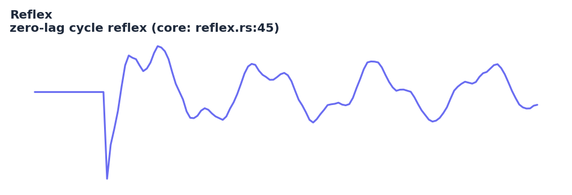

# Reflex

<div class="indicator-meta"><span class="category-badge">Ehlers DSP</span> <span class="kw-badge">zero-lag</span> <span class="kw-badge">cycle</span> <span class="kw-badge">ehlers</span> <span class="kw-badge">dsp</span> <span class="kw-badge">oscillator</span></div>

A zero-lag averaging indicator that synchronizes with the cycle component by measuring the reflex (difference) between a SuperSmoother and its linearly projected historical values.

## Visual Example



*Synthetic ideal cyclic price series engineered to produce clear zero-crossings at cycle extrema. Matches the exact SuperSmoother(period/2) + slope projection + RMS normalization logic in `quantwave-core/src/indicators/reflex.rs` (Next<f64> at lines 33-62 and the proptest batch reference). Generated 2026-05-31 IST via `docs/gen_indicator_previews.py`.*

## Description

Reflex is designed to give the earliest possible indication of a cyclic reversal while remaining smooth. It first applies a SuperSmoother (with period = length/2) to suppress noise, then computes a linear slope projection from the current smoothed value back `length` bars, and measures the cumulative "reflex" (difference) between the actual smoothed history and that straight-line projection. The result is normalized by a running RMS estimate to produce a zero-centered oscillator that leads price turns.

It is more responsive to genuine cycle turns than a plain moving average or even the Cyber Cycle in many regimes, but like all Ehlers tools it assumes the presence of a dominant cycle. In strong trends the output tends to stay on one side of zero for extended periods. Use in conjunction with a trend-strength or regime filter (Cyber Cycle momentum, market structure bias, or ADX) for best results. The indicator is fully causal and participates in the universal parity guarantee.

## Formula / Specification

**Exact implementation in QuantWave** (`quantwave-core/src/indicators/reflex.rs`):

1. Compute `Filt = SuperSmoother(price, length/2)` (internal stateful smoother).
2. Maintain a history of the last `length+1` filtered values.
3. After sufficient history, compute the slope over the full lookback: `slope = (Filt_{t-length} − Filt_t) / length`.
4. Compute the average reflex `Sum = (1/length) Σ (Filt_t + n·slope − Filt_{t-n})` for n = 1…length.
5. Update a smoothed mean-square: `MS = 0.04·Sum² + 0.96·MS_{t−1}`.
6. Output `Reflex = Sum / √MS` (or 0 when MS is near zero).
7. The streaming `Next<f64>` and the proptest reference batch implementation (reproducing the identical smoother + history + slope math) are bit-identical (`approx` 1e-10).

## Parameters

| Parameter | Default | Description |
|-----------|---------|-------------|
| `length`  | 20      | Assumed cycle period. The internal SuperSmoother uses `length/2`; the reflex lookback and slope projection use the full `length`. |

## Usage Examples

**Streaming (Rust)**

```rust
use quantwave_core::indicators::Reflex;
use quantwave_core::traits::Next;

let mut reflex = Reflex::new(20);
for price in price_series {
    let r = reflex.next(price);
    if r > 0.8 { /* strong bullish reflex */ }
}
```

**Streaming (Python)**

```python
from quantwave import Reflex

reflex = Reflex(20)
for price in price_series:
    r = reflex.next(price)
```

**Polars Batch (Python — primary research / feature surface)**

```python
import polars as pl
import quantwave as qw

def reflex_expr(col: str, length: int = 20):
    r = qw.Reflex(length)
    def _apply(s: pl.Series) -> pl.Series:
        return pl.Series([r.next(float(v)) for v in s.to_list()])
    return pl.col(col).map_batches(_apply, return_dtype=pl.Float64)

df = (
    pl.read_csv("ohlcv.csv")
    .lazy()
    .with_columns([reflex_expr("close", 20).alias("reflex")])
    .collect()
)
```

All surfaces share the identical `Next<f64>` implementation; parity is proven by the proptest in `reflex.rs`.

## Edge Cases & Limitations

- Returns 0.0 during the first `length` bars (insufficient history for the slope/reflex calculation).
- In strong persistent trends the indicator can remain away from zero for long runs; it is not a mean-reversion oscillator.
- The internal SuperSmoother period is hard-coded to `length/2` per the original design; changing the outer length also changes the smoother.
- MS can underflow or become extremely small in very quiet periods, producing unstable division (guarded by the implementation).
- Sensitive to the assumed cycle length; a length that is far from the true dominant cycle reduces leading character.
- Best paired with a regime gate (e.g. only take Reflex zero-cross signals when Cyber Cycle momentum is high and market structure bias agrees).
- No look-ahead bias.

## Related Indicators & See Also

- [Cyber Cycle](cyber_cycle.md) — companion cycle oscillator; use together for regime confirmation
- [UltimateSmoother](ultimatesmoother.md) and [Super Smoother](supersmoother.md) — building blocks
- [Trendflex](trendflex.md) — the trend counterpart in the same 2020 TradersTips article
- [Ehlers Stochastic](ehlers_stochastic.md) — another zero-lag cycle tool from the Ehlers family
- [Market Structure](market_structure.md) — confirm bias before acting on Reflex crosses
- [Indicator Gallery](../gallery.md) • [Native Indicators](native/index.md)
- See Ehlers 2020 Traders' Tips article for the original EasyLanguage reference.

## Sources & References

**Primary Source**: `quantwave-core/src/indicators/reflex.rs` (REFLEX_METADATA + Next<f64> + internal SuperSmoother + proptest). Formula source: https://github.com/lavs9/quantwave/blob/main/references/traderstipsreference/implemented/TRADERS’ TIPS - FEBRUARY 2020.html (John Ehlers, "Reflex: A New Zero-Lag Indicator", Traders' Tips, Feb 2020).

**Visual**: Generated 2026-05-31 IST via `docs/gen_indicator_previews.py`.

**Additional Context**: Ehlers, *Cycle Analytics for Traders* (2013) for the broader context of zero-lag techniques and the importance of matching the assumed cycle length to market conditions.

**Implementation Provenance**: Universal `Next<T>` contract and batch/streaming parity in `quantwave-core/src/traits.rs` and the proptest inside `reflex.rs`.
