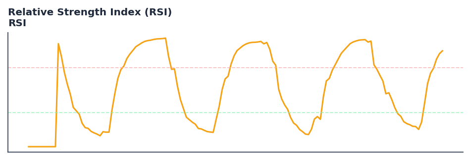

# Relative Strength Index (RSI)

<div class="indicator-meta"><span class="category-badge">Classic</span> <span class="kw-badge">momentum</span> <span class="kw-badge">oscillator</span> <span class="kw-badge">overbought</span> <span class="kw-badge">oversold</span> <span class="kw-badge">classic</span></div>

Wilder's momentum oscillator — the most widely deployed mean-reversion and divergence tool in systematic trading.

## Visual Example



*Synthetic price with RSI(14) panel. Generated via `docs/generate_all_previews.py`; maps to core `Next<f64>` implementation.*

## Description

RSI measures the **ratio of average gains to average losses** over a lookback window, scaled to 0–100. Values above 70 are traditionally overbought; below 30 oversold — though production systems often calibrate thresholds per asset and regime.

Common uses:

- **Mean-reversion entries** — fade extremes when higher-timeframe trend agrees
- **Divergence detection** — price makes new high while RSI does not (bearish divergence)
- **ML features** — stationary bounded oscillator; pairs well with [Hurst](hurst_exponent/) and regime labels
- **Signal gating** — only take longs when RSI recovers from oversold in an uptrend ([SuperTrend](supertrend/) direction > 0)

QuantWave implements Wilder-smoothed RSI via `Next<f64>`, bit-identical across Rust streaming, Python streaming, and the Polars `.ta.rsi()` plugin. Validated against TA-Lib parity proptests and `rsi.json` gold-standard vectors.

## Formula / Specification

**Source:** J. Welles Wilder, *New Concepts in Technical Trading Systems* (1978)

For each bar, compute price change \(\Delta_t = C_t - C_{t-1}\). Separate gains and losses:

\[
\text{Gain}_t = \max(\Delta_t, 0), \quad \text{Loss}_t = \max(-\Delta_t, 0)
\]

Wilder smoothing (same recurrence as ATR):

\[
\overline{\text{Gain}}_t = \frac{\overline{\text{Gain}}_{t-1} \cdot (n-1) + \text{Gain}_t}{n}, \quad
\overline{\text{Loss}}_t = \frac{\overline{\text{Loss}}_{t-1} \cdot (n-1) + \text{Loss}_t}{n}
\]

\[
RS_t = \frac{\overline{\text{Gain}}_t}{\overline{\text{Loss}}_t}, \quad
RSI_t = 100 - \frac{100}{1 + RS_t}
\]

**Implementation:** `quantwave-core/src/indicators/incremental/rsi.rs` (re-exported from `momentum.rs`).

**Gold-standard vectors:** `quantwave-core/tests/gold_standard/rsi.json`.

## Parameters

| Parameter | Default | Description |
|-----------|---------|-------------|
| `timeperiod` | 14 | Wilder lookback length |

Shorter periods (7–9) react faster but whipsaw in ranges; longer (21–25) smooth noise at the cost of lag.

## Usage Examples

**Polars batch (recommended)**

```python
import polars as pl
import quantwave  # registers pl.col().ta

df = (
    pl.read_csv("ohlcv.csv")
    .lazy()
    .with_columns(
        pl.col("close").ta.rsi(14).alias("rsi"),
        (pl.col("close").ta.rsi(14) < 30).alias("oversold"),
    )
    .collect()
)
```

**Streaming (Python)**

```python
import quantwave as qw

rsi = qw.streaming_class("rsi")(timeperiod=14)
for price in closes:
    value = rsi.next(price)  # 0–100
```

**Streaming (Rust)**

```rust
use quantwave_core::indicators::RSI;
use quantwave_core::traits::Next;

let mut rsi = RSI::new(14);
for price in &closes {
    let value = rsi.next(*price);
}
```

**Backtest wiring (mean-reversion sketch)**

```python
signal_df = df.with_columns(
    pl.when(pl.col("rsi") < 30).then(1.0)
    .when(pl.col("rsi") > 70).then(0.0)
    .otherwise(None)
    .forward_fill()
    .alias("signal")
)
```

## Edge Cases & Limitations

- **Trending markets:** RSI can remain overbought/oversold for extended runs — use trend filters, not raw levels alone.
- **Warm-up:** First `timeperiod` bars build Wilder state; early values follow core warmup semantics.
- **Flat markets:** Zero average loss → RSI defined as 100 in Wilder convention.
- **Divergence is visual:** Automating divergence requires swing detection — consider [Market Structure](market_structure/) for structure-aware logic.

## Boundary Behavior

| Condition | Behavior |
|-----------|----------|
| Warm-up | Leading bars return NaN until `timeperiod` samples accumulated. |
| `timeperiod` > series length | Insufficient data → NaN outputs. |
| NaN in close | NaN propagates through the rolling window. |
| Invalid params | Non-positive `timeperiod` raises `ValueError`. |

## Related Indicators & See Also

- [Laguerre RSI](laguerre_rsi/) — Ehlers low-lag alternative
- [Stochastic Oscillator](stochastic_oscillator/) — range-based momentum cousin
- [Chande Momentum Oscillator](chande_momentum_oscillator_cmo/) — unsmoothed sensitivity variant
- [ML Feature Stability notebook](../../../examples/notebooks/ml_feature_stability.md)
- [Indicator Gallery](../gallery.md)

## Sources & References

**Primary source:** Wilder (1978); [Investopedia RSI](https://www.investopedia.com/terms/r/rsi.asp)

**Implementation:** `quantwave-core/src/indicators/incremental/rsi.rs` (`RSI` / `RSI_METADATA`)

**Parity:** TA-Lib proptest in `momentum.rs`; gold-standard `rsi.json`