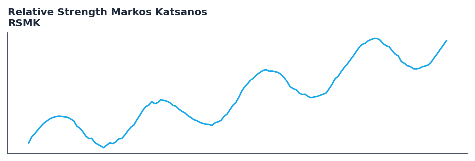

# Relative Strength Markos Katsanos

<div class="indicator-meta"><span class="category-badge">Momentum</span> <span class="kw-badge">relative strength</span> <span class="kw-badge">momentum</span> <span class="kw-badge">benchmark</span> <span class="kw-badge">katsanos</span></div>

An improved relative strength indicator that compares a security to a benchmark, separating periods of strong and weak relative performance.

## Visual Example



*Synthetic ideal per library logic. Generated 2026-06-25 IST via `docs/generate_all_previews.py` (reproducible; maps to core `Next<T>` implementation).*

## Description

An improved relative strength indicator that compares a security to a benchmark, separating periods of strong and weak relative performance.

Use as a momentum-based relative strength indicator. Values above zero indicate the security is outperforming the benchmark over the specified period.

RSMK calculates the log-ratio momentum of a security relative to a benchmark (e.g., SPY). It measures the difference between current log-relative strength and its value N bars ago, then smooths it with an EMA. This approach identifies trends in relative performance with less lag than traditional methods.

QuantWave implements this indicator via the universal `Next<T>` trait, guaranteeing bit-identical results between Rust streaming, Python streaming, and Polars batch (`.ta()` / `map_batches`) surfaces.

## Formula / Specification

**Implementation** (`quantwave-core/src/indicators/rsmk.rs`):

\[
RSMK = EMA(\ln(\frac{P_t}{B_t}) - \ln(\frac{P_{t-n}}{B_{t-n}}), m) \times 100
\]

Gold-standard parity vectors: `quantwave-core/tests/gold_standard/rsmk_90_3.json`.


## Parameters

| Parameter | Default | Description |
|-----------|---------|-------------|
| `length` | 90 | Momentum lookback period |
| `ema_length` | 3 | EMA smoothing period |


## Usage Examples

**Streaming (Rust)**

```rust
use quantwave_core::indicators::RSMK;
use quantwave_core::traits::Next;

let mut ind = RSMK::new(90);
for price in &prices {
    let value = ind.next(price);
}
```

**Streaming (Python)**

```python
from quantwave import RSMK

ind = RSMK(90)
for price in prices:
    value = ind.next(price)
```

**Polars Batch (Python)**

```python
import polars as pl
import quantwave as qw

def apply_relative_strength_markos_katsanos(series: pl.Series) -> pl.Series:
    ind = qw.RSMK(90)
    return pl.Series([ind.next(float(v)) for v in series.to_list()])

df = (
    pl.read_csv('ohlcv.csv')
    .lazy()
    .with_columns(
        pl.col("close").map_batches(apply_relative_strength_markos_katsanos, return_dtype=pl.Float64).alias("relative_strength_markos_katsanos")
    )
    .collect()
)
```

All surfaces are bit-identical via the single `Next<T>` implementation and proptests.

## Edge Cases & Limitations

- Warm-up: first `90` bars may return NaN or partial state per implementation.
- Parameter sensitivity: smaller periods increase noise; larger periods increase lag.
- Sudden gaps or bad ticks can distort rolling windows — consider pre-filtering.
- Single-series indicators ignore volume unless otherwise documented.
- Validated via proptests against gold-standard vectors where available.
- No look-ahead bias; streaming and Polars batch paths are bit-identical.

## Related Indicators & See Also

- [Indicator Gallery](../gallery.md)
- [Native Indicators index](index.md)
- [Batch vs Streaming guide](../../../examples/batch-streaming.md)
- [RSI](relative_strength_index_rsi.md)
- [SuperTrend](supertrend.md)

## Sources & References

**Primary Source**: TASC March 2020

**Implementation**: `quantwave-core/src/indicators/rsmk.rs` (`RSMK` / `RSMK_METADATA`).
**Parity**: `quantwave-core/tests/gold_standard/rsmk_90_3.json`

**Provenance**: Standards bulk upgrade 2026-06-25 IST — see `docs/DOCUMENTATION_STANDARDS.md`.
