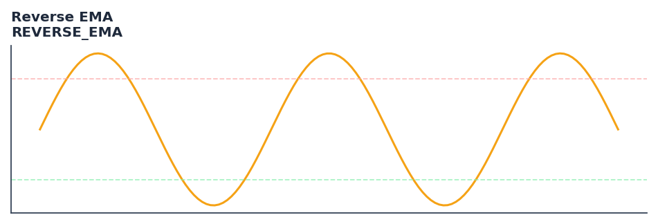

# Reverse EMA

<div class="indicator-meta"><span class="category-badge">Ehlers DSP</span> <span class="kw-badge">ema</span> <span class="kw-badge">lag</span> <span class="kw-badge">ehlers</span> <span class="kw-badge">oscillator</span> <span class="kw-badge">zero-lag</span></div>

A causal forward and backward EMA indicator that minimizes lag using a series of alignment filters.

## Visual Example



*Synthetic ideal per library logic. Generated 2026-07-01 IST via `docs/generate_all_previews.py` (reproducible; maps to core `Next<T>` implementation).*

## Description

A causal forward and backward EMA indicator that minimizes lag using a series of alignment filters.

Use to identify trends or cycles with minimal lag. Higher alpha values (e.g., 0.3) isolate cycles, while lower values (e.g., 0.05) isolate trends.

Part of QuantWave's Ehlers digital signal processing suite. Designed for low-lag cycle and trend work — pair with Roofing Filter or SuperSmoother on noisy inputs.

Ehlers' Reverse EMA approximates a non-causal zero-lag filter by using a product series of Z-transform components. It achieves double smoothing at high frequencies and mitigates spectral dilation at low frequencies, providing a unique balance of smoothness and responsiveness.

**Typical applications:**

- Use for cycle timing in mean-reverting regimes
- Gate with Hurst exponent or ADX before taking cycle signals
- Allow `0.1`+ bars warm-up for filter state to stabilise
- Chain with Roofing Filter when input is noisy

QuantWave implements this via the universal `Next<T>` trait — bit-identical across Rust streaming, Python streaming, and Polars `.ta()` batch plugins.

## Formula / Specification

**Implementation** (`quantwave-core/src/indicators/reverse_ema.rs`):

\[
EMA = \alpha \cdot Price + (1 - \alpha) \cdot EMA_{t-1}
\]
\[
RE_1 = (1 - \alpha) \cdot EMA + EMA_{t-1}
\]
\[
RE_i = (1 - \alpha)^{2^{i-1}} \cdot RE_{i-1} + RE_{i-1, t-1} \text{ for } i=2..8
\]
\[
Wave = EMA - \alpha \cdot RE_8
\]

Gold-standard parity vectors: `quantwave-core/tests/gold_standard/reverse_ema.json`.


## Parameters

| Parameter | Default | Description |
|-----------|---------|-------------|
| `alpha` | 0.1 | Smoothing factor (0.0 to 1.0) |


## Usage Examples

**Streaming (Rust)**

```rust
use quantwave_core::indicators::REVERSE_EMA;
use quantwave_core::traits::Next;

let mut ind = REVERSE_EMA::new(0.1);
for price in &prices {
    let value = ind.next(price);
}
```

**Streaming (Python)**

```python
from quantwave import REVERSE_EMA

ind = REVERSE_EMA(0.1)
for price in prices:
    value = ind.next(price)
```

**Polars Batch (Python)**

```python
import polars as pl
import quantwave as qw

def apply_reverse_ema(series: pl.Series) -> pl.Series:
    ind = qw.REVERSE_EMA(0.1)
    return pl.Series([ind.next(float(v)) for v in series.to_list()])

df = (
    pl.read_csv('ohlcv.csv')
    .lazy()
    .with_columns(
        pl.col("close").map_batches(apply_reverse_ema, return_dtype=pl.Float64).alias("reverse_ema")
    )
    .collect()
)
```

All surfaces are bit-identical via the single `Next<T>` implementation and proptests.

## Edge Cases & Limitations

- Recursive DSP filters require a warm-up period; first N bars may be unstable or raw-pass-through.
- Designed for cyclic/mean-reverting regimes; trending markets can produce lag or drift.
- Parameter `period` (or equivalent) controls cutoff — too small adds noise, too large adds lag.
- Prefer chaining with other Ehlers tools (Roofing Filter, SuperSmoother) on noisy inputs.
- Validated via proptests against gold-standard vectors where available.
- No look-ahead bias; suitable for live streaming and batch feature pipelines.

## Boundary Behavior

| Condition | Behavior |
|-----------|----------|
| Warm-up | Leading bars return NaN until warmup_bars is satisfied. |
| period > len | When period exceeds series length, output is all NaN. |
| NaN inputs | NaN in input propagates to output (NaN out). |
| Invalid params | Non-positive period or missing required params raise ValueError. |
| Empty data | Empty input returns an empty result series. |

## Related Indicators & See Also

- [Indicator Gallery](../gallery.md)
- [Native Indicators index](index.md)
- [Ehlers DSP guide](../ehlers/index.md)
- [Cyber Cycle](cyber_cycle.md)
- [SuperSmoother](supersmoother.md)

## Sources & References

**Primary Source**: https://github.com/lavs9/quantwave/blob/main/references/traderstipsreference/TRADERS%E2%80%99%20TIPS%20-%20SEPTEMBER%202017.html

**Implementation**: `quantwave-core/src/indicators/reverse_ema.rs` (`REVERSE_EMA` / `REVERSE_EMA_METADATA`).
**Parity**: `quantwave-core/tests/gold_standard/reverse_ema.json`

**Provenance**: Standards bulk upgrade 2026-07-01 IST — see `docs/DOCUMENTATION_STANDARDS.md`.
