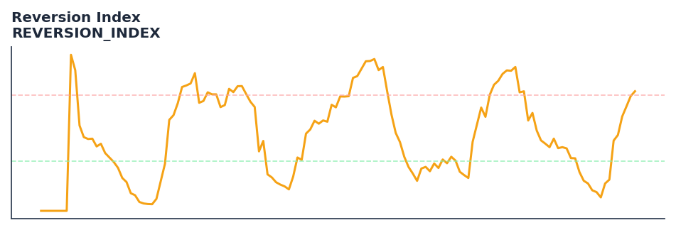

# Reversion Index

<div class="indicator-meta"><span class="category-badge">Ehlers DSP</span> <span class="kw-badge">mean-reversion</span> <span class="kw-badge">oscillator</span> <span class="kw-badge">ehlers</span> <span class="kw-badge">cycle</span></div>

A mean-reversion oscillator that normalizes price changes by their absolute magnitude and applies SuperSmoother filtering.

## Visual Example



*Synthetic ideal per library logic. Generated 2026-06-25 IST via `docs/generate_all_previews.py` (reproducible; maps to core `Next<T>` implementation).*

## Description

A mean-reversion oscillator that normalizes price changes by their absolute magnitude and applies SuperSmoother filtering.

Use to identify mean-reversion opportunities when price has deviated significantly from its cycle trend. High index values signal overextended moves ripe for reversal.

Ehlers Reversion Index measures how far price has deviated from its Instantaneous Trendline in units of cycle amplitude. Because it normalizes by the current cycle energy, the index provides consistent overbought/oversold thresholds regardless of the absolute price level or volatility regime.

QuantWave implements this indicator via the universal `Next<T>` trait, guaranteeing bit-identical results between Rust streaming, Python streaming, and Polars batch (`.ta()` / `map_batches`) surfaces.

## Formula / Specification

**Implementation** (`quantwave-core/src/indicators/reversion_index.rs`):

\[
\Delta_t = \text{Close}_t - \text{Close}_{t-1}
\]
\[
\text{Ratio} = \frac{\sum_{i=0}^{L-1} \Delta_{t-i}}{\sum_{i=0}^{L-1} |\Delta_{t-i}|}
\]
\[
\text{Smooth} = SuperSmoother(\text{Ratio}, 8)
\]
\[
\text{Trigger} = SuperSmoother(\text{Ratio}, 4)
\]

Gold-standard parity vectors: `quantwave-core/tests/gold_standard/reversion_index.json`.


## Parameters

| Parameter | Default | Description |
|-----------|---------|-------------|
| `length` | 20 | Summation period (approx. half dominant cycle) |


## Usage Examples

**Streaming (Rust)**

```rust
use quantwave_core::indicators::REVERSION_INDEX;
use quantwave_core::traits::Next;

let mut ind = REVERSION_INDEX::new(20);
for price in &prices {
    let value = ind.next(price);
}
```

**Streaming (Python)**

```python
from quantwave import REVERSION_INDEX

ind = REVERSION_INDEX(20)
for price in prices:
    value = ind.next(price)
```

**Polars Batch (Python)**

```python
import polars as pl
import quantwave as qw

def apply_reversion_index(series: pl.Series) -> pl.Series:
    ind = qw.REVERSION_INDEX(20)
    return pl.Series([ind.next(float(v)) for v in series.to_list()])

df = (
    pl.read_csv('ohlcv.csv')
    .lazy()
    .with_columns(
        pl.col("close").map_batches(apply_reversion_index, return_dtype=pl.Float64).alias("reversion_index")
    )
    .collect()
)
```

All surfaces are bit-identical via the single `Next<T>` implementation and proptests.

## Edge Cases & Limitations

- Recursive DSP filters require a warm-up period; first N bars may be unstable or raw-pass-through.
- Designed for cyclic/mean-reverting regimes; trending markets can produce lag or drift.
- Parameter `period` (or equivalent) controls cutoff — too small adds noise, too large adds lag.
- Prefer chaining with other Ehlers tools (Roofing Filter, SuperSmoother) on noisy inputs.
- Validated via proptests against gold-standard vectors where available.
- No look-ahead bias; suitable for live streaming and batch feature pipelines.

## Related Indicators & See Also

- [Indicator Gallery](../gallery.md)
- [Native Indicators index](index.md)
- [Ehlers DSP guide](../ehlers/index.md)
- [Cyber Cycle](cyber_cycle.md)
- [SuperSmoother](supersmoother.md)

## Sources & References

**Primary Source**: https://github.com/lavs9/quantwave/blob/main/references/traderstipsreference/TRADERS%E2%80%99%20TIPS%20-%20JANUARY%202026.html

**Implementation**: `quantwave-core/src/indicators/reversion_index.rs` (`REVERSION_INDEX` / `REVERSION_INDEX_METADATA`).
**Parity**: `quantwave-core/tests/gold_standard/reversion_index.json`

**Provenance**: Standards bulk upgrade 2026-06-25 IST — see `docs/DOCUMENTATION_STANDARDS.md`.
