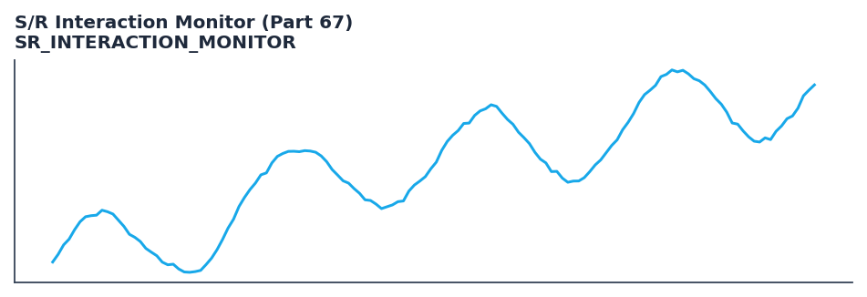

# S/R Interaction Monitor (Part 67)

<div class="indicator-meta"><span class="category-badge">Price Action</span> <span class="kw-badge">price-action</span> <span class="kw-badge">support-resistance</span> <span class="kw-badge">sr-interaction</span> <span class="kw-badge">breakout</span> <span class="kw-badge">retest</span> <span class="kw-badge">market-structure</span></div>

Real-time horizontal S/R monitoring with Approach/Touch/Breakout/Reversal/Retest detection. Auto levels from MarketStructure swings + dynamic user-provided levels. Rich event output designed for backtester and confluence (MQL5 Part 67 port).

## Visual Example



*Synthetic ideal per library logic. Generated 2026-07-01 IST via `docs/generate_all_previews.py` (reproducible; maps to core `Next<T>` implementation).*

## Description

Real-time horizontal S/R monitoring with Approach/Touch/Breakout/Reversal/Retest detection. Auto levels from MarketStructure swings + dynamic user-provided levels. Rich event output designed for backtester and confluence (MQL5 Part 67 port).

Use the Rust struct directly for streaming (add_user_level + next). Emits SRMonitorOutput with Vec<SRInteraction>. Ideal for event-driven backtesting and PA + regime filters. See also MarketStructure for the swing foundation.

Price-action tooling with streaming and Polars batch parity. Rich outputs feed backtest signals, regime filters, and ML feature pipelines.

Classical price action (not DSP). Horizontal level state machine on top of adaptive swings.

**Typical applications:**

- See Parameters — default period/length `3`
- Validated via proptests and gold-standard vectors where available
- Use Polars `.ta` plugins for batch; `streaming_class()` for live

QuantWave implements this via the universal `Next<T>` trait — bit-identical across Rust streaming, Python streaming, and Polars `.ta()` batch plugins.

## Formula / Specification

**Implementation** (`quantwave-core/src/indicators/sr_monitor.rs`):

\text{side} = \text{sign}(price - level)\\
\text{touch if } |level - [L,H]| \le tol\\
\text{breakout if side flips}\\
\text{retest if post-breakout distance} \le tol


## Parameters

| Parameter | Default | Description |
|-----------|---------|-------------|
| `swing_strength` | 3 | Depth for internal MarketStructure swing detection (Part 21). |
| `touch_tolerance` | 0.5 | Absolute price tolerance for Touch/Retest (Part 67 TouchTolerancePips scaled). |
| `approach_zone` | 5.0 | Outer Approach zone (Part 67 ApproachZonePips). |
| `touch_tol_atr_mult` | 0.5 | ATR-relative touch tolerance (use new_atr_relative). |
| `approach_zone_atr_mult` | 2.0 | ATR-relative approach zone (use new_atr_relative). |


## Usage Examples

**Streaming (Rust)**

```rust
use quantwave_core::indicators::SR_INTERACTION_MONITOR;
use quantwave_core::traits::Next;

let mut ind = SR_INTERACTION_MONITOR::new(3);
for price in &prices {
    let value = ind.next(price);
}
```

**Streaming (Python)**

```python
from quantwave import SR_INTERACTION_MONITOR

ind = SR_INTERACTION_MONITOR(3)
for price in prices:
    value = ind.next(price)
```

**Polars Batch (Python)**

```python
import polars as pl
import quantwave as qw

def apply_s_r_interaction_monitor_part_67(series: pl.Series) -> pl.Series:
    ind = qw.SR_INTERACTION_MONITOR(3)
    return pl.Series([ind.next(float(v)) for v in series.to_list()])

df = (
    pl.read_csv('ohlcv.csv')
    .lazy()
    .with_columns(
        pl.col("close").map_batches(apply_s_r_interaction_monitor_part_67, return_dtype=pl.Float64).alias("s_r_interaction_monitor_part_67")
    )
    .collect()
)
```

All surfaces are bit-identical via the single `Next<T>` implementation and proptests.

## Edge Cases & Limitations

- Warm-up: first `3` bars may return NaN or partial state per implementation.
- Parameter sensitivity: smaller periods increase noise; larger periods increase lag.
- Sudden gaps or bad ticks can distort rolling windows — consider pre-filtering.
- Single-series indicators ignore volume unless otherwise documented.
- Validated via proptests against gold-standard vectors where available.
- No look-ahead bias; streaming and Polars batch paths are bit-identical.

## Boundary Behavior

| Condition | Behavior |
|-----------|----------|
| Warm-up | Leading bars return NaN until warmup_bars is satisfied. |
| period > len | When period exceeds series length, output is all NaN. |
| NaN inputs | NaN in input propagates to output (NaN out). |
| Invalid params | Non-positive period or missing required params raise ValueError. |
| Empty data | Empty input returns an empty result series. |

## Related Indicators & See Also

- [Indicator Gallery](../gallery.md)
- [Native Indicators index](index.md)
- [Batch vs Streaming guide](../../../examples/batch-streaming.md)
- [RSI](relative_strength_index_rsi.md)
- [SuperTrend](supertrend/)

## Sources & References

**Primary Source**: https://www.mql5.com/en/articles/21961 (SupportResistanceMonitor.mq5) + Part 21 market_structure foundation

**Implementation**: `quantwave-core/src/indicators/sr_monitor.rs` (`SR_INTERACTION_MONITOR` / `SR_INTERACTION_MONITOR_METADATA`).

**Provenance**: Standards bulk upgrade 2026-07-01 IST — see `docs/DOCUMENTATION_STANDARDS.md`.
