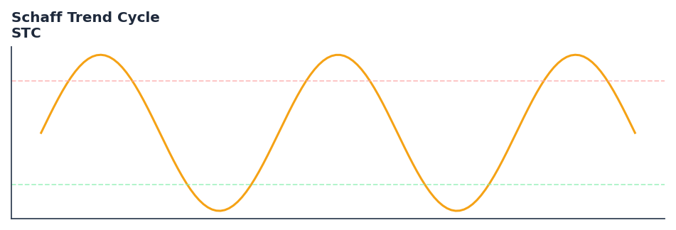

# Schaff Trend Cycle

<div class="indicator-meta"><span class="category-badge">Modern</span> <span class="kw-badge">trend</span> <span class="kw-badge">momentum</span> <span class="kw-badge">cycle</span> <span class="kw-badge">oscillator</span> <span class="kw-badge">classic</span></div>

A hybrid indicator that applies a double-smoothed stochastic to MACD for faster trend identification.

## Visual Example



*Synthetic ideal per library logic. Generated 2026-07-01 IST via `docs/generate_all_previews.py` (reproducible; maps to core `Next<T>` implementation).*

## Description

A hybrid indicator that applies a double-smoothed stochastic to MACD for faster trend identification.

Use as a faster trend-cycle momentum indicator. STC typically reaches overbought/oversold levels sooner than MACD while generating fewer false signals than a raw stochastic.

Native Rust implementation with gold-standard or TA-Lib parity tests where applicable.

The Schaff Trend Cycle, developed by Doug Schaff, applies the stochastic oscillator formula twice to MACD values rather than to price. This double stochastic smoothing produces faster, more defined overbought and oversold levels than MACD alone, while the cycle component reduces the lag of a conventional stochastic. — investopedia.com

**Typical applications:**

- Fade extremes in ranges; trade with trend on recoveries from oversold/overbought
- Use divergences as early warning — confirm with structure or volume
- Parameter default `10` — shorten for sensitivity, lengthen for stability
- Drop into `build_feature_matrix()` for ML research

QuantWave implements this via the universal `Next<T>` trait — bit-identical across Rust streaming, Python streaming, and Polars `.ta()` batch plugins.

## Formula / Specification

**Implementation** (`quantwave-core/src/indicators/stc.rs`):

\[
MACD = EMA(23) - EMA(50)
\]
\[
STC = EMA(Stochastic(EMA(Stochastic(MACD, 10), 3), 10), 3)
\]

Gold-standard parity vectors: `quantwave-core/tests/gold_standard/stc.json`.


## Parameters

| Parameter | Default | Description |
|-----------|---------|-------------|
| `cycle_period` | 10 | Stochastic lookback period |
| `fast_period` | 23 | Fast EMA period for MACD |
| `slow_period` | 50 | Slow EMA period for MACD |


## Usage Examples

**Streaming (Rust)**

```rust
use quantwave_core::indicators::STC;
use quantwave_core::traits::Next;

let mut ind = STC::new(10);
for price in &prices {
    let value = ind.next(price);
}
```

**Streaming (Python)**

```python
from quantwave import STC

ind = STC(10)
for price in prices:
    value = ind.next(price)
```

**Polars Batch (Python)**

```python
import polars as pl
import quantwave as qw

def apply_schaff_trend_cycle(series: pl.Series) -> pl.Series:
    ind = qw.STC(10)
    return pl.Series([ind.next(float(v)) for v in series.to_list()])

df = (
    pl.read_csv('ohlcv.csv')
    .lazy()
    .with_columns(
        pl.col("close").map_batches(apply_schaff_trend_cycle, return_dtype=pl.Float64).alias("schaff_trend_cycle")
    )
    .collect()
)
```

All surfaces are bit-identical via the single `Next<T>` implementation and proptests.

## Edge Cases & Limitations

- Warm-up: first `10` bars may return NaN or partial state per implementation.
- Parameter sensitivity: smaller periods increase noise; larger periods increase lag.
- Sudden gaps or bad ticks can distort rolling windows — consider pre-filtering.
- Single-series indicators ignore volume unless otherwise documented.
- Validated via proptests against gold-standard vectors where available.
- No look-ahead bias; streaming and Polars batch paths are bit-identical.

## Boundary Behavior

| Condition | Behavior |
|-----------|----------|
| Warm-up | Leading bars return NaN until warmup_bars is satisfied. |
| period > len | When period exceeds series length, output is all NaN. |
| NaN inputs | NaN in input propagates to output (NaN out). |
| Invalid params | Non-positive period or missing required params raise ValueError. |
| Empty data | Empty input returns an empty result series. |

## Related Indicators & See Also

- [Indicator Gallery](../gallery.md)
- [Native Indicators index](index.md)
- [Batch vs Streaming guide](../../../examples/batch-streaming.md)
- [RSI](relative_strength_index_rsi.md)
- [SuperTrend](supertrend/)

## Sources & References

**Primary Source**: https://www.investopedia.com/articles/forex/10/schaff-trend-cycle-indicator.asp

**Implementation**: `quantwave-core/src/indicators/stc.rs` (`STC` / `STC_METADATA`).
**Parity**: `quantwave-core/tests/gold_standard/stc.json`

**Provenance**: Standards bulk upgrade 2026-07-01 IST — see `docs/DOCUMENTATION_STANDARDS.md`.
