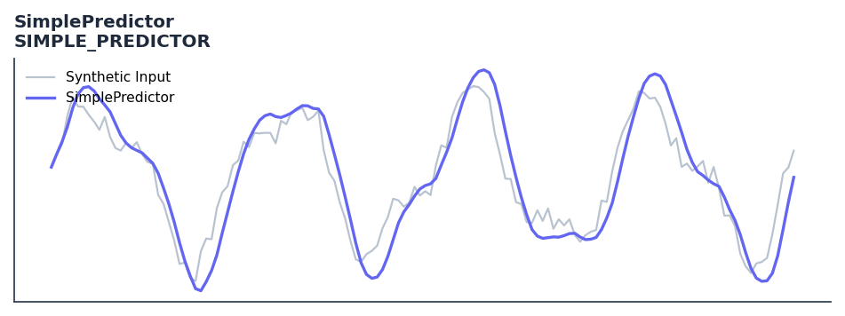

# SimplePredictor

<div class="indicator-meta"><span class="category-badge">Ehlers DSP</span> <span class="kw-badge">prediction</span> <span class="kw-badge">cycle</span> <span class="kw-badge">ehlers</span> <span class="kw-badge">dsp</span></div>

A fixed-coefficient 2-pole linear predictive filter.

## Visual Example



*Synthetic ideal per library logic. Generated 2026-06-25 IST via `docs/generate_all_previews.py` (reproducible; maps to core `Next<T>` implementation).*

## Description

The SimplePredictor indicator is a technical analysis tool that a fixed-coefficient 2-pole linear predictive filter.

This indicator is primarily used for identifying key market conditions. It provides a robust signal that can be easily integrated into both simple strategies and more complex machine learning feature pipelines. Compared to its alternatives, it offers a distinct balance of responsiveness and stability.

Traders often combine this with other metrics to confirm signals and avoid false positives during sideways market regimes. It remains a standard tool for systematic trading models.

Use as a lightweight one-bar-ahead price predictor for cycle-mode markets. Its low computational cost makes it suitable for real-time streaming at high frequency.

Ehlers derives a Simple Predictor that extrapolates price one bar forward using only the current and prior bars weighted by the dominant cycle coefficient. Despite its simplicity it provides useful one-bar forecasts in cycling markets, demonstrating the predictive value of cycle measurement.

QuantWave implements this indicator via the universal `Next<T>` trait, guaranteeing bit-identical results between Rust streaming, Python streaming, and Polars batch (`.ta()` / `map_batches`) surfaces.


## Formula / Specification

**Implementation** (`quantwave-core/src/indicators/simple_predictor.rs`):

\[
Predict = \frac{Signal - 1.8Q \cdot Signal_{t-1} + Q^2 \cdot Signal_{t-2}}{1 - 1.8Q + Q^2}
\]

Gold-standard parity vectors: `quantwave-core/tests/gold_standard/simple_predictor.json`.


## Parameters

| Parameter | Default | Description |
|-----------|---------|-------------|
| `hp_len` | 15 | HighPass filter length |
| `lp_len` | 30 | LowPass (SuperSmoother) length |
| `q` | 0.35 | Damping/Predictor coefficient |


## Usage Examples

**Streaming (Rust)**

```rust
use quantwave_core::indicators::SIMPLE_PREDICTOR;
use quantwave_core::traits::Next;

let mut ind = SIMPLE_PREDICTOR::new(15);
for price in &prices {
    let value = ind.next(price);
}
```

**Streaming (Python)**

```python
from quantwave import SIMPLE_PREDICTOR

ind = SIMPLE_PREDICTOR(15)
for price in prices:
    value = ind.next(price)
```

**Polars Batch (Python)**

```python
import polars as pl
import quantwave as qw

def apply_simplepredictor(series: pl.Series) -> pl.Series:
    ind = qw.SIMPLE_PREDICTOR(15)
    return pl.Series([ind.next(float(v)) for v in series.to_list()])

df = (
    pl.read_csv('ohlcv.csv')
    .lazy()
    .with_columns(
        pl.col("close").map_batches(apply_simplepredictor, return_dtype=pl.Float64).alias("simplepredictor")
    )
    .collect()
)
```

All surfaces are bit-identical via the single `Next<T>` implementation and proptests.

## Edge Cases & Limitations

- Recursive DSP filters require a warm-up period; first N bars may be unstable or raw-pass-through.
- Designed for cyclic/mean-reverting regimes; trending markets can produce lag or drift.
- Parameter `period` (or equivalent) controls cutoff — too small adds noise, too large adds lag.
- Prefer chaining with other Ehlers tools (Roofing Filter, SuperSmoother) on noisy inputs.
- Validated via proptests against gold-standard vectors where available.
- No look-ahead bias; suitable for live streaming and batch feature pipelines.

## Boundary Behavior

| Condition | Behavior |
|-----------|----------|
| Warm-up | Leading bars return NaN until warmup_bars is satisfied. |
| period > len | When period exceeds series length, output is all NaN. |
| NaN inputs | NaN in input propagates to output (NaN out). |
| Invalid params | Non-positive period or missing required params raise ValueError. |
| Empty data | Empty input returns an empty result series. |

## Related Indicators & See Also

- [Indicator Gallery](../gallery.md)
- [Native Indicators index](index.md)
- [Ehlers DSP guide](../ehlers/index.md)
- [Cyber Cycle](cyber_cycle.md)
- [SuperSmoother](supersmoother.md)

## Sources & References

**Primary Source**: https://github.com/lavs9/quantwave/blob/main/references/traderstipsreference/TRADERS’%20TIPS%20-%20JANUARY%202025.html

**Implementation**: `quantwave-core/src/indicators/simple_predictor.rs` (`SIMPLE_PREDICTOR` / `SIMPLE_PREDICTOR_METADATA`).
**Parity**: `quantwave-core/tests/gold_standard/simple_predictor.json`

**Provenance**: Standards bulk upgrade 2026-06-25 IST — see `docs/DOCUMENTATION_STANDARDS.md`.
