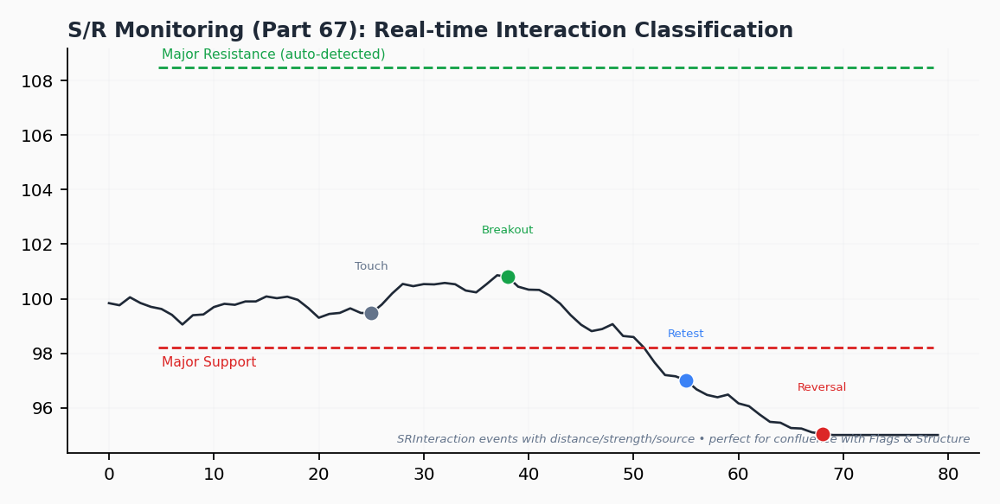

# S/R Interactions (Support & Resistance Monitoring)

<div class="indicator-meta"><span class="category-badge">Price Action</span> <span class="kw-badge">support-resistance</span> <span class="kw-badge">sr</span> <span class="kw-badge">breakout</span> <span class="kw-badge">retest</span> <span class="kw-badge">mql5</span></div>

**Date**: 2026-05-31 IST  
**Sources**: MQL5 Price Action Analysis Toolkit (Part 67) — Support/Resistance interactions by lynnchris. Article: https://www.mql5.com/en/articles/21961. Archived: `references/MQL5/lynnchris/implemented/Part67/SupportResistanceMonitor.mq5`.  
Core implementation: `quantwave-core/src/indicators/sr_monitor.rs` (composes MarketStructure).

The `SRInteractionMonitor` (Rust) provides real-time classification of price behavior around horizontal support and resistance levels. Levels can be:

- **Auto-generated** from confirmed MarketStructure swing points (with provenance tracking).
- **User-provided** dynamically (perfect for strategy-defined levels, round numbers, or previous day high/low).

Every bar it reports zero or more `SRInteraction` events with precise classification:

- **Approach** — Price entered the outer zone (early warning).
- **Touch** — Price overlapped the level within tolerance.
- **Breakout** — Price crossed the level (side change).
- **Reversal** — After a Touch, price returned to the original side without breaking.
- **Retest** — After a confirmed Breakout, price returned to the level (classic "retest of broken level").

## When to Use

- **Confluence engines**: "Only take this bull flag breakout if it occurs at a major support level that has already seen 3+ touches."
- **Mean-reversion strategies** around high-strength touches or reversals.
- **Breakout trading with retest filter**: Wait for Breakout + successful Retest before entry (dramatically improves win rate on many instruments).
- **Feature engineering**: Count touches on current support over last N bars, distance to nearest level, interaction type one-hot, strength at interaction.
- **Event-driven backtesting**: Every interaction is a first-class timestamped event carrying `distance_at_event`, `strength`, and `source`.

**Note**: As of this release the rich S/R surface is primarily available via the Rust streaming API (`SRInteractionMonitor`). Polars `.ta()` exposure and full Python bindings are on the near-term roadmap (the underlying engine is production-ready).

## Rich Event Metadata

`SRInteraction` (primary output inside `SRMonitorOutput.interactions`):

- `bar`, `level_price`, `level_label` (human readable, e.g. "R_auto_87" or "UserPivot_1.2345")
- `is_support`: bool
- `interaction`: Approach | Touch | Breakout | Reversal | Retest
- `strength`: Importance (for auto levels: the structure_count at swing creation; for user levels: can be incremented on repeated touches)
- `bars_since_creation`
- `distance_at_event`: signed distance (positive = price above level)
- `source`: `LevelSource::AutoSwing { origin_swing_bar, origin_strength }` or `UserProvided { user_id }`

`SRMonitorOutput` also always carries the current `MarketStructureState` so you can apply bias/structure filters at the same moment.

**Visual: S/R Interaction Lifecycle**  
Price rises into a resistance level (Approach → Touch). It fails and reverses (Reversal). Later it breaks through decisively (Breakout). On the pullback it retests the level from above (Retest) and holds — a high-probability continuation setup. All five event types are annotated on the chart with strength and distance callouts.



## Practical Usage (Rust Streaming — Current Primary Surface)

```rust
use quantwave_core::indicators::sr_monitor::SRInteractionMonitor;
use quantwave_core::traits::Next;

let mut monitor = SRInteractionMonitor::new(3, touch_tolerance=0.5, approach_zone=5.0);

let user_resist_id = monitor.add_user_level(112.40, "MajorResistance");

for (h, l, c) in highs.iter().zip(lows).zip(closes) {
    let out = monitor.next((*h, *l, *c));
    
    for inter in &out.interactions {
        if inter.interaction == SRInteractionType::Retest && inter.strength > 1.5 {
            // High-quality retest of a significant level
            if out.structure.bias == Bias::Bullish {
                // long bias + retest at support = strong setup
            }
        }
    }
}
```

Auto levels are generated internally from the MarketStructure swings. You can also register multiple user levels at any time.

## Polars / Python

While direct `.ta.sr_monitor()` is not yet exposed in the Polars namespace, you can:

1. Generate the MarketStructure + swing points via Polars.
2. Feed the swing-derived levels into a small Rust or Python loop (or the backtester) that runs `SRInteractionMonitor`.
3. Or join externally computed interaction events on `bar` index.

See the main PA notebook for patterns of combining the three tools.

## Strategy & ML Integration

**Confluence example** (pseudocode):

```python
if (flag.breakout_confirmed and
    any(i.interaction == "Breakout" and i.level_price near flag.breakout_price
        for i in sr_interactions_on_same_bar)):
    # Flag breakout occurring at / through S/R = high conviction
```

**ML features**:
- `touches_on_current_support_20`
- `nearest_level_distance_atr`
- `interaction_type_onehot` (5 columns)
- `auto_level_strength_at_event`
- Interaction × geometric pattern cross features

The provenance (`source`) field lets you distinguish "organic" swing-based levels from your own strategy levels — extremely useful for attribution in both live trading and research.

## Parameters

- `swing_strength`: Passed to internal MarketStructure (controls auto level generation).
- `touch_tolerance`: Absolute price distance considered a "touch" (scale to instrument — e.g. 0.5 points, 5 pips, etc.).
- `approach_zone`: Outer buffer for pre-touch Approach signals (typically 3–10× touch tolerance).

**Metadata source of truth**: `SR_INTERACTION_MONITOR_METADATA` in `sr_monitor.rs` (keywords include "part-67").

## Related

- [Market Structure](market_structure.md) — supplies the auto levels and bias
- [Geometric Patterns](geometric_patterns.md) — pair with S/R for confluence
- [Using Rich PA Events](pa_events_strategies.md)
- Comprehensive examples: [pa_flag_breakout_strategy.md](../../../examples/notebooks/pa_flag_breakout_strategy.md)
- MQL5 Part 67: https://www.mql5.com/en/articles/21961

Full parity tests exist for the streaming implementation (including mixed auto + user level scenarios).
