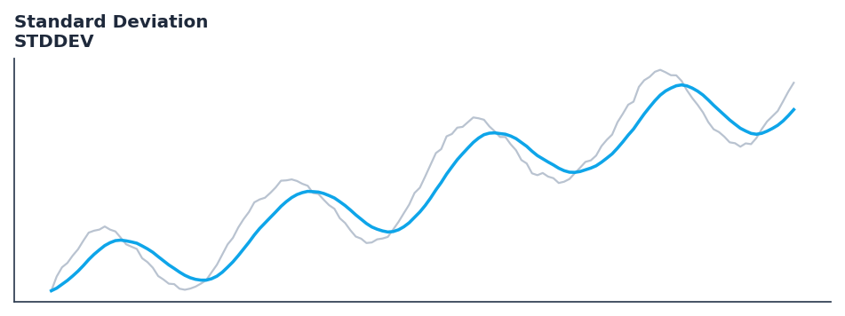

# Standard Deviation

<div class="indicator-meta"><span class="category-badge">Classic</span> <span class="kw-badge">statistics</span> <span class="kw-badge">classic</span> <span class="kw-badge">volatility</span> <span class="kw-badge">trend</span></div>

Standard Deviation is a statistical measure of market volatility.

## Visual Example



*Synthetic ideal per library logic. Generated 2026-06-25 IST via `docs/generate_all_previews.py` (reproducible; maps to core `Next<T>` implementation).*

## Description

The Standard Deviation indicator is a technical analysis tool that standard deviation is a statistical measure of market volatility.

This indicator is primarily used for identifying key market conditions. It provides a robust signal that can be easily integrated into both simple strategies and more complex machine learning feature pipelines. Compared to its alternatives, it offers a distinct balance of responsiveness and stability.

Traders often combine this with other metrics to confirm signals and avoid false positives during sideways market regimes. It remains a standard tool for systematic trading models.

Use for statistical analysis of price series: linear regression, standard deviation, correlation coefficients, and other descriptive statistics used as indicator inputs.

Standard statistical measures provide the mathematical foundation for many technical indicators. Linear regression finds the best-fit line through price, standard deviation quantifies dispersion, and correlation coefficients measure how closely two series move together — all are essential for quantitative strategy construction.

QuantWave implements this indicator via the universal `Next<T>` trait, guaranteeing bit-identical results between Rust streaming, Python streaming, and Polars batch (`.ta()` / `map_batches`) surfaces.


## Formula / Specification

**Implementation** (`quantwave-core/src/indicators/statistics.rs`):

\[
\sigma = \sqrt{ \frac{\sum (x_i - \mu)^2}{N} }
\]

Gold-standard parity vectors: `quantwave-core/tests/gold_standard/stddev.json`.


## Parameters

| Parameter | Default | Description |
|-----------|---------|-------------|
| `period` | 14 | Period |


## Usage Examples

**Streaming (Rust)**

```rust
use quantwave_core::indicators::STDDEV;
use quantwave_core::traits::Next;

let mut ind = STDDEV::new(14);
for price in &prices {
    let value = ind.next(price);
}
```

**Streaming (Python)**

```python
from quantwave import STDDEV

ind = STDDEV(14)
for price in prices:
    value = ind.next(price)
```

**Polars Batch (Python)**

```python
import polars as pl
import quantwave as qw

def apply_standard_deviation(series: pl.Series) -> pl.Series:
    ind = qw.STDDEV(14)
    return pl.Series([ind.next(float(v)) for v in series.to_list()])

df = (
    pl.read_csv('ohlcv.csv')
    .lazy()
    .with_columns(
        pl.col("close").map_batches(apply_standard_deviation, return_dtype=pl.Float64).alias("standard_deviation")
    )
    .collect()
)
```

All surfaces are bit-identical via the single `Next<T>` implementation and proptests.

## Edge Cases & Limitations

- Warm-up: first `14` bars may return NaN or partial state per implementation.
- Parameter sensitivity: smaller periods increase noise; larger periods increase lag.
- Sudden gaps or bad ticks can distort rolling windows — consider pre-filtering.
- Single-series indicators ignore volume unless otherwise documented.
- Validated via proptests against gold-standard vectors where available.
- No look-ahead bias; streaming and Polars batch paths are bit-identical.

## Boundary Behavior

| Condition | Behavior |
|-----------|----------|
| Warm-up | Leading bars return NaN until warmup_bars is satisfied. |
| period > len | When period exceeds series length, output is all NaN. |
| NaN inputs | NaN in input propagates to output (NaN out). |
| Invalid params | Non-positive period or missing required params raise ValueError. |
| Empty data | Empty input returns an empty result series. |

## Related Indicators & See Also

- [Indicator Gallery](../gallery.md)
- [Native Indicators index](index.md)
- [Batch vs Streaming guide](../../../examples/batch-streaming.md)
- [RSI](relative_strength_index_rsi.md)
- [SuperTrend](supertrend.md)

## Sources & References

**Primary Source**: https://www.investopedia.com/terms/s/standarddeviation.asp

**Implementation**: `quantwave-core/src/indicators/statistics.rs` (`STDDEV` / `STDDEV_METADATA`).
**Parity**: `quantwave-core/tests/gold_standard/stddev.json`

**Provenance**: Standards bulk upgrade 2026-06-25 IST — see `docs/DOCUMENTATION_STANDARDS.md`.
