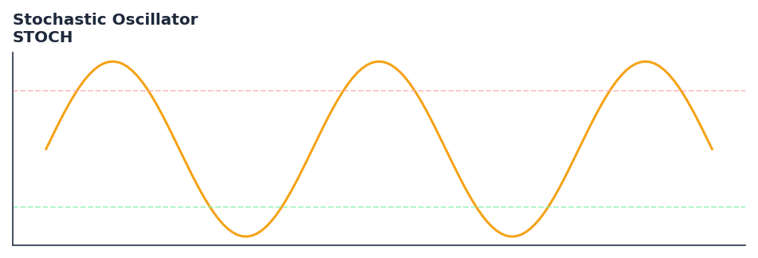

# Stochastic Oscillator

<div class="indicator-meta"><span class="category-badge">Classic</span> <span class="kw-badge">momentum</span> <span class="kw-badge">oscillator</span> <span class="kw-badge">overbought</span> <span class="kw-badge">oversold</span> <span class="kw-badge">classic</span></div>

A momentum indicator comparing a particular closing price of a security to a range of its prices over a certain period of time.

## Visual Example



*Synthetic ideal per library logic. Generated 2026-07-01 IST via `docs/generate_all_previews.py` (reproducible; maps to core `Next<T>` implementation).*

## Description

A momentum indicator comparing a particular closing price of a security to a range of its prices over a certain period of time.

Use to identify trend reversals by looking for crossovers and overbought/oversold levels. The %K and %D lines indicate when the momentum is shifting relative to the recent price range.

Native Rust implementation with gold-standard or TA-Lib parity tests where applicable.

George Lane developed the Stochastic Oscillator in the 1950s. It is based on the observation that in an uptrend, prices tend to close near their high, and in a downtrend, they tend to close near their low. The sensitivity of the oscillator to market movements is reducible by adjusting the time period or by taking a moving average of the result. — StockCharts ChartSchool

**Typical applications:**

- Fade extremes in ranges; trade with trend on recoveries from oversold/overbought
- Use divergences as early warning — confirm with structure or volume
- Parameter default `5` — shorten for sensitivity, lengthen for stability
- Drop into `build_feature_matrix()` for ML research

QuantWave implements this via the universal `Next<T>` trait — bit-identical across Rust streaming, Python streaming, and Polars `.ta()` batch plugins.

## Formula / Specification

**Implementation** (`quantwave-core/src/indicators/momentum.rs`):

\[
\%K = 100 \times \frac{C - L14}{H14 - L14} \\ \%D = 3\text{-period SMA of } \%K
\]

Gold-standard parity vectors: `quantwave-core/tests/gold_standard/stoch.json`.


## Parameters

| Parameter | Default | Description |
|-----------|---------|-------------|
| `fastk_period` | 5 | Fast %K period |
| `slowk_period` | 3 | Slow %K period |
| `slowd_period` | 3 | Slow %D period |


## Usage Examples

**Streaming (Rust)**

```rust
use quantwave_core::indicators::STOCH;
use quantwave_core::traits::Next;

let mut ind = STOCH::new(5);
for price in &prices {
    let value = ind.next(price);
}
```

**Streaming (Python)**

```python
from quantwave import STOCH

ind = STOCH(5)
for price in prices:
    value = ind.next(price)
```

**Polars Batch (Python)**

```python
import polars as pl
import quantwave as qw

def apply_stochastic_oscillator(series: pl.Series) -> pl.Series:
    ind = qw.STOCH(5)
    return pl.Series([ind.next(float(v)) for v in series.to_list()])

df = (
    pl.read_csv('ohlcv.csv')
    .lazy()
    .with_columns(
        pl.col("close").map_batches(apply_stochastic_oscillator, return_dtype=pl.Float64).alias("stochastic_oscillator")
    )
    .collect()
)
```

All surfaces are bit-identical via the single `Next<T>` implementation and proptests.

## Edge Cases & Limitations

- Warm-up: first `5` bars may return NaN or partial state per implementation.
- Parameter sensitivity: smaller periods increase noise; larger periods increase lag.
- Sudden gaps or bad ticks can distort rolling windows — consider pre-filtering.
- Single-series indicators ignore volume unless otherwise documented.
- Validated via proptests against gold-standard vectors where available.
- No look-ahead bias; streaming and Polars batch paths are bit-identical.

## Boundary Behavior

| Condition | Behavior |
|-----------|----------|
| Warm-up | Leading bars return NaN until warmup_bars is satisfied. |
| period > len | When period exceeds series length, output is all NaN. |
| NaN inputs | NaN in input propagates to output (NaN out). |
| Invalid params | Non-positive period or missing required params raise ValueError. |
| Empty data | Empty input returns an empty result series. |

## Related Indicators & See Also

- [Indicator Gallery](../gallery.md)
- [Native Indicators index](index.md)
- [Batch vs Streaming guide](../../../examples/batch-streaming.md)
- [RSI](relative_strength_index_rsi.md)
- [SuperTrend](supertrend/)

## Sources & References

**Primary Source**: https://www.investopedia.com/terms/s/stochasticoscillator.asp

**Implementation**: `quantwave-core/src/indicators/momentum.rs` (`STOCH` / `STOCH_METADATA`).
**Parity**: `quantwave-core/tests/gold_standard/stoch.json`

**Provenance**: Standards bulk upgrade 2026-07-01 IST — see `docs/DOCUMENTATION_STANDARDS.md`.
