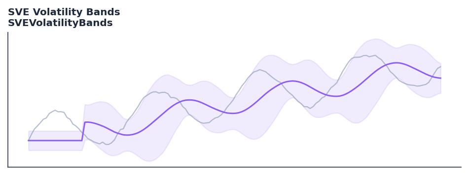

# SVE Volatility Bands

<div class="indicator-meta"><span class="category-badge">Classic</span> <span class="kw-badge">bands</span> <span class="kw-badge">volatility</span> <span class="kw-badge">renko</span> <span class="kw-badge">vervoort</span></div>

Volatility bands designed to highlight volatility changes especially when using non-time-related charts like Renko.

## Visual Example



*Synthetic ideal per library logic. Generated 2026-06-25 IST via `docs/generate_all_previews.py` (reproducible; maps to core `Next<T>` implementation).*

## Description

Volatility bands designed to highlight volatility changes especially when using non-time-related charts like Renko.

Use to identify extreme price excursions and volatility contraction/expansion. The bands adapt to volatility using a smoothed ATR-like calculation.

Introduced by Sylvain Vervoort, SVE Volatility Bands use a weighted moving average of price and a smoothed True Range to create dynamic bands. It includes a specific adjustment for the lower band and a midline based on typical price.

QuantWave implements this indicator via the universal `Next<T>` trait, guaranteeing bit-identical results between Rust streaming, Python streaming, and Polars batch (`.ta()` / `map_batches`) surfaces.

## Formula / Specification

**Implementation** (`quantwave-core/src/indicators/sve_volatility_bands.rs`):

\[
ATR\_MA = SMA(TrueRange, bands\_period \times 2 - 1) \\
WtdAvgVal = WMA(Close, bands\_period) \\
Upper = WtdAvgVal \times (1 + (ATR\_MA \times bands\_deviation) / Close) \\
Lower = WtdAvgVal \times (1 - (ATR\_MA \times bands\_deviation \times low\_band\_adjust) / Close) \\
MidLine = WMA(TypicalPrice, mid\_line\_length)
\]

Gold-standard parity vectors: `quantwave-core/tests/gold_standard/sve_volatility_bands_20_2.4_0.9_20.json`.


## Parameters

| Parameter | Default | Description |
|-----------|---------|-------------|
| `bands_period` | 20 | Period for the price WMA and the ATR smoothing basis. |
| `bands_deviation` | 2.4 | Multiplier for the volatility range. |
| `low_band_adjust` | 0.9 | Adjustment factor for the lower band. |
| `mid_line_length` | 20 | Period for the midline WMA. |


## Usage Examples

**Streaming (Rust)**

```rust
use quantwave_core::indicators::SVEVolatilityBands;
use quantwave_core::traits::Next;

let mut ind = SVEVolatilityBands::new(20);
for price in &prices {
    let value = ind.next(price);
}
```

**Streaming (Python)**

```python
from quantwave import SVEVolatilityBands

ind = SVEVolatilityBands(20)
for price in prices:
    value = ind.next(price)
```

**Polars Batch (Python)**

```python
import polars as pl
import quantwave as qw

def apply_sve_volatility_bands(series: pl.Series) -> pl.Series:
    ind = qw.SVEVolatilityBands(20)
    return pl.Series([ind.next(float(v)) for v in series.to_list()])

df = (
    pl.read_csv('ohlcv.csv')
    .lazy()
    .with_columns(
        pl.col("close").map_batches(apply_sve_volatility_bands, return_dtype=pl.Float64).alias("sve_volatility_bands")
    )
    .collect()
)
```

All surfaces are bit-identical via the single `Next<T>` implementation and proptests.

## Edge Cases & Limitations

- Warm-up: first `20` bars may return NaN or partial state per implementation.
- Parameter sensitivity: smaller periods increase noise; larger periods increase lag.
- Sudden gaps or bad ticks can distort rolling windows — consider pre-filtering.
- Single-series indicators ignore volume unless otherwise documented.
- Validated via proptests against gold-standard vectors where available.
- No look-ahead bias; streaming and Polars batch paths are bit-identical.

## Related Indicators & See Also

- [Indicator Gallery](../gallery.md)
- [Native Indicators index](index.md)
- [Batch vs Streaming guide](../../../examples/batch-streaming.md)
- [RSI](relative_strength_index_rsi.md)
- [SuperTrend](supertrend.md)

## Sources & References

**Primary Source**: Technical Analysis of Stocks & Commodities, January 2019

**Implementation**: `quantwave-core/src/indicators/sve_volatility_bands.rs` (`SVEVolatilityBands` / `SVEVOLATILITYBANDS_METADATA`).
**Parity**: `quantwave-core/tests/gold_standard/sve_volatility_bands_20_2.4_0.9_20.json`

**Provenance**: Standards bulk upgrade 2026-06-25 IST — see `docs/DOCUMENTATION_STANDARDS.md`.
