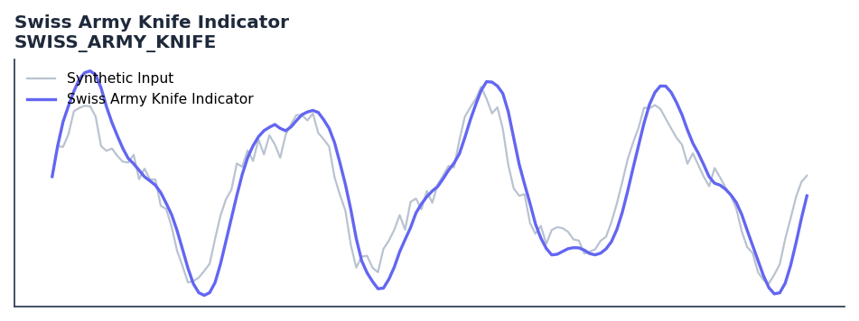

# Swiss Army Knife Indicator

<div class="indicator-meta"><span class="category-badge">Ehlers DSP</span> <span class="kw-badge">filter</span> <span class="kw-badge">ehlers</span> <span class="kw-badge">dsp</span> <span class="kw-badge">multi-purpose</span> <span class="kw-badge">smoothing</span></div>

A versatile indicator that can be configured as EMA, SMA, Gaussian, Butterworth, High Pass, Band Pass, or Band Stop filter.

## Visual Example



*Synthetic ideal per library logic. Generated 2026-06-25 IST via `docs/generate_all_previews.py` (reproducible; maps to core `Next<T>` implementation).*

## Description

The Swiss Army Knife Indicator indicator is a technical analysis tool that a versatile indicator that can be configured as ema, sma, gaussian, butterworth, high pass, band pass, or band stop filter.

This indicator is primarily used for identifying key market conditions. It provides a robust signal that can be easily integrated into both simple strategies and more complex machine learning feature pipelines. Compared to its alternatives, it offers a distinct balance of responsiveness and stability.

Traders often combine this with other metrics to confirm signals and avoid false positives during sideways market regimes. It remains a standard tool for systematic trading models.

Use as a single configurable filter that can emulate SMA, EMA, Gaussian, Butterworth, or bandpass responses by switching mode flags. Ideal for prototyping different filter designs without code changes.

Ehlers presents the Swiss Army Knife Indicator in Cycle Analytics for Traders as a unified filter framework. A set of boolean flags selects the operating mode, making it possible to compare multiple filter responses on the same data by simply toggling flags rather than reimplementing each filter.

QuantWave implements this indicator via the universal `Next<T>` trait, guaranteeing bit-identical results between Rust streaming, Python streaming, and Polars batch (`.ta()` / `map_batches`) surfaces.


## Formula / Specification

**Implementation** (`quantwave-core/src/indicators/swiss_army_knife.rs`):

\[
Filt = c_0(b_0 x_t + b_1 x_{t-1} + b_2 x_{t-2}) + a_1 Filt_{t-1} + a_2 Filt_{t-2} - c_1 x_{t-N}
\]

Gold-standard parity vectors: `quantwave-core/tests/gold_standard/swiss_army_knife.json`.


## Parameters

| Parameter | Default | Description |
|-----------|---------|-------------|
| `mode` | BandPass | Filter mode (EMA, SMA, Gauss, Butter, Smooth, HP, 2PHP, BP, BS) |
| `period` | 20 | Filter period |
| `delta` | 0.1 | Bandwidth parameter for BP and BS modes |


## Usage Examples

**Streaming (Rust)**

```rust
use quantwave_core::indicators::SWISS_ARMY_KNIFE;
use quantwave_core::traits::Next;

let mut ind = SWISS_ARMY_KNIFE::new(BandPass);
for price in &prices {
    let value = ind.next(price);
}
```

**Streaming (Python)**

```python
from quantwave import SWISS_ARMY_KNIFE

ind = SWISS_ARMY_KNIFE(BandPass)
for price in prices:
    value = ind.next(price)
```

**Polars Batch (Python)**

```python
import polars as pl
import quantwave as qw

def apply_swiss_army_knife_indicator(series: pl.Series) -> pl.Series:
    ind = qw.SWISS_ARMY_KNIFE(BandPass)
    return pl.Series([ind.next(float(v)) for v in series.to_list()])

df = (
    pl.read_csv('ohlcv.csv')
    .lazy()
    .with_columns(
        pl.col("close").map_batches(apply_swiss_army_knife_indicator, return_dtype=pl.Float64).alias("swiss_army_knife_indicator")
    )
    .collect()
)
```

All surfaces are bit-identical via the single `Next<T>` implementation and proptests.

## Edge Cases & Limitations

- Recursive DSP filters require a warm-up period; first N bars may be unstable or raw-pass-through.
- Designed for cyclic/mean-reverting regimes; trending markets can produce lag or drift.
- Parameter `period` (or equivalent) controls cutoff — too small adds noise, too large adds lag.
- Prefer chaining with other Ehlers tools (Roofing Filter, SuperSmoother) on noisy inputs.
- Validated via proptests against gold-standard vectors where available.
- No look-ahead bias; suitable for live streaming and batch feature pipelines.

## Boundary Behavior

| Condition | Behavior |
|-----------|----------|
| Warm-up | Leading bars return NaN until warmup_bars is satisfied. |
| period > len | When period exceeds series length, output is all NaN. |
| NaN inputs | NaN in input propagates to output (NaN out). |
| Invalid params | Non-positive period or missing required params raise ValueError. |
| Empty data | Empty input returns an empty result series. |

## Related Indicators & See Also

- [Indicator Gallery](../gallery.md)
- [Native Indicators index](index.md)
- [Ehlers DSP guide](../ehlers/index.md)
- [Cyber Cycle](cyber_cycle.md)
- [SuperSmoother](supersmoother.md)

## Sources & References

**Primary Source**: https://github.com/lavs9/quantwave/blob/main/references/Ehlers%20Papers/SwissArmyKnifeIndicator.pdf

**Implementation**: `quantwave-core/src/indicators/swiss_army_knife.rs` (`SWISS_ARMY_KNIFE` / `SWISS_ARMY_KNIFE_METADATA`).
**Parity**: `quantwave-core/tests/gold_standard/swiss_army_knife.json`

**Provenance**: Standards bulk upgrade 2026-06-25 IST — see `docs/DOCUMENTATION_STANDARDS.md`.
