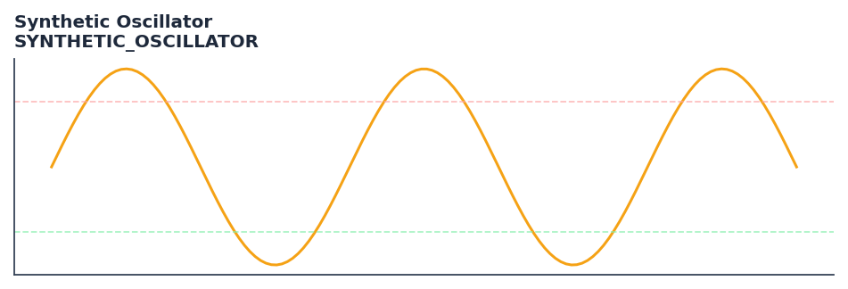

# Synthetic Oscillator

<div class="indicator-meta"><span class="category-badge">Ehlers DSP</span> <span class="kw-badge">oscillator</span> <span class="kw-badge">ehlers</span> <span class="kw-badge">dsp</span> <span class="kw-badge">cycle</span> <span class="kw-badge">synthetic</span></div>

A nonlinear oscillator designed to reduce lag while maintaining smoothness by adapting to the dominant cycle.

## Visual Example



*Synthetic ideal per library logic. Generated 2026-06-25 IST via `docs/generate_all_previews.py` (reproducible; maps to core `Next<T>` implementation).*

## Description

A nonlinear oscillator designed to reduce lag while maintaining smoothness by adapting to the dominant cycle.

Use to construct a synthetic oscillator from dominant cycle sine components when direct price oscillators are too noisy. Most effective in clearly cyclical markets.

Ehlers constructs a Synthetic Oscillator by generating a synthetic sine wave at the measured dominant cycle period and comparing it to price. The phase difference between the synthetic sine and actual price reveals whether the market is ahead of or behind its expected cycle position.

QuantWave implements this indicator via the universal `Next<T>` trait, guaranteeing bit-identical results between Rust streaming, Python streaming, and Polars batch (`.ta()` / `map_batches`) surfaces.

## Formula / Specification

**Implementation** (`quantwave-core/src/indicators/synthetic_oscillator.rs`):

\[
Price = \text{Hann}(Close, 12)
\]
\[
LP = \text{SuperSmoother}(\text{HighPass}(Price, UB), LB)
\]
\[
Re = \frac{LP}{RMS(LP, 100)}, \quad Im = \frac{Re - Re_{t-1}}{RMS(Re - Re_{t-1}, 100)}
\]
\[
DC = \frac{2\pi(Re^2 + Im^2)}{(Re - Re_{t-1})Im - (Im - Im_{t-1})Re}
\]
\[
BP = \text{UltimateSmoother}(\text{HighPass}(Close, Mid), Mid)
\]
\[
Phase = Phase_{t-1} + \frac{2\pi}{DC}
\]
\[
Synth = \sin(Phase)
\]

Gold-standard parity vectors: `quantwave-core/tests/gold_standard/synthetic_oscillator.json`.


## Parameters

| Parameter | Default | Description |
|-----------|---------|-------------|
| `lower_bound` | 15 | Lower bound of cycle period |
| `upper_bound` | 25 | Upper bound of cycle period |


## Usage Examples

**Streaming (Rust)**

```rust
use quantwave_core::indicators::SYNTHETIC_OSCILLATOR;
use quantwave_core::traits::Next;

let mut ind = SYNTHETIC_OSCILLATOR::new(15);
for price in &prices {
    let value = ind.next(price);
}
```

**Streaming (Python)**

```python
from quantwave import SYNTHETIC_OSCILLATOR

ind = SYNTHETIC_OSCILLATOR(15)
for price in prices:
    value = ind.next(price)
```

**Polars Batch (Python)**

```python
import polars as pl
import quantwave as qw

def apply_synthetic_oscillator(series: pl.Series) -> pl.Series:
    ind = qw.SYNTHETIC_OSCILLATOR(15)
    return pl.Series([ind.next(float(v)) for v in series.to_list()])

df = (
    pl.read_csv('ohlcv.csv')
    .lazy()
    .with_columns(
        pl.col("close").map_batches(apply_synthetic_oscillator, return_dtype=pl.Float64).alias("synthetic_oscillator")
    )
    .collect()
)
```

All surfaces are bit-identical via the single `Next<T>` implementation and proptests.

## Edge Cases & Limitations

- Recursive DSP filters require a warm-up period; first N bars may be unstable or raw-pass-through.
- Designed for cyclic/mean-reverting regimes; trending markets can produce lag or drift.
- Parameter `period` (or equivalent) controls cutoff — too small adds noise, too large adds lag.
- Prefer chaining with other Ehlers tools (Roofing Filter, SuperSmoother) on noisy inputs.
- Validated via proptests against gold-standard vectors where available.
- No look-ahead bias; suitable for live streaming and batch feature pipelines.

## Related Indicators & See Also

- [Indicator Gallery](../gallery.md)
- [Native Indicators index](index.md)
- [Ehlers DSP guide](../ehlers/index.md)
- [Cyber Cycle](cyber_cycle.md)
- [SuperSmoother](supersmoother.md)

## Sources & References

**Primary Source**: https://github.com/lavs9/quantwave/blob/main/references/traderstipsreference/TRADERS’%20TIPS%20-%20APRIL%202026.html

**Implementation**: `quantwave-core/src/indicators/synthetic_oscillator.rs` (`SYNTHETIC_OSCILLATOR` / `SYNTHETIC_OSCILLATOR_METADATA`).
**Parity**: `quantwave-core/tests/gold_standard/synthetic_oscillator.json`

**Provenance**: Standards bulk upgrade 2026-06-25 IST — see `docs/DOCUMENTATION_STANDARDS.md`.
