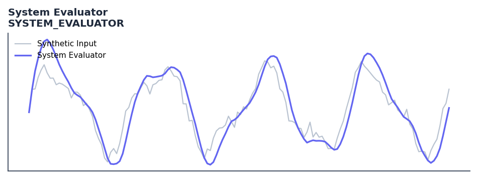

# System Evaluator

<div class="indicator-meta"><span class="category-badge">Statistics</span> <span class="kw-badge">system</span> <span class="kw-badge">performance</span> <span class="kw-badge">ehlers</span> <span class="kw-badge">statistics</span></div>

Calculates robust statistical performance metrics for a trading system based on a stream of trade profits.

## Visual Example



*Synthetic ideal per library logic. Generated 2026-06-25 IST via `docs/generate_all_previews.py` (reproducible; maps to core `Next<T>` implementation).*

## Description

Calculates robust statistical performance metrics for a trading system based on a stream of trade profits.

Use to assess the performance quality of a trading system output using signal processing metrics. Helps distinguish systems with genuine edge from those that merely overfit.

Ehlers applies signal processing metrics to evaluate trading system quality in Cybernetic Analysis. Metrics such as the Signal-to-Noise Ratio of the equity curve quantify whether a system is generating genuine signal above the noise floor of random entry and exit.

QuantWave implements this indicator via the universal `Next<T>` trait, guaranteeing bit-identical results between Rust streaming, Python streaming, and Polars batch (`.ta()` / `map_batches`) surfaces.

## Formula / Specification

**Implementation** (`quantwave-core/src/indicators/system_evaluator.rs`):

\[
AveTrade = \% \cdot (PF + 1) - 1
\]
\[
PF_{breakeven} = \frac{1 - \%}{\%}
\]
\[
N_{losers} = \frac{\ln(0.0027)}{\ln(1 - \%)}
\]

Gold-standard parity vectors: `quantwave-core/tests/gold_standard/system_evaluation.json`.


## Parameters

| Parameter | Default | Description |
|-----------|---------|-------------|
| (none) | — | No tunable parameters for this detector. |

## Usage Examples

**Streaming (Rust)**

```rust
use quantwave_core::indicators::SYSTEM_EVALUATOR;
use quantwave_core::traits::Next;

let mut ind = SYSTEM_EVALUATOR::new(14);
for price in &prices {
    let value = ind.next(price);
}
```

**Streaming (Python)**

```python
from quantwave import SYSTEM_EVALUATOR

ind = SYSTEM_EVALUATOR(14)
for price in prices:
    value = ind.next(price)
```

**Polars Batch (Python)**

```python
import polars as pl
import quantwave as qw

def apply_system_evaluator(series: pl.Series) -> pl.Series:
    ind = qw.SYSTEM_EVALUATOR(14)
    return pl.Series([ind.next(float(v)) for v in series.to_list()])

df = (
    pl.read_csv('ohlcv.csv')
    .lazy()
    .with_columns(
        pl.col("close").map_batches(apply_system_evaluator, return_dtype=pl.Float64).alias("system_evaluator")
    )
    .collect()
)
```

All surfaces are bit-identical via the single `Next<T>` implementation and proptests.

## Edge Cases & Limitations

- Recursive DSP filters require a warm-up period; first N bars may be unstable or raw-pass-through.
- Designed for cyclic/mean-reverting regimes; trending markets can produce lag or drift.
- Parameter `period` (or equivalent) controls cutoff — too small adds noise, too large adds lag.
- Prefer chaining with other Ehlers tools (Roofing Filter, SuperSmoother) on noisy inputs.
- Validated via proptests against gold-standard vectors where available.
- No look-ahead bias; suitable for live streaming and batch feature pipelines.

## Related Indicators & See Also

- [Indicator Gallery](../gallery.md)
- [Native Indicators index](index.md)
- [Ehlers DSP guide](../ehlers/index.md)
- [Cyber Cycle](cyber_cycle.md)
- [SuperSmoother](supersmoother.md)

## Sources & References

**Primary Source**: https://github.com/lavs9/quantwave/blob/main/references/Ehlers%20Papers/SystemEvaluation.pdf

**Implementation**: `quantwave-core/src/indicators/system_evaluator.rs` (`SYSTEM_EVALUATOR` / `SYSTEM_EVALUATOR_METADATA`).
**Parity**: `quantwave-core/tests/gold_standard/system_evaluation.json`

**Provenance**: Standards bulk upgrade 2026-06-25 IST — see `docs/DOCUMENTATION_STANDARDS.md`.
