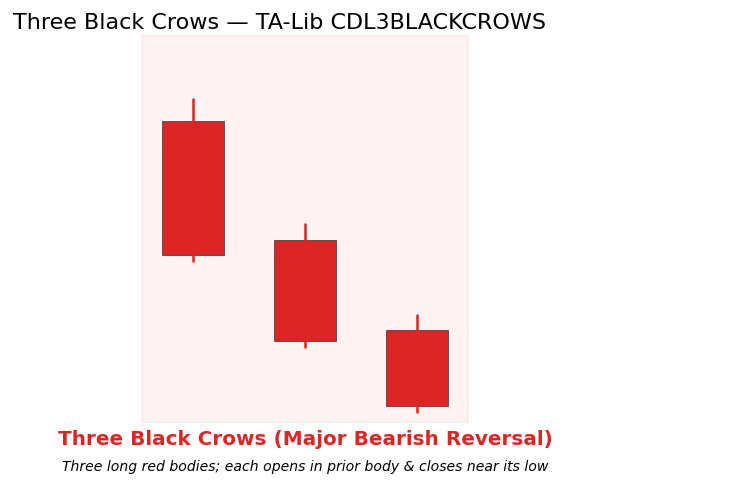

# Three Black Crows

<div class="indicator-meta"><span class="category-badge">Patterns</span> <span class="kw-badge">candlestick</span> <span class="kw-badge">reversal</span> <span class="kw-badge">bearish</span></div>

A three-candle bearish reversal pattern consisting of three consecutive long red (bearish) bodies. Each candle opens inside the prior body and closes near its own low, producing a steady downward staircase that often marks the end of an uptrend.

## Visual Example



*Synthetic ideal satisfying TA-Lib CDL3BLACKCROWS stepping logic. Generated 2026-05-31 IST via `docs/gen_candle_previews.py`.*

## Description

The pattern embodies sustained selling pressure over three periods with no meaningful relief. It is one of the more reliable multi-candle reversal formations when it appears after a clear advance and at a resistance or structure level.

Quant developers treat it as a high-conviction binary event feature for short entries or for regime-shift labels in supervised ML. Confirmation on the fourth bar (further weakness) or confluence with a Market Structure BOS flip dramatically improves edge.

## Formula / Specification

**Recognition Rules (exact implementation in QuantWave / TA-Lib CDL3BLACKCROWS)**:

1. Three consecutive bars, each with close < open (red body).
2. Each bar's open lies inside the body of the prior bar.
3. Each bar closes near its own low (strong bearish conviction).
4. The pattern completes on the third bar.
5. Three-bar window maintained by the streaming wrapper.

## Parameters

| Parameter | Default | Description |
|-----------|---------|-------------|
| (none) | — | Pattern recognition only; no tunable parameters. |

## Usage Examples

**Streaming (Rust)**

```rust
use quantwave_core::indicators::CDL3BLACKCROWS;
use quantwave_core::traits::Next;

let mut crows = CDL3BLACKCROWS::new();
for (o, h, l, c) in &ohlcv {
    let sig = crows.next((o, h, l, c));
    if sig < 0.0 { /* strong bearish reversal event */ }
}
```

**Streaming (Python) and Polars** use the corresponding `CDL3BLACKCROWS` / `.ta.cdl_3blackcrows(...)` surface. Full bit-identical parity.

## Edge Cases & Limitations

- Requires three complete bars.
- Can be overridden by news or very strong trend; always seek structure/volume confirmation.
- In low-liquidity names the "long body + inside open" geometry can appear without real conviction.
- Best after an established uptrend or at a higher-timeframe resistance.

## Boundary Behavior

| Condition | Behavior |
|-----------|----------|
| Warm-up | Pattern functions emit 0 (no pattern) until enough bars exist. |
| period > len | Short series returns all zeros (no pattern detected). |
| NaN inputs | Bars with NaN OHLC are treated as no pattern (0). |
| Invalid params | N/A for most candlestick patterns. |
| Empty data | Empty input returns an empty integer series. |

## Related Indicators & See Also

- [Three White Soldiers](three_white_soldiers.md), [Three Inside Up/Down](three_inside_up_down.md), [Dark Cloud Cover](dark_cloud_cover.md)
- [Market Structure](market_structure.md) (bias + BOS confirmation)
- Gallery, native index, PA notebook

## Sources & References

**Primary Source**: TA-Lib CDL3BLACKCROWS via `quantwave-core/src/indicators/pattern.rs`.

**Visual**: `docs/gen_candle_previews.py`, 2026-05-31 IST.

**Context**: Nison (1991) for staircase selling psychology only. MQL5 PA for confluence.

**Provenance**: Next<T> + Polars parity.
