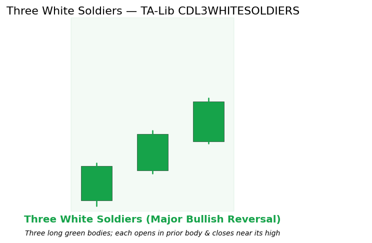

# Three White Soldiers

Patterns candlestick reversal bullish

A three-candle bullish reversal pattern consisting of three consecutive long green (bullish) bodies. Each candle opens inside the prior body and closes near its own high, forming a steady upward staircase that frequently terminates a downtrend.

## Visual Example

*Synthetic ideal satisfying TA-Lib CDL3WHITESOLDIERS stepping logic. Generated 2026-05-31 IST via `docs/gen_candle_previews.py`.*

## Description

The mirror image of Three Black Crows. Sustained buying over three periods with no meaningful pullback produces a high-conviction bullish reversal signal when it appears after a decline and at support or a Market Structure level.

This indicator is primarily used for identifying key market conditions. It provides a robust signal that can be easily integrated into both simple strategies and more complex machine learning feature pipelines. Compared to its alternatives, it offers a distinct balance of responsiveness and stability.

Traders often combine this with other metrics to confirm signals and avoid false positives during sideways market regimes. It remains a standard tool for systematic trading models.

Used in quant workflows as a strong long-event feature or regime label.

## Formula / Specification

**Recognition Rules (exact implementation in QuantWave / TA-Lib CDL3WHITESOLDIERS)**:

1. Three consecutive green bodies (close > open).
2. Each opens inside the body of the prior bar.
3. Each closes near its own high.
4. Completes on bar 3.
5. Three-bar state in streaming wrapper.

## Parameters

| Parameter | Default | Description |
|-----------|---------|-------------|
| (none) | — | Pattern recognition only; no tunable parameters. |

## Usage Examples

Streaming / Polars identical in form to Three Black Crows (substitute the CDL3WHITESOLDIERS type / `.ta.cdl_3whitesoldiers(...)` method). Guaranteed parity.

## Edge Cases & Limitations

- Warm-up: first 14 bars may return NaN or partial state per implementation.
- Parameter sensitivity: smaller periods increase noise; larger periods increase lag.
- Sudden gaps or bad ticks can distort rolling windows — consider pre-filtering.
- Single-series indicators ignore volume unless otherwise documented.
- Validated via proptests against gold-standard vectors where available.
- No look-ahead bias; streaming and Polars batch paths are bit-identical.

## Boundary Behavior

| Condition | Behavior |
|-----------|----------|
| Warm-up | Pattern functions emit 0 (no pattern) until enough bars exist. |
| period > len | Short series returns all zeros (no pattern detected). |
| NaN inputs | Bars with NaN OHLC are treated as no pattern (0). |
| Invalid params | N/A for most candlestick patterns. |
| Empty data | Empty input returns an empty integer series. |

## Related Indicators & See Also

- [Three Black Crows](three_black_crows.md), [Three Outside Up/Down](three_outside_up_down.md), [Piercing Pattern](piercing_pattern.md)
- Market Structure, SR Monitor
- Gallery, native index, PA notebook

## Sources & References

**Primary Source**: TA-Lib CDL3WHITESOLDIERS via core pattern.rs.

**Visual**: gen script 2026-05-31 IST.

**Context**: Nison (1991) staircase buying psychology only; MQL5 PA.

**Provenance**: Next + Polars fidelity.
