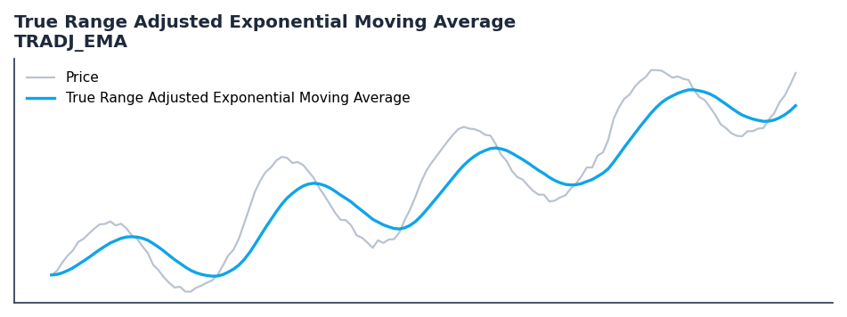

# True Range Adjusted Exponential Moving Average

<div class="indicator-meta"><span class="category-badge">Moving Averages</span> <span class="kw-badge">moving-average</span> <span class="kw-badge">adaptive</span> <span class="kw-badge">true-range</span> <span class="kw-badge">volatility</span></div>

An exponential moving average that incorporates true range to measure volatility and adapt to price movements.

## Visual Example



*Synthetic ideal per library logic. Generated 2026-06-25 IST via `docs/generate_all_previews.py` (reproducible; maps to core `Next<T>` implementation).*

## Description

The True Range Adjusted Exponential Moving Average indicator is a technical analysis tool that an exponential moving average that incorporates true range to measure volatility and adapt to price movements.

This indicator is primarily used for identifying key market conditions. It provides a robust signal that can be easily integrated into both simple strategies and more complex machine learning feature pipelines. Compared to its alternatives, it offers a distinct balance of responsiveness and stability.

Traders often combine this with other metrics to confirm signals and avoid false positives during sideways market regimes. It remains a standard tool for systematic trading models.

Use to identify trend turning points and filter price movements. Comparing TRAdj EMA with a standard EMA of the same length provides insights into the overall trend.

Introduced by Vitali Apirine in TASC January 2023, TRAdj EMA modifies the standard exponential moving average by adjusting the smoothing factor using the True Range. The normalized true range modifies the rate, making the indicator more responsive during volatile periods while filtering out noise when volatility drops.

QuantWave implements this indicator via the universal `Next<T>` trait, guaranteeing bit-identical results between Rust streaming, Python streaming, and Polars batch (`.ta()` / `map_batches`) surfaces.


## Formula / Specification

**Implementation** (`quantwave-core/src/indicators/tradj_ema.rs`):

\[
TRAdj = \frac{TR - TR_{min}}{TR_{max} - TR_{min}} \\ Rate = \frac{2}{P+1} \times (1 + TRAdj \times Multiplier)
\]


## Parameters

| Parameter | Default | Description |
|-----------|---------|-------------|
| `period` | 40 | Smoothing period |
| `pds` | 40 | Lookback period for True Range |
| `mltp` | 10.0 | Multiplier |


## Usage Examples

**Streaming (Rust)**

```rust
use quantwave_core::indicators::TRADJ_EMA;
use quantwave_core::traits::Next;

let mut ind = TRADJ_EMA::new(40);
for price in &prices {
    let value = ind.next(price);
}
```

**Streaming (Python)**

```python
from quantwave import TRADJ_EMA

ind = TRADJ_EMA(40)
for price in prices:
    value = ind.next(price)
```

**Polars Batch (Python)**

```python
import polars as pl
import quantwave as qw

def apply_true_range_adjusted_exponential_moving_average(series: pl.Series) -> pl.Series:
    ind = qw.TRADJ_EMA(40)
    return pl.Series([ind.next(float(v)) for v in series.to_list()])

df = (
    pl.read_csv('ohlcv.csv')
    .lazy()
    .with_columns(
        pl.col("close").map_batches(apply_true_range_adjusted_exponential_moving_average, return_dtype=pl.Float64).alias("true_range_adjusted_exponential_moving_average")
    )
    .collect()
)
```

All surfaces are bit-identical via the single `Next<T>` implementation and proptests.

## Edge Cases & Limitations

- Warm-up: first `40` bars may return NaN or partial state per implementation.
- Parameter sensitivity: smaller periods increase noise; larger periods increase lag.
- Sudden gaps or bad ticks can distort rolling windows — consider pre-filtering.
- Single-series indicators ignore volume unless otherwise documented.
- Validated via proptests against gold-standard vectors where available.
- No look-ahead bias; streaming and Polars batch paths are bit-identical.

## Boundary Behavior

| Condition | Behavior |
|-----------|----------|
| Warm-up | Leading bars return NaN until warmup_bars is satisfied. |
| period > len | When period exceeds series length, output is all NaN. |
| NaN inputs | NaN in input propagates to output (NaN out). |
| Invalid params | Non-positive period or missing required params raise ValueError. |
| Empty data | Empty input returns an empty result series. |

## Related Indicators & See Also

- [Indicator Gallery](../gallery.md)
- [Native Indicators index](index.md)
- [Batch vs Streaming guide](../../../examples/batch-streaming.md)
- [RSI](relative_strength_index_rsi.md)
- [SuperTrend](supertrend.md)

## Sources & References

**Primary Source**: Technical Analysis of Stocks & Commodities, January 2023

**Implementation**: `quantwave-core/src/indicators/tradj_ema.rs` (`TRADJ_EMA` / `TRADJ_EMA_METADATA`).

**Provenance**: Standards bulk upgrade 2026-06-25 IST — see `docs/DOCUMENTATION_STANDARDS.md`.
