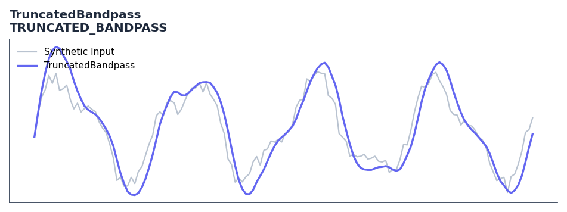

# TruncatedBandpass

<div class="indicator-meta"><span class="category-badge">Ehlers DSP</span> <span class="kw-badge">filter</span> <span class="kw-badge">ehlers</span> <span class="kw-badge">dsp</span> <span class="kw-badge">bandpass</span> <span class="kw-badge">cycle</span> <span class="kw-badge">robust</span></div>

Truncated Bandpass filter for handling sharp price movements.

## Visual Example



*Synthetic ideal per library logic. Generated 2026-06-25 IST via `docs/generate_all_previews.py` (reproducible; maps to core `Next<T>` implementation).*

## Description

The TruncatedBandpass indicator is a technical analysis tool that truncated bandpass filter for handling sharp price movements.

This indicator is primarily used for identifying key market conditions. It provides a robust signal that can be easily integrated into both simple strategies and more complex machine learning feature pipelines. Compared to its alternatives, it offers a distinct balance of responsiveness and stability.

Traders often combine this with other metrics to confirm signals and avoid false positives during sideways market regimes. It remains a standard tool for systematic trading models.

Use to isolate cyclic components while minimizing 'ringing' effects caused by sudden price shocks. Ideal for cycle-based trading systems in volatile markets.

Finite Impulse Response (FIR) filters have a fixed history, while Infinite Impulse Response (IIR) filters technically have an infinite history. Truncation limits the IIR feedback loop to a specific length, combining the sharp selectivity of IIR with the outlier-rejection of FIR.

QuantWave implements this indicator via the universal `Next<T>` trait, guaranteeing bit-identical results between Rust streaming, Python streaming, and Polars batch (`.ta()` / `map_batches`) surfaces.


## Formula / Specification

**Implementation** (`quantwave-core/src/indicators/truncated_bandpass.rs`):

\[
L1 = \cos(360/P), \quad G1 = \cos(BW \cdot 360/P), \quad S1 = 1/G1 - \sqrt{1/G1^2 - 1}
\]
\[
BPT_t = \text{IIR window of length } L \text{ with zero initial conditions}
\]

Gold-standard parity vectors: `quantwave-core/tests/gold_standard/truncated_bandpass.json`.


## Parameters

| Parameter | Default | Description |
|-----------|---------|-------------|
| `period` | 20 | Cycle period to isolate |
| `bandwidth` | 0.1 | Bandwidth of the filter |
| `length` | 10 | Truncation length |


## Usage Examples

**Streaming (Rust)**

```rust
use quantwave_core::indicators::TRUNCATED_BANDPASS;
use quantwave_core::traits::Next;

let mut ind = TRUNCATED_BANDPASS::new(20);
for price in &prices {
    let value = ind.next(price);
}
```

**Streaming (Python)**

```python
from quantwave import TRUNCATED_BANDPASS

ind = TRUNCATED_BANDPASS(20)
for price in prices:
    value = ind.next(price)
```

**Polars Batch (Python)**

```python
import polars as pl
import quantwave as qw

def apply_truncatedbandpass(series: pl.Series) -> pl.Series:
    ind = qw.TRUNCATED_BANDPASS(20)
    return pl.Series([ind.next(float(v)) for v in series.to_list()])

df = (
    pl.read_csv('ohlcv.csv')
    .lazy()
    .with_columns(
        pl.col("close").map_batches(apply_truncatedbandpass, return_dtype=pl.Float64).alias("truncatedbandpass")
    )
    .collect()
)
```

All surfaces are bit-identical via the single `Next<T>` implementation and proptests.

## Edge Cases & Limitations

- Recursive DSP filters require a warm-up period; first N bars may be unstable or raw-pass-through.
- Designed for cyclic/mean-reverting regimes; trending markets can produce lag or drift.
- Parameter `period` (or equivalent) controls cutoff — too small adds noise, too large adds lag.
- Prefer chaining with other Ehlers tools (Roofing Filter, SuperSmoother) on noisy inputs.
- Validated via proptests against gold-standard vectors where available.
- No look-ahead bias; suitable for live streaming and batch feature pipelines.

## Boundary Behavior

| Condition | Behavior |
|-----------|----------|
| Warm-up | Leading bars return NaN until warmup_bars is satisfied. |
| period > len | When period exceeds series length, output is all NaN. |
| NaN inputs | NaN in input propagates to output (NaN out). |
| Invalid params | Non-positive period or missing required params raise ValueError. |
| Empty data | Empty input returns an empty result series. |

## Related Indicators & See Also

- [Indicator Gallery](../gallery.md)
- [Native Indicators index](index.md)
- [Ehlers DSP guide](../ehlers/index.md)
- [Cyber Cycle](cyber_cycle.md)
- [SuperSmoother](supersmoother.md)

## Sources & References

**Primary Source**: https://www.traders.com/Documentation/FEEDbk_docs/2020/07/TradersTips.html

**Implementation**: `quantwave-core/src/indicators/truncated_bandpass.rs` (`TRUNCATED_BANDPASS` / `TRUNCATED_BANDPASS_METADATA`).
**Parity**: `quantwave-core/tests/gold_standard/truncated_bandpass.json`

**Provenance**: Standards bulk upgrade 2026-06-25 IST — see `docs/DOCUMENTATION_STANDARDS.md`.
