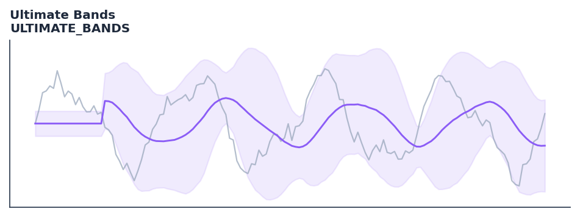

# Ultimate Bands

<div class="indicator-meta"><span class="category-badge">Ehlers DSP</span> <span class="kw-badge">bands</span> <span class="kw-badge">volatility</span> <span class="kw-badge">ehlers</span> <span class="kw-badge">dsp</span> <span class="kw-badge">adaptive</span></div>

A Bollinger-style band using UltimateSmoother for the center line and standard deviation of the price-smooth difference for width.

## Visual Example



*Synthetic ideal per library logic. Generated 2026-06-25 IST via `docs/generate_all_previews.py` (reproducible; maps to core `Next<T>` implementation).*

## Description

A Bollinger-style band using UltimateSmoother for the center line and standard deviation of the price-smooth difference for width.

Use as volatility bands that automatically widen during high-energy cycle phases and narrow during quiet phases. Better than fixed-multiple ATR bands in strongly cyclical markets.

Ehlers Ultimate Bands compute upper and lower price envelopes using the RMS amplitude of the dominant cycle rather than a fixed ATR multiple. This makes the bands proportional to the current cycle energy, expanding when the market is actively cycling and contracting when it enters a low-energy consolidation.

QuantWave implements this indicator via the universal `Next<T>` trait, guaranteeing bit-identical results between Rust streaming, Python streaming, and Polars batch (`.ta()` / `map_batches`) surfaces.

## Formula / Specification

**Implementation** (`quantwave-core/src/indicators/ultimate_bands.rs`):

\[
Smooth = UltimateSmoother(Close, Length)
\]
\[
SD = \sqrt{\frac{1}{n}\sum_{i=0}^{n-1} (Close_{t-i} - Smooth_{t-i})^2}
\]
\[
Upper = Smooth + NumSDs \times SD
\]
\[
Lower = Smooth - NumSDs \times SD
\]

Gold-standard parity vectors: `quantwave-core/tests/gold_standard/ultimate_bands.json`.


## Parameters

| Parameter | Default | Description |
|-----------|---------|-------------|
| `length` | 20 | Smoothing and SD period |
| `num_sds` | 1.0 | Standard Deviation multiplier |


## Usage Examples

**Streaming (Rust)**

```rust
use quantwave_core::indicators::ULTIMATE_BANDS;
use quantwave_core::traits::Next;

let mut ind = ULTIMATE_BANDS::new(20);
for price in &prices {
    let value = ind.next(price);
}
```

**Streaming (Python)**

```python
from quantwave import ULTIMATE_BANDS

ind = ULTIMATE_BANDS(20)
for price in prices:
    value = ind.next(price)
```

**Polars Batch (Python)**

```python
import polars as pl
import quantwave as qw

def apply_ultimate_bands(series: pl.Series) -> pl.Series:
    ind = qw.ULTIMATE_BANDS(20)
    return pl.Series([ind.next(float(v)) for v in series.to_list()])

df = (
    pl.read_csv('ohlcv.csv')
    .lazy()
    .with_columns(
        pl.col("close").map_batches(apply_ultimate_bands, return_dtype=pl.Float64).alias("ultimate_bands")
    )
    .collect()
)
```

All surfaces are bit-identical via the single `Next<T>` implementation and proptests.

## Edge Cases & Limitations

- Recursive DSP filters require a warm-up period; first N bars may be unstable or raw-pass-through.
- Designed for cyclic/mean-reverting regimes; trending markets can produce lag or drift.
- Parameter `period` (or equivalent) controls cutoff — too small adds noise, too large adds lag.
- Prefer chaining with other Ehlers tools (Roofing Filter, SuperSmoother) on noisy inputs.
- Validated via proptests against gold-standard vectors where available.
- No look-ahead bias; suitable for live streaming and batch feature pipelines.

## Related Indicators & See Also

- [Indicator Gallery](../gallery.md)
- [Native Indicators index](index.md)
- [Ehlers DSP guide](../ehlers/index.md)
- [Cyber Cycle](cyber_cycle.md)
- [SuperSmoother](supersmoother.md)

## Sources & References

**Primary Source**: https://github.com/lavs9/quantwave/blob/main/references/Ehlers%20Papers/UltimateChannel.pdf

**Implementation**: `quantwave-core/src/indicators/ultimate_bands.rs` (`ULTIMATE_BANDS` / `ULTIMATE_BANDS_METADATA`).
**Parity**: `quantwave-core/tests/gold_standard/ultimate_bands.json`

**Provenance**: Standards bulk upgrade 2026-06-25 IST — see `docs/DOCUMENTATION_STANDARDS.md`.
