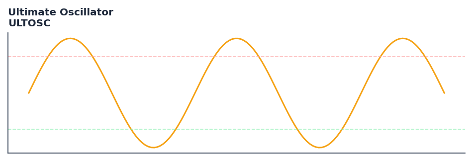

# Ultimate Oscillator

<div class="indicator-meta"><span class="category-badge">Classic</span> <span class="kw-badge">momentum</span> <span class="kw-badge">oscillator</span> <span class="kw-badge">classic</span> <span class="kw-badge">multi-timeframe</span></div>

A momentum oscillator designed to capture momentum across three different timeframes.

## Visual Example



*Synthetic ideal per library logic. Generated 2026-07-01 IST via `docs/generate_all_previews.py` (reproducible; maps to core `Next<T>` implementation).*

## Description

A momentum oscillator designed to capture momentum across three different timeframes.

Use to avoid the pitfalls of oscillators that are limited to a single timeframe. Buy signals are generated when there is bullish divergence between price and the indicator.

Native Rust implementation with gold-standard or TA-Lib parity tests where applicable.

Developed by Larry Williams in 1976, the Ultimate Oscillator uses weighted averages of three different timeframes to reduce the volatility and false signals common in other oscillators. It remains a staple for identifying divergence across short, medium, and long-term price action. — StockCharts ChartSchool

**Typical applications:**

- Fade extremes in ranges; trade with trend on recoveries from oversold/overbought
- Use divergences as early warning — confirm with structure or volume
- Parameter default `7` — shorten for sensitivity, lengthen for stability
- Drop into `build_feature_matrix()` for ML research

QuantWave implements this via the universal `Next<T>` trait — bit-identical across Rust streaming, Python streaming, and Polars `.ta()` batch plugins.

## Formula / Specification

**Implementation** (`quantwave-core/src/indicators/momentum.rs`):

\[
\text{BP} = \text{Close} - \min(\text{Low}, \text{PrevClose}) \\ \text{TR} = \max(\text{High}, \text{PrevClose}) - \min(\text{Low}, \text{PrevClose})
\]

Gold-standard parity vectors: `quantwave-core/tests/gold_standard/ultosc.json`.


## Parameters

| Parameter | Default | Description |
|-----------|---------|-------------|
| `timeperiod1` | 7 | Short period |
| `timeperiod2` | 14 | Medium period |
| `timeperiod3` | 28 | Long period |


## Usage Examples

**Streaming (Rust)**

```rust
use quantwave_core::indicators::ULTOSC;
use quantwave_core::traits::Next;

let mut ind = ULTOSC::new(7);
for price in &prices {
    let value = ind.next(price);
}
```

**Streaming (Python)**

```python
from quantwave import ULTOSC

ind = ULTOSC(7)
for price in prices:
    value = ind.next(price)
```

**Polars Batch (Python)**

```python
import polars as pl
import quantwave as qw

def apply_ultimate_oscillator(series: pl.Series) -> pl.Series:
    ind = qw.ULTOSC(7)
    return pl.Series([ind.next(float(v)) for v in series.to_list()])

df = (
    pl.read_csv('ohlcv.csv')
    .lazy()
    .with_columns(
        pl.col("close").map_batches(apply_ultimate_oscillator, return_dtype=pl.Float64).alias("ultimate_oscillator")
    )
    .collect()
)
```

All surfaces are bit-identical via the single `Next<T>` implementation and proptests.

## Edge Cases & Limitations

- Warm-up: first `7` bars may return NaN or partial state per implementation.
- Parameter sensitivity: smaller periods increase noise; larger periods increase lag.
- Sudden gaps or bad ticks can distort rolling windows — consider pre-filtering.
- Single-series indicators ignore volume unless otherwise documented.
- Validated via proptests against gold-standard vectors where available.
- No look-ahead bias; streaming and Polars batch paths are bit-identical.

## Boundary Behavior

| Condition | Behavior |
|-----------|----------|
| Warm-up | Leading bars return NaN until warmup_bars is satisfied. |
| period > len | When period exceeds series length, output is all NaN. |
| NaN inputs | NaN in input propagates to output (NaN out). |
| Invalid params | Non-positive period or missing required params raise ValueError. |
| Empty data | Empty input returns an empty result series. |

## Related Indicators & See Also

- [Indicator Gallery](../gallery.md)
- [Native Indicators index](index.md)
- [Batch vs Streaming guide](../../../examples/batch-streaming.md)
- [RSI](relative_strength_index_rsi.md)
- [SuperTrend](../supertrend/)

## Sources & References

**Primary Source**: https://www.investopedia.com/terms/u/ultimateoscillator.asp

**Implementation**: `quantwave-core/src/indicators/momentum.rs` (`ULTOSC` / `ULTOSC_METADATA`).
**Parity**: `quantwave-core/tests/gold_standard/ultosc.json`

**Provenance**: Standards bulk upgrade 2026-07-01 IST — see `docs/DOCUMENTATION_STANDARDS.md`.
