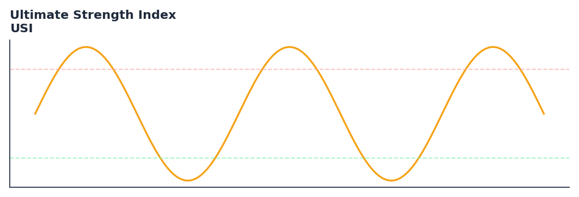

# Ultimate Strength Index

<div class="indicator-meta"><span class="category-badge">Ehlers DSP</span> <span class="kw-badge">oscillator</span> <span class="kw-badge">strength</span> <span class="kw-badge">ehlers</span> <span class="kw-badge">adaptive</span> <span class="kw-badge">momentum</span></div>

A lag-reduced version of the RSI using UltimateSmoother on smoothed up/down components.

## Visual Example



*Synthetic ideal per library logic. Generated 2026-07-01 IST via `docs/generate_all_previews.py` (reproducible; maps to core `Next<T>` implementation).*

## Description

A lag-reduced version of the RSI using UltimateSmoother on smoothed up/down components.

Use to measure the relative strength of the current market move normalized to the dominant cycle amplitude, giving a volatility-adjusted momentum reading.

Part of QuantWave's Ehlers digital signal processing suite. Designed for low-lag cycle and trend work — pair with Roofing Filter or SuperSmoother on noisy inputs.

The Ultimate Strength Index measures directional momentum as a fraction of the total cycle amplitude. By normalizing momentum to the RMS energy of the dominant cycle, it produces a consistent 0-100 reading that is comparable across different instruments and volatility regimes.

**Typical applications:**

- Use for cycle timing in mean-reverting regimes
- Gate with Hurst exponent or ADX before taking cycle signals
- Allow `14`+ bars warm-up for filter state to stabilise
- Chain with Roofing Filter when input is noisy

QuantWave implements this via the universal `Next<T>` trait — bit-identical across Rust streaming, Python streaming, and Polars `.ta()` batch plugins.

## Formula / Specification

**Implementation** (`quantwave-core/src/indicators/usi.rs`):

\[
\text{SU} = \max(0, \text{Close} - \text{Close}_{t-1})
\]
\[
\text{SD} = \max(0, \text{Close}_{t-1} - \text{Close})
\]
\[
\text{USU} = UltimateSmoother(SMA(\text{SU}, 4), Length)
\]
\[
\text{USD} = UltimateSmoother(SMA(\text{SD}, 4), Length)
\]
\[
\text{USI} = \frac{\text{USU} - \text{USD}}{\text{USU} + \text{USD}}
\]

Gold-standard parity vectors: `quantwave-core/tests/gold_standard/usi.json`.


## Parameters

| Parameter | Default | Description |
|-----------|---------|-------------|
| `length` | 14 | UltimateSmoother period |


## Usage Examples

**Streaming (Rust)**

```rust
use quantwave_core::indicators::USI;
use quantwave_core::traits::Next;

let mut ind = USI::new(14);
for price in &prices {
    let value = ind.next(price);
}
```

**Streaming (Python)**

```python
from quantwave import USI

ind = USI(14)
for price in prices:
    value = ind.next(price)
```

**Polars Batch (Python)**

```python
import polars as pl
import quantwave as qw

def apply_ultimate_strength_index(series: pl.Series) -> pl.Series:
    ind = qw.USI(14)
    return pl.Series([ind.next(float(v)) for v in series.to_list()])

df = (
    pl.read_csv('ohlcv.csv')
    .lazy()
    .with_columns(
        pl.col("close").map_batches(apply_ultimate_strength_index, return_dtype=pl.Float64).alias("ultimate_strength_index")
    )
    .collect()
)
```

All surfaces are bit-identical via the single `Next<T>` implementation and proptests.

## Edge Cases & Limitations

- Recursive DSP filters require a warm-up period; first N bars may be unstable or raw-pass-through.
- Designed for cyclic/mean-reverting regimes; trending markets can produce lag or drift.
- Parameter `period` (or equivalent) controls cutoff — too small adds noise, too large adds lag.
- Prefer chaining with other Ehlers tools (Roofing Filter, SuperSmoother) on noisy inputs.
- Validated via proptests against gold-standard vectors where available.
- No look-ahead bias; suitable for live streaming and batch feature pipelines.

## Boundary Behavior

| Condition | Behavior |
|-----------|----------|
| Warm-up | Leading bars return NaN until warmup_bars is satisfied. |
| period > len | When period exceeds series length, output is all NaN. |
| NaN inputs | NaN in input propagates to output (NaN out). |
| Invalid params | Non-positive period or missing required params raise ValueError. |
| Empty data | Empty input returns an empty result series. |

## Related Indicators & See Also

- [Indicator Gallery](../gallery.md)
- [Native Indicators index](index.md)
- [Ehlers DSP guide](../ehlers/index.md)
- [Cyber Cycle](cyber_cycle.md)
- [SuperSmoother](supersmoother.md)

## Sources & References

**Primary Source**: https://github.com/lavs9/quantwave/blob/main/references/traderstipsreference/TRADERS%E2%80%99%20TIPS%20-%20NOVEMBER%202024.html

**Implementation**: `quantwave-core/src/indicators/usi.rs` (`USI` / `USI_METADATA`).
**Parity**: `quantwave-core/tests/gold_standard/usi.json`

**Provenance**: Standards bulk upgrade 2026-07-01 IST — see `docs/DOCUMENTATION_STANDARDS.md`.
