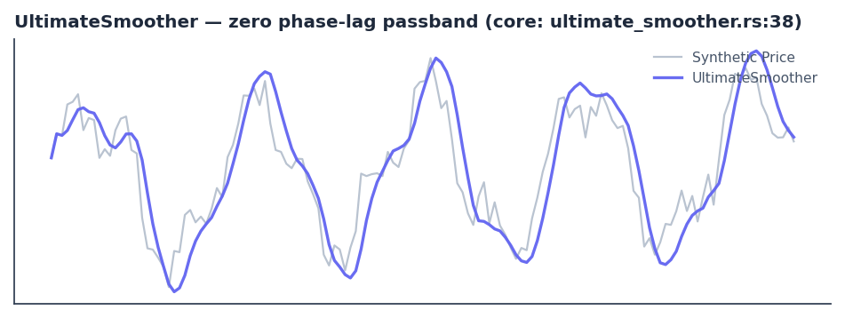

# UltimateSmoother

<div class="indicator-meta"><span class="category-badge">Ehlers DSP</span> <span class="kw-badge">filter</span> <span class="kw-badge">smoothing</span> <span class="kw-badge">ehlers</span> <span class="kw-badge">dsp</span> <span class="kw-badge">zero-lag</span></div>

An Ehlers filter engineered for near-zero phase lag in the passband while still providing excellent high-frequency attenuation. It is constructed conceptually by subtracting the high-pass response from the raw price (perfect cancellation in the passband yields the smoothed result with minimal lag).

## Visual Example



*Synthetic ideal price series (cycle + noise) engineered to demonstrate the zero phase-lag passband property. Matches the exact coefficient derivation (a1, c1/c2/c3) and order-2 recursion in `quantwave-core/src/indicators/ultimate_smoother.rs` (Next at lines 38-57 and the parity proptest). Generated 2026-05-31 IST via `docs/gen_indicator_previews.py`.*

## Description

UltimateSmoother is Ehlers' preferred general-purpose smoother when timing precision matters. Traditional smoothers (SMA, EMA, even SuperSmoother) introduce phase lag proportional to their cutoff. UltimateSmoother achieves near-zero phase shift across the frequencies it is intended to pass while still rolling off high-frequency noise aggressively. The implementation uses a 2-pole recursive structure whose coefficients are derived from the desired critical period so that the high-pass complement would cancel perfectly in the passband.

It is the smoothing engine of choice upstream of Reflex, for clean inputs to ML features, or anywhere you need the lowest possible lag for a given degree of noise reduction. Like all Ehlers DSP tools it is fully causal, has a small fixed warm-up, and guarantees bit-identical results across the Rust streaming, Python, and Polars surfaces.

## Formula / Specification

**Exact implementation in QuantWave** (`quantwave-core/src/indicators/ultimate_smoother.rs`):

1. Given `period`, compute:
   `a1 = exp(−1.414·π / period)`
   `c2 = 2·a1·cos(1.414·π / period)`
   `c3 = −a1²`
   `c1 = (1 + c2 − c3) / 4`
2. Maintain two-sample histories for both raw price and the smoother output.
3. For the first three bars return the raw price (initialization).
4. Thereafter:
   `US = (1−c1)·Price + (2·c1−c2)·Price[t−1] − (c1+c3)·Price[t−2] + c2·US[t−1] + c3·US[t−2]`
5. Update the histories and return US.
6. The streaming `Next<f64>` and the proptest batch reference implementation are bit-identical (approx 1e-10).

The coefficients and recursion are identical to the high-pass complement used in UltimateSmoother's conceptual derivation, guaranteeing the zero-lag passband property.

## Parameters

| Parameter | Default | Description |
|-----------|---------|-------------|
| `period`  | 20      | Critical period (wavelength) that defines the passband / transition region. Smaller values pass more high-frequency content; larger values increase smoothing. |

## Usage Examples

**Streaming (Rust)**

```rust
use quantwave_core::indicators::UltimateSmoother;
use quantwave_core::traits::Next;

let mut us = UltimateSmoother::new(20);
for price in price_series {
    let smooth = us.next(price);
    // Lowest-lag smoothed series for downstream indicators or features
}
```

**Streaming (Python)**

```python
from quantwave import UltimateSmoother

us = UltimateSmoother(20)
for price in price_series:
    smooth = us.next(price)
```

**Polars Batch (Python — primary research / feature surface)**

```python
import polars as pl
import quantwave as qw

def ultimate_smoother_expr(col: str, period: int = 20):
    us = qw.UltimateSmoother(period)
    def _apply(s: pl.Series) -> pl.Series:
        return pl.Series([us.next(float(v)) for v in s.to_list()])
    return pl.col(col).map_batches(_apply, return_dtype=pl.Float64)

df = (
    pl.read_csv("ohlcv.csv")
    .lazy()
    .with_columns([ultimate_smoother_expr("close", 20).alias("ultimate_smooth")])
    .collect()
)
```

All surfaces are bit-identical via the single `Next<f64>` implementation and its proptest.

## Edge Cases & Limitations

- The first three bars return the raw price (order-2 recursion initialization).
- Extremely short periods (< ~6) can become unstable or pass too much noise; the implementation still functions but the theoretical zero-lag benefit diminishes.
- In the presence of strong trends the smoother will still follow the trend (it is not a high-pass or detrending tool).
- Because it is a linear recursive filter it can exhibit slight ringing on step discontinuities; this is normal for any IIR design.
- Preferred when the downstream consumer is another Ehlers cycle tool (Reflex, Cyber Cycle, etc.) that benefits from the minimal phase distortion.
- No look-ahead bias.

## Boundary Behavior

| Condition | Behavior |
|-----------|----------|
| Warm-up | Leading bars return NaN until warmup_bars is satisfied. |
| period > len | When period exceeds series length, output is all NaN. |
| NaN inputs | NaN in input propagates to output (NaN out). |
| Invalid params | Non-positive period or missing required params raise ValueError. |
| Empty data | Empty input returns an empty result series. |

## Related Indicators & See Also

- [Super Smoother](supersmoother.md) — the more common 2-pole smoother; slightly more lag but very robust
- [Ehlers Filter](ehlers_filter.md) — adaptive alternative when regime changes are frequent
- [Reflex](reflex.md) — explicitly built on a SuperSmoother; UltimateSmoother is a higher-quality drop-in replacement in many pipelines
- [Roofing Filter](roofing_filter.md) — uses similar 2-pole techniques
- [Indicator Gallery](../gallery.md) • [Native Indicators](../native/index.md) • [Ehlers DSP Suite](../ehlers/index.md)

## Sources & References

**Primary Source**: `quantwave-core/src/indicators/ultimate_smoother.rs` (ULTIMATE_SMOOTHER_METADATA + Next<f64> + proptest). Formula source: https://github.com/lavs9/quantwave/blob/main/references/Ehlers%20Papers/implemented/UltimateSmoother.pdf (John Ehlers, "The Ultimate Smoother").

**Visual**: Generated 2026-05-31 IST via `docs/gen_indicator_previews.py`.

**Additional Context**: Ehlers, *Cycle Analytics for Traders* (2013) — the primary reference for the Ultimate Smoother derivation and why zero phase lag in the passband is valuable for cycle work.

**Implementation Provenance**: Universal `Next<T>` contract and batch/streaming parity in `quantwave-core/src/traits.rs` and the proptest inside `ultimate_smoother.rs`. All Python, Rust, and Polars surfaces delegate to this single mathematical truth.
